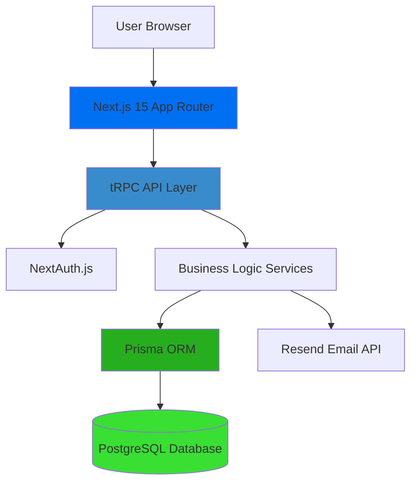
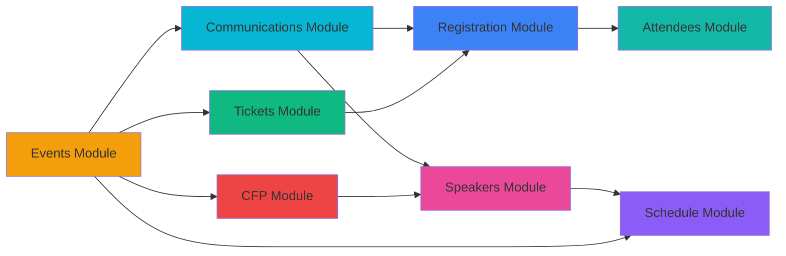

# Events-Ting Developer Documentation

Welcome to the **Events-Ting** developer documentation. This comprehensive guide will help you understand, contribute to, and extend the event management platform.

## 🎯 What is Events-Ting?

Events-Ting is a full-stack event management system built with modern web technologies. It provides organizers with tools to create events, manage tickets, handle registrations, schedule sessions, accept speaker proposals (CFP), and communicate with attendees.

## 🏗️ System Architecture Overview



### Architecture Layers

1. **Frontend Layer** (Next.js App Router)
   - Server Components by default
   - Client Components for interactivity
   - Flowbite React + Tailwind CSS for UI

2. **API Layer** (tRPC)
   - Type-safe client-server communication
   - Automatic TypeScript inference
   - Zod validation for all inputs

3. **Business Logic Layer** (Services)
   - Domain-specific logic separated from routes
   - Reusable across different API endpoints
   - Transaction management for complex operations

4. **Data Layer** (Prisma + PostgreSQL)
   - Type-safe database queries
   - Migration management
   - Optimized indexes for performance

5. **External Services**
   - **Resend**: Transactional emails (confirmations, notifications)
   - **NextAuth.js**: OAuth authentication (Google, GitHub, Discord)

## 🗺️ Module Interconnection Map



### Module Dependencies

- **Events** (Core): Foundation module - all other modules depend on it
- **Tickets** → **Registration**: Tickets define what attendees can register for
- **Registration** → **Attendees**: Attendees view is essentially registration management
- **CFP** → **Speakers**: Accepted proposals automatically create speaker profiles
- **Speakers** → **Schedule**: Speakers are assigned to schedule sessions
- **Communications**: Broadcasts to any combination of attendees, speakers, or custom groups

## 📚 Documentation Structure

### Getting Started
- **[Getting Started Guide](./getting-started.md)** - Quick setup for local development

### Architecture
- **[System Overview](./architecture/system-overview.md)** - High-level architecture and data flows
- **[Tech Stack](./architecture/tech-stack.md)** - Detailed technology choices and versions
- **[Data Model](./architecture/data-model.md)** - Complete database schema with ERD
- **[Authentication](./architecture/authentication.md)** - NextAuth setup and authorization patterns
- **[File Structure](./architecture/file-structure.md)** - Project organization and conventions

### Feature Modules
Each module has comprehensive documentation covering backend, frontend, data models, and workflows:

#### Core Modules
- **[Events](./modules/events/)** - Event creation, publishing, and management
- **[Tickets](./modules/tickets/)** - Ticket types and availability management
- **[Registration](./modules/registration/)** - Attendee registration and check-in

#### Advanced Modules
- **[Schedule](./modules/schedule/)** - Event schedules, sessions, and tracks
- **[Speakers](./modules/speakers/)** - Speaker profiles and management
- **[CFP (Call for Papers)](./modules/cfp/)** - Proposal submission and review workflow
- **[Communications](./modules/communications/)** - Email campaigns and messaging
- **[Attendees](./modules/attendees/)** - Attendee management and tracking

### API Reference
- **[tRPC Overview](./api/trpc-overview.md)** - tRPC setup and patterns
- **[Routers](./api/routers.md)** - All API procedures reference
- **[Authentication](./api/authentication.md)** - Protected vs public procedures
- **[Error Handling](./api/error-handling.md)** - Error codes and validation

### Components
- **[UI System](./components/ui-system.md)** - Design system and component library
- **[Forms](./components/forms.md)** - Form patterns and validation
- **[Tables](./components/tables.md)** - Data tables with sorting/filtering
- **[Reusable Components](./components/reusable-components.md)** - Shared component documentation

### Deployment
- **[Environment Variables](./deployment/environment-variables.md)** - Required configuration
- **[Database Setup](./deployment/database-setup.md)** - PostgreSQL and migrations
- **[Email Setup](./deployment/email-setup.md)** - Resend integration
- **[Storage Setup](./deployment/storage-setup.md)** - File upload configuration
- **[Vercel Deployment](./deployment/vercel-deployment.md)** - Production deployment guide

### Development
- **[Setup](./development/setup.md)** - Local development environment
- **[Database Migrations](./development/database-migrations.md)** - Prisma workflow
- **[Testing](./development/testing.md)** - Testing strategy (future)
- **[Contributing](./development/contributing.md)** - Contribution guidelines

### Additional Resources
- **[Troubleshooting](./troubleshooting.md)** - Common issues and solutions

## 🚀 Quick Navigation

### I want to...

**Understand the system**
→ Start with [System Overview](./architecture/system-overview.md) and [Tech Stack](./architecture/tech-stack.md)

**Set up locally**
→ Follow [Getting Started Guide](./getting-started.md)

**Add a new feature**
→ Read relevant [Module Documentation](./modules/) and [API Reference](./api/)

**Understand the database**
→ Check [Data Model](./architecture/data-model.md)

**Work with authentication**
→ See [Authentication](./architecture/authentication.md)

**Deploy to production**
→ Follow [Deployment Guides](./deployment/)

**Fix an issue**
→ Check [Troubleshooting](./troubleshooting.md) first

## 🎓 Learning Path

### For New Contributors

1. **Day 1: Environment Setup**
   - Complete [Getting Started Guide](./getting-started.md)
   - Explore the running application
   - Review [File Structure](./architecture/file-structure.md)

2. **Day 2: Architecture Understanding**
   - Read [System Overview](./architecture/system-overview.md)
   - Study [Data Model](./architecture/data-model.md)
   - Understand [tRPC Overview](./api/trpc-overview.md)

3. **Day 3: Feature Deep Dive**
   - Pick a module (start with [Events](./modules/events/))
   - Read all 5 documentation files (README, backend, frontend, data-model, workflows)
   - Trace a workflow from UI → tRPC → Service → Database

4. **Day 4: Make Your First Change**
   - Fix a good first issue
   - Follow [Contributing Guide](./development/contributing.md)
   - Submit a pull request

### For Maintainers

- **Adding a Feature**: Document it in the relevant module folder
- **Changing APIs**: Update [Routers](./api/routers.md) documentation
- **Schema Changes**: Update [Data Model](./architecture/data-model.md)
- **Deployment Changes**: Update [Deployment Guides](./deployment/)

## 🛠️ Technology Stack

| Category | Technology | Version | Purpose |
|----------|-----------|---------|---------|
| **Framework** | Next.js | 15.2.3 | React framework with App Router |
| **Language** | TypeScript | 5.8.2 | Type-safe JavaScript |
| **API** | tRPC | 11.0.0 | Type-safe API layer |
| **Database** | PostgreSQL | 14+ | Relational database |
| **ORM** | Prisma | 6.6.0 | Type-safe database client |
| **Auth** | NextAuth.js | 5.0.0-beta.25 | Authentication |
| **UI** | Flowbite React | 0.12.10 | Component library |
| **Styling** | Tailwind CSS | 4.0.15 | Utility-first CSS |
| **Validation** | Zod | 3.24.2 | Schema validation |
| **Email** | Resend | 4.0.1 | Email delivery |
| **Package Manager** | pnpm | 10.20.0 | Fast, efficient package manager |

## 🧩 Key Concepts

### Server Components vs Client Components
- **Server Components** (default): Render on server, no JavaScript sent to client
- **Client Components** (`"use client"`): Interactive components with React hooks
- **Rule**: Use Server Components unless you need interactivity

### tRPC Procedures
- **Queries**: Read operations (GET)
- **Mutations**: Write operations (POST/PUT/DELETE)
- **Protected Procedures**: Require authentication
- **Public Procedures**: No authentication required

### Data Flow Pattern
```
User Action → Client Component → tRPC Query/Mutation → Protected/Public Procedure
→ Input Validation (Zod) → Authorization Check → Service Layer
→ Prisma Query → Database → Response
```

### Module Organization
Each feature module follows this structure:
```
modules/[feature]/
├── README.md          # Overview and features
├── backend.md         # tRPC router and business logic
├── frontend.md        # Components and pages
├── data-model.md      # Prisma schema for this module
└── workflows.md       # Step-by-step user flows
```

## 🔗 External Resources

- **Next.js Documentation**: https://nextjs.org/docs
- **tRPC Documentation**: https://trpc.io/docs
- **Prisma Documentation**: https://www.prisma.io/docs
- **NextAuth.js Documentation**: https://next-auth.js.org
- **Flowbite React**: https://flowbite-react.com
- **Tailwind CSS**: https://tailwindcss.com/docs

## 📝 Documentation Standards

### When to Update Documentation

- **API Changes**: Update router documentation and module backend.md
- **Schema Changes**: Update data-model.md files
- **UI Changes**: Update module frontend.md files
- **Workflow Changes**: Update module workflows.md files
- **New Features**: Create new module documentation following templates

### Documentation Templates

All module documentation follows standardized templates (see PRD for details):
- README.md template
- backend.md template
- frontend.md template
- data-model.md template
- workflows.md template

## 🤝 Contributing to Documentation

Documentation lives alongside code. When making changes:

1. **Update docs in the same PR** as code changes
2. **Follow templates** for consistency
3. **Include code examples** from actual codebase
4. **Add diagrams** using Mermaid.js when helpful
5. **Link related documentation** for easy navigation

## 📊 Documentation Status

| Category | Status | Last Updated |
|----------|--------|--------------|
| Foundation | ✅ Complete | Nov 9, 2025 |
| Architecture | ✅ Complete | Nov 10, 2025 |
| Modules | 🚧 In Progress | Nov 10, 2025 |
| API Reference | ✅ Complete | Nov 10, 2025 |
| Components | ✅ Complete | Nov 10, 2025 |
| Deployment | ✅ Complete | Nov 10, 2025 |
| Development | ✅ Complete | Nov 10, 2025 |

---

**Need Help?**
- 🐛 Found a bug? [Open an issue](https://github.com/babblebey/events-ting/issues)
- 💬 Have questions? [Start a discussion](https://github.com/babblebey/events-ting/discussions)
- 📧 Need support? Check [Troubleshooting](./troubleshooting.md)

**Last Updated**: November 9, 2025  
**Maintained by**: @babblebey
