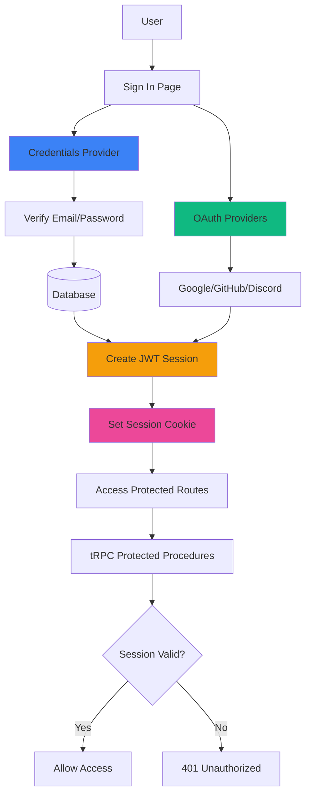

# Authentication & Authorization

This document covers the authentication and authorization systems in Events-Ting, including NextAuth.js configuration, session management, and authorization patterns.

## 📋 Table of Contents

- [Overview](#overview)
- [NextAuth.js Configuration](#nextauthjs-configuration)
- [Authentication Methods](#authentication-methods)
- [Session Management](#session-management)
- [Authorization Patterns](#authorization-patterns)
- [Security Considerations](#security-considerations)
- [Usage Examples](#usage-examples)

## 🔐 Overview

Events-Ting uses **NextAuth.js 5.0** (beta) for authentication, supporting:

- ✅ **Credentials**: Email + password authentication
- ✅ **OAuth Providers**: Google, GitHub, Discord (optional)
- ✅ **JWT Sessions**: Stateless sessions (no database lookup per request)
- ✅ **Password Hashing**: bcrypt with 10 salt rounds
- ✅ **Role-based Access**: Organizer vs attendee authorization

### Architecture



## ⚙️ NextAuth.js Configuration

### Base Configuration

**Location**: `src/server/auth/config.ts`

```typescript
import { type NextAuthConfig } from "next-auth";
import Credentials from "next-auth/providers/credentials";
import { compare } from "bcryptjs";
import { z } from "zod";
import { db } from "@/server/db";

export const authConfig = {
  providers: [
    Credentials({
      name: "credentials",
      credentials: {
        email: { label: "Email", type: "email" },
        password: { label: "Password", type: "password" },
      },
      async authorize(credentials) {
        // 1. Validate input
        const parsedCredentials = z
          .object({ 
            email: z.string().email(), 
            password: z.string().min(6) 
          })
          .safeParse(credentials);

        if (!parsedCredentials.success) {
          return null;
        }

        const { email, password } = parsedCredentials.data;

        // 2. Find user
        const user = await db.user.findUnique({
          where: { email },
        });

        if (!user?.password) {
          return null;  // User doesn't exist or no password set
        }

        // 3. Verify password
        const passwordsMatch = await compare(password, user.password);

        if (!passwordsMatch) {
          return null;
        }

        // 4. Return user (creates session)
        return {
          id: user.id,
          email: user.email,
          name: user.name,
          image: user.image,
        };
      },
    }),
  ],
  session: {
    strategy: "jwt",  // JWT sessions (stateless)
  },
  callbacks: {
    // Add user ID to JWT token
    jwt: ({ token, user }) => {
      if (user) {
        token.id = user.id;
      }
      return token;
    },
    // Add user ID to session object
    session: ({ session, token }) => ({
      ...session,
      user: {
        ...session.user,
        id: token.id as string,
      },
    }),
  },
  pages: {
    signIn: "/auth/signin",  // Custom sign-in page
  },
} satisfies NextAuthConfig;
```

### Auth Instance

**Location**: `src/server/auth/index.ts`

```typescript
import NextAuth from "next-auth";
import { cache } from "react";
import { authConfig } from "./config";

const { auth: uncachedAuth, handlers, signIn, signOut } = NextAuth(authConfig);

// Cache auth function for Server Components (deduplication)
const auth = cache(uncachedAuth);

export { auth, handlers, signIn, signOut };
```

### TypeScript Module Augmentation

Extend NextAuth types to include custom user fields:

```typescript
declare module "next-auth" {
  interface Session extends DefaultSession {
    user: {
      id: string;  // Add user ID to session
      // Add more custom fields here
    } & DefaultSession["user"];
  }
}
```

## 🔑 Authentication Methods

### 1. Credentials Authentication

**Email + Password authentication with bcrypt**

#### Registration Flow

```typescript
import { hash } from "bcryptjs";

// In registration procedure
const hashedPassword = await hash(input.password, 10);  // 10 salt rounds

await ctx.db.user.create({
  data: {
    email: input.email,
    name: input.name,
    password: hashedPassword,
  },
});
```

#### Login Flow

1. User submits email + password
2. NextAuth calls `authorize` function
3. Find user by email
4. Compare password with bcrypt
5. Return user object (creates JWT session)
6. Set session cookie

**Security Features**:
- ✅ Password minimum length: 6 characters
- ✅ bcrypt hashing with salt (10 rounds)
- ✅ Email validation with Zod
- ✅ No password in session/JWT
- ✅ Secure session cookies (httpOnly, secure, sameSite)

### 2. OAuth Authentication (Future)

**Support for Google, GitHub, Discord**

```typescript
import Google from "next-auth/providers/google";
import GitHub from "next-auth/providers/github";
import Discord from "next-auth/providers/discord";

export const authConfig = {
  providers: [
    Credentials({ /* ... */ }),
    Google({
      clientId: process.env.AUTH_GOOGLE_ID,
      clientSecret: process.env.AUTH_GOOGLE_SECRET,
    }),
    GitHub({
      clientId: process.env.AUTH_GITHUB_ID,
      clientSecret: process.env.AUTH_GITHUB_SECRET,
    }),
    Discord({
      clientId: process.env.AUTH_DISCORD_ID,
      clientSecret: process.env.AUTH_DISCORD_SECRET,
    }),
  ],
  // ... rest of config
};
```

**OAuth Flow**:
1. User clicks "Sign in with Google"
2. Redirect to Google consent screen
3. User grants permission
4. Google redirects back with auth code
5. NextAuth exchanges code for tokens
6. Create or update user in database
7. Create session

## 🎫 Session Management

### JWT Session Strategy

**Why JWT over Database Sessions?**

- ✅ **Stateless**: No database lookup per request
- ✅ **Scalable**: No session storage required
- ✅ **Fast**: Verify token cryptographically
- ✅ **Simple**: No session cleanup jobs
- ❌ **Cannot revoke**: Token valid until expiration

### Session Structure

```typescript
interface Session {
  user: {
    id: string;      // Added via callback
    name: string;
    email: string;
    image: string;
  };
  expires: string;   // ISO 8601 expiration time
}
```

### Session Cookie

**Cookie Name**: `next-auth.session-token` (or `__Secure-next-auth.session-token` in production)

**Cookie Attributes**:
- `httpOnly: true` - Not accessible via JavaScript (XSS protection)
- `secure: true` - HTTPS only (production)
- `sameSite: "lax"` - CSRF protection
- `path: "/"` - Available site-wide
- `maxAge: 30 days` - Default session duration

### Accessing Session

#### Server Components

```typescript
import { auth } from "@/server/auth";

export default async function ServerComponent() {
  const session = await auth();
  
  if (!session) {
    return <div>Not signed in</div>;
  }
  
  return <div>Welcome, {session.user.name}</div>;
}
```

#### Client Components

```typescript
"use client";
import { useSession } from "next-auth/react";

export default function ClientComponent() {
  const { data: session, status } = useSession();
  
  if (status === "loading") return <div>Loading...</div>;
  if (status === "unauthenticated") return <div>Not signed in</div>;
  
  return <div>Welcome, {session.user.name}</div>;
}
```

#### tRPC Context

```typescript
// src/server/api/trpc.ts
export const createTRPCContext = async (opts: { headers: Headers }) => {
  const session = await auth();  // Available in all procedures
  
  return {
    db,
    session,
    ...opts,
  };
};
```

### Session Refresh

JWT sessions automatically refresh when:
- User navigates between pages
- Session is close to expiration
- Manual refresh: `update()` from useSession

## 🛡️ Authorization Patterns

### 1. Public vs Protected Procedures

#### Public Procedure

**No authentication required**

```typescript
export const publicProcedure = t.procedure.use(timingMiddleware);

// Example: List published events
export const eventRouter = createTRPCRouter({
  list: publicProcedure
    .query(async ({ ctx }) => {
      return ctx.db.event.findMany({
        where: { status: "published", isArchived: false }
      });
    }),
});
```

#### Protected Procedure

**Requires authentication**

```typescript
export const protectedProcedure = t.procedure
  .use(timingMiddleware)
  .use(({ ctx, next }) => {
    if (!ctx.session?.user) {
      throw new TRPCError({ code: "UNAUTHORIZED" });
    }
    return next({
      ctx: {
        session: { ...ctx.session, user: ctx.session.user },
      },
    });
  });

// Example: Create event
export const eventRouter = createTRPCRouter({
  create: protectedProcedure
    .input(createEventSchema)
    .mutation(async ({ ctx, input }) => {
      return ctx.db.event.create({
        data: {
          ...input,
          organizerId: ctx.session.user.id,  // User guaranteed to exist
        },
      });
    }),
});
```

### 2. Resource Ownership (Organizer Check)

**Verify user owns the resource**

```typescript
export const eventRouter = createTRPCRouter({
  update: protectedProcedure
    .input(updateEventSchema)
    .mutation(async ({ ctx, input }) => {
      // 1. Fetch event
      const event = await ctx.db.event.findUnique({
        where: { id: input.id },
      });

      if (!event) {
        throw new TRPCError({ 
          code: "NOT_FOUND",
          message: "Event not found"
        });
      }

      // 2. Check ownership
      if (event.organizerId !== ctx.session.user.id) {
        throw new TRPCError({ 
          code: "FORBIDDEN",
          message: "You don't have permission to edit this event"
        });
      }

      // 3. Proceed with update
      return ctx.db.event.update({
        where: { id: input.id },
        data: input,
      });
    }),
});
```

### 3. Reusable Authorization Functions

**Centralize authorization logic**

```typescript
// src/server/services/authz.ts
export async function requireEventOwnership(
  eventId: string,
  userId: string,
  db: PrismaClient
) {
  const event = await db.event.findUnique({
    where: { id: eventId },
    select: { organizerId: true },
  });

  if (!event) {
    throw new TRPCError({ code: "NOT_FOUND" });
  }

  if (event.organizerId !== userId) {
    throw new TRPCError({ code: "FORBIDDEN" });
  }

  return event;
}

// Usage in router
export const eventRouter = createTRPCRouter({
  update: protectedProcedure
    .input(updateEventSchema)
    .mutation(async ({ ctx, input }) => {
      await requireEventOwnership(input.id, ctx.session.user.id, ctx.db);
      
      return ctx.db.event.update({
        where: { id: input.id },
        data: input,
      });
    }),
});
```

### 4. Route Protection (Pages)

#### Protecting Full Pages

```typescript
// src/app/(dashboard)/[id]/page.tsx
import { auth } from "@/server/auth";
import { redirect } from "next/navigation";

export default async function DashboardPage({ params }) {
  const session = await auth();
  
  if (!session) {
    redirect("/auth/signin");
  }
  
  // Page content for authenticated users
  return <div>Dashboard</div>;
}
```

#### Protecting API Routes

```typescript
// src/app/api/example/route.ts
import { auth } from "@/server/auth";
import { NextResponse } from "next/server";

export async function GET() {
  const session = await auth();
  
  if (!session) {
    return NextResponse.json(
      { error: "Unauthorized" },
      { status: 401 }
    );
  }
  
  // Handle request
  return NextResponse.json({ data: "..." });
}
```

## 🔒 Security Considerations

### Password Security

```typescript
import { hash, compare } from "bcryptjs";

// ✅ GOOD: Proper salt rounds
const hashed = await hash(password, 10);  // 10 rounds

// ❌ BAD: Too few rounds (insecure)
const hashed = await hash(password, 4);

// ❌ BAD: Too many rounds (slow)
const hashed = await hash(password, 15);
```

**Recommendations**:
- Use 10-12 salt rounds for bcrypt
- Enforce minimum password length (6+ characters)
- Consider password strength meter (future)
- Implement rate limiting on login (future)

### Session Security

**Session Cookie Attributes**:
```typescript
cookies: {
  sessionToken: {
    name: `${useSecureCookies ? "__Secure-" : ""}next-auth.session-token`,
    options: {
      httpOnly: true,     // Not accessible via JS
      sameSite: "lax",    // CSRF protection
      path: "/",
      secure: useSecureCookies,  // HTTPS only in prod
    },
  },
}
```

### CSRF Protection

NextAuth.js includes built-in CSRF protection:
- CSRF token in forms
- Verify token on POST requests
- sameSite cookie attribute

### XSS Protection

- Session cookie is httpOnly (no JavaScript access)
- React auto-escapes output
- Sanitize user-generated content (markdown, HTML)

### Brute Force Protection (Future)

Implement rate limiting:
- Max 5 failed login attempts per 15 minutes
- Exponential backoff
- CAPTCHA after multiple failures

## 💼 Usage Examples

### Complete Registration Flow

```typescript
// src/server/api/routers/auth.ts
import { hash } from "bcryptjs";
import { z } from "zod";

export const authRouter = createTRPCRouter({
  register: publicProcedure
    .input(z.object({
      email: z.string().email(),
      password: z.string().min(6),
      name: z.string().min(2),
    }))
    .mutation(async ({ ctx, input }) => {
      // 1. Check if user exists
      const existing = await ctx.db.user.findUnique({
        where: { email: input.email },
      });

      if (existing) {
        throw new TRPCError({ 
          code: "CONFLICT",
          message: "Email already registered"
        });
      }

      // 2. Hash password
      const hashedPassword = await hash(input.password, 10);

      // 3. Create user
      const user = await ctx.db.user.create({
        data: {
          email: input.email,
          name: input.name,
          password: hashedPassword,
        },
      });

      // 4. Return success (user must sign in separately)
      return { success: true, userId: user.id };
    }),
});
```

### Sign In Page

```typescript
// src/app/auth/signin/page.tsx
"use client";
import { signIn } from "next-auth/react";
import { useState } from "react";
import { useRouter } from "next/navigation";

export default function SignInPage() {
  const router = useRouter();
  const [error, setError] = useState("");

  async function handleSubmit(e: React.FormEvent<HTMLFormElement>) {
    e.preventDefault();
    const formData = new FormData(e.currentTarget);

    const result = await signIn("credentials", {
      email: formData.get("email"),
      password: formData.get("password"),
      redirect: false,
    });

    if (result?.error) {
      setError("Invalid email or password");
    } else {
      router.push("/dashboard");
      router.refresh();
    }
  }

  return (
    <form onSubmit={handleSubmit}>
      {error && <div className="text-red-600">{error}</div>}
      <input type="email" name="email" required />
      <input type="password" name="password" required />
      <button type="submit">Sign In</button>
    </form>
  );
}
```

### Sign Out

```typescript
"use client";
import { signOut } from "next-auth/react";

export function SignOutButton() {
  return (
    <button onClick={() => signOut({ callbackUrl: "/" })}>
      Sign Out
    </button>
  );
}
```

## 📚 Related Documentation

- **[Tech Stack - NextAuth.js](./tech-stack.md#nextauthjs-500-beta25)** - Technology details
- **[Data Model - User](./data-model.md#user)** - User schema
- **[System Overview](./system-overview.md)** - Architecture patterns
- **[API - tRPC Authentication](../api/authentication.md)** - API-level auth

---

**Last Updated**: November 9, 2025  
**Security Review**: December 9, 2025
