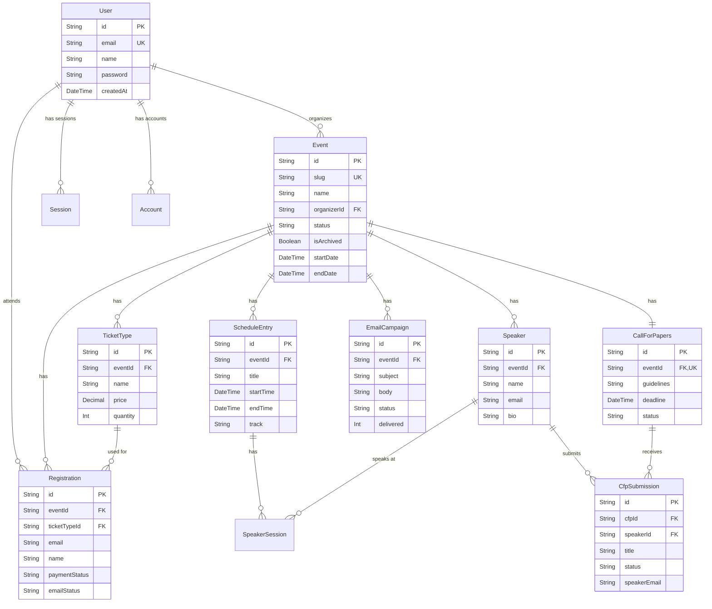

# Data Model

This document provides a comprehensive overview of the Events-Ting database schema, including all models, relationships, indexes, and design decisions.

## 📋 Table of Contents

- [Entity Relationship Diagram](#entity-relationship-diagram)
- [Core Models](#core-models)
- [Authentication Models](#authentication-models)
- [Event Management Models](#event-management-models)
- [Registration Models](#registration-models)
- [Schedule Models](#schedule-models)
- [Speaker Models](#speaker-models)
- [CFP Models](#cfp-models)
- [Communication Models](#communication-models)
- [Indexes & Performance](#indexes--performance)
- [Cascade Rules](#cascade-rules)
- [Design Decisions](#design-decisions)

## 🗺️ Entity Relationship Diagram



## 🔐 Authentication Models

### User

**Purpose**: Represents user accounts (organizers and attendees)

```prisma
model User {
  id            String    @id @default(cuid())
  name          String?
  email         String?   @unique
  emailVerified DateTime?
  image         String?
  password      String?   // bcrypt hashed
  
  // Relations
  accounts      Account[]       // OAuth accounts
  sessions      Session[]       // Active sessions
  posts         Post[]          // Demo posts (T3 Stack)
  events        Event[]         // Events organized by user
  registrations Registration[]  // Events user registered for
  
  createdAt     DateTime  @default(now())
  updatedAt     DateTime  @default(now()) @updatedAt
}
```

**Key Points**:
- `email` is unique - one account per email
- `password` is nullable (OAuth users don't have password)
- `password` is bcrypt hashed with 10 salt rounds
- `image` stores profile picture URL from OAuth or upload
- Dual role: organizers create events, attendees register

**Indexes**:
- Unique index on `email` (automatic from @unique)

---

### Account

**Purpose**: OAuth provider accounts linked to users (NextAuth.js)

```prisma
model Account {
  id                       String  @id @default(cuid())
  userId                   String
  type                     String  // "oauth" | "email" | "credentials"
  provider                 String  // "google" | "github" | "discord"
  providerAccountId        String  // Provider's user ID
  refresh_token            String?
  access_token             String?
  expires_at               Int?
  token_type               String?
  scope                    String?
  id_token                 String?
  session_state            String?
  refresh_token_expires_in Int?
  
  user                     User    @relation(fields: [userId], references: [id], onDelete: Cascade)
  
  @@unique([provider, providerAccountId])
}
```

**Key Points**:
- One user can have multiple OAuth accounts (Google + GitHub)
- Tokens stored securely in database
- Cascade delete: deleting user removes all accounts

---

### Session

**Purpose**: Active user sessions (alternative to JWT)

```prisma
model Session {
  id           String   @id @default(cuid())
  sessionToken String   @unique
  userId       String
  expires      DateTime
  
  user         User     @relation(fields: [userId], references: [id], onDelete: Cascade)
}
```

**Note**: Events-Ting currently uses JWT sessions (not database sessions). This model is for future use.

---

### VerificationToken

**Purpose**: Email verification tokens

```prisma
model VerificationToken {
  identifier String   // Email or user ID
  token      String   @unique
  expires    DateTime
  
  @@unique([identifier, token])
}
```

---

## 🎪 Event Management Models

### Event

**Purpose**: Core event entity - conferences, meetups, workshops

```prisma
model Event {
  id          String   @id @default(cuid())
  slug        String   @unique  // URL-friendly: "tech-conf-2025"
  name        String              // Display name
  description String   @db.Text
  
  // Location & Timing
  locationType    String   // 'in-person' | 'virtual' | 'hybrid'
  locationAddress String?  // Physical address if in-person/hybrid
  locationUrl     String?  // Virtual URL if virtual/hybrid
  timezone        String   @default("UTC")  // IANA timezone: "America/New_York"
  startDate       DateTime // Stored in UTC, displayed in event timezone
  endDate         DateTime // Stored in UTC
  
  // Status & Visibility
  status      String   @default("draft")  // 'draft' | 'published' | 'archived'
  isArchived  Boolean  @default(false)     // Soft delete flag
  
  // Organizer
  organizerId String
  organizer   User     @relation(fields: [organizerId], references: [id], onDelete: Restrict)
  
  // Relations
  ticketTypes      TicketType[]
  registrations    Registration[]
  scheduleEntries  ScheduleEntry[]
  callForPapers    CallForPapers?
  speakers         Speaker[]
  emailCampaigns   EmailCampaign[]
  
  createdAt   DateTime @default(now())
  updatedAt   DateTime @updatedAt
  
  @@index([organizerId])
  @@index([slug])
  @@index([status, isArchived])
  @@index([startDate])
  @@index([organizerId, status])
}
```

**Key Design Decisions**:
- **slug**: URL-friendly identifier (must be unique globally)
- **locationType**: Enum-like string (consider adding Prisma enum)
- **timezone**: Store timezone separately for proper conversion
- **Dates in UTC**: All dates stored in UTC, converted to event timezone for display
- **Soft delete**: `isArchived` instead of actual deletion (preserve historical data)
- **onDelete: Restrict**: Cannot delete user if they have events (data integrity)

**Status Transitions**:
```
draft → published → archived
  ↓        ↓
  ↓        └─> draft (unpublish)
  └─> archived (abandon)
```

---

### TicketType

**Purpose**: Define ticket tiers for an event (General Admission, VIP, etc.)

```prisma
model TicketType {
  id          String   @id @default(cuid())
  eventId     String
  event       Event    @relation(fields: [eventId], references: [id], onDelete: Cascade)
  
  name        String   // "General Admission", "VIP", "Early Bird"
  description String   @db.Text
  
  // Pricing (MVP: must be 0.00 for free tickets)
  price       Decimal  @default(0.00) @db.Decimal(10, 2)
  currency    String   @default("USD")
  
  // Availability
  quantity    Int      // Total available (decremented on registration)
  saleStart   DateTime? // Nullable: no restriction if null
  saleEnd     DateTime? // Nullable: no restriction if null
  
  // Relations
  registrations Registration[]
  
  createdAt   DateTime @default(now())
  updatedAt   DateTime @updatedAt
  
  @@index([eventId])
  @@index([eventId, saleStart, saleEnd])
}
```

**Key Points**:
- **Decimal for price**: Avoid floating-point errors (10 digits, 2 decimals)
- **MVP constraint**: price must be 0.00 (free tickets only)
- **quantity**: Tracks remaining tickets (atomic decrement on registration)
- **Sale windows**: Optional start/end dates for early bird pricing
- **Cascade delete**: Delete event → delete all ticket types

**Availability Logic**:
```typescript
const isAvailable = (
  ticketType.quantity > 0 &&
  (!ticketType.saleStart || now >= ticketType.saleStart) &&
  (!ticketType.saleEnd || now <= ticketType.saleEnd)
);
```

---

## 🎟️ Registration Models

### Registration

**Purpose**: Record of an attendee registering for an event

```prisma
model Registration {
  id          String   @id @default(cuid())
  eventId     String
  event       Event    @relation(fields: [eventId], references: [id], onDelete: Cascade)
  
  ticketTypeId String
  ticketType   TicketType @relation(fields: [ticketTypeId], references: [id], onDelete: Restrict)
  
  // Attendee Info
  email       String
  name        String
  userId      String?  // Optional: link to authenticated user
  user        User?    @relation(fields: [userId], references: [id], onDelete: SetNull)
  
  // Payment (future-ready fields)
  paymentStatus     String  @default("free")  // 'free' | 'pending' | 'paid' | 'failed' | 'refunded'
  paymentIntentId   String?                   // Stripe/Paystack intent ID
  paymentProcessor  String?                   // 'stripe' | 'paystack' | null
  
  // Email Status
  emailStatus String  @default("active")  // 'active' | 'bounced' | 'unsubscribed'
  
  // Custom Fields (future: dynamic form fields)
  customData  Json?
  
  registeredAt DateTime @default(now())
  updatedAt    DateTime @updatedAt
  
  @@index([eventId])
  @@index([ticketTypeId])
  @@index([email])
  @@index([userId])
  @@index([eventId, ticketTypeId])
  @@index([eventId, emailStatus])
  @@index([registeredAt])
}
```

**Key Design Decisions**:
- **email + name required**: No anonymous registrations
- **userId optional**: Attendees don't need accounts to register
- **onDelete: Restrict for ticketType**: Cannot delete ticket type with registrations
- **onDelete: SetNull for user**: User deletion doesn't delete registrations
- **paymentStatus**: Ready for future paid tickets
- **emailStatus**: Track bounce/unsubscribe for email campaigns
- **customData JSON**: Store flexible form responses

**Registration Flow**:
```
1. User submits registration form
2. Check ticket availability (quantity > 0)
3. Create registration in transaction
4. Decrement ticket quantity atomically
5. Send confirmation email
6. Return registration with status
```

---

## 📅 Schedule Models

### ScheduleEntry

**Purpose**: Individual session in event schedule (talk, workshop, break)

```prisma
model ScheduleEntry {
  id          String   @id @default(cuid())
  eventId     String
  event       Event    @relation(fields: [eventId], references: [id], onDelete: Cascade)
  
  title       String
  description String   @db.Text
  
  // Timing (stored in UTC)
  startTime   DateTime
  endTime     DateTime
  
  // Location (room, stage, track)
  location    String?  // "Main Hall", "Room A"
  track       String?  // Track name for multi-track conferences
  trackColor  String?  // Hex color for track visual indicator: "#3b82f6"
  
  // Session Type
  sessionType String?  // 'keynote' | 'talk' | 'workshop' | 'break' | 'networking'
  
  // Relations
  speakerSessions SpeakerSession[]
  
  createdAt   DateTime @default(now())
  updatedAt   DateTime @updatedAt
  
  @@index([eventId])
  @@index([startTime])
  @@index([eventId, startTime])
  @@index([eventId, track])
}
```

**Key Points**:
- **Times in UTC**: Stored in UTC, converted to event timezone for display
- **track + trackColor**: Visual categorization (Frontend Track = blue, Backend = green)
- **sessionType**: Used for filtering and styling
- **Overlap detection**: Check for conflicting sessions in same track
- **Many-to-many with speakers**: Via SpeakerSession junction table

**Overlap Detection**:
```typescript
const hasOverlap = (session1, session2) => (
  session1.track === session2.track &&
  session1.startTime < session2.endTime &&
  session1.endTime > session2.startTime
);
```

---

### SpeakerSession

**Purpose**: Junction table linking speakers to schedule entries

```prisma
model SpeakerSession {
  id              String        @id @default(cuid())
  scheduleEntryId String
  scheduleEntry   ScheduleEntry @relation(fields: [scheduleEntryId], references: [id], onDelete: Cascade)
  
  speakerId       String
  speaker         Speaker       @relation(fields: [speakerId], references: [id], onDelete: Cascade)
  
  role            String?       @default("speaker")  // 'speaker' | 'moderator' | 'panelist'
  
  createdAt       DateTime      @default(now())
  
  @@unique([scheduleEntryId, speakerId])  // One speaker per session (no duplicates)
  @@index([scheduleEntryId])
  @@index([speakerId])
}
```

**Why Junction Table?**
- Many-to-many relationship (one session can have multiple speakers, one speaker can have multiple sessions)
- Additional field: `role` differentiates speaker types

---

## 🎤 Speaker Models

### Speaker

**Purpose**: Speaker profiles for events

```prisma
model Speaker {
  id          String   @id @default(cuid())
  eventId     String
  event       Event    @relation(fields: [eventId], references: [id], onDelete: Cascade)
  
  name        String
  bio         String   @db.Text
  email       String
  photo       String?  // URL to uploaded photo
  
  // Social Links
  twitter     String?  // Handle or full URL
  github      String?
  linkedin    String?
  website     String?
  
  // Relations
  speakerSessions SpeakerSession[]
  cfpSubmissions  CfpSubmission[]  // Link back to CFP if created via acceptance
  
  createdAt   DateTime @default(now())
  updatedAt   DateTime @updatedAt
  
  @@index([eventId])
  @@index([email])
}
```

**Key Points**:
- **Per-event speakers**: Speakers are event-specific (same person = different records per event)
- **Email index**: Quick lookup for duplicate detection
- **Created via CFP or manually**: CFP acceptance auto-creates speaker
- **photo**: Stored as URL (local upload or external link)

**Creation Paths**:
1. **Manual**: Organizer adds speaker directly
2. **CFP Acceptance**: Auto-created from accepted submission

---

## 📢 CFP Models

### CallForPapers

**Purpose**: Configuration for accepting session proposals

```prisma
model CallForPapers {
  id          String   @id @default(cuid())
  eventId     String   @unique  // One CFP per event
  event       Event    @relation(fields: [eventId], references: [id], onDelete: Cascade)
  
  guidelines  String   @db.Text  // Markdown: submission requirements, topics, etc.
  deadline    DateTime
  status      String   @default("open")  // 'open' | 'closed'
  
  // Required fields for submissions (future: dynamic form builder)
  requiredFields Json?
  
  // Relations
  submissions CfpSubmission[]
  
  createdAt   DateTime @default(now())
  updatedAt   DateTime @updatedAt
  
  @@index([status, deadline])
}
```

**Key Points**:
- **One CFP per event**: Enforced by @unique on eventId
- **guidelines**: Rich text (Markdown) displayed to submitters
- **status**: Auto-close after deadline or manual close
- **requiredFields**: Future feature for custom form fields

---

### CfpSubmission

**Purpose**: Individual session proposal submission

```prisma
model CfpSubmission {
  id          String   @id @default(cuid())
  eventId     String   // Denormalized for easier querying
  cfpId       String
  cfp         CallForPapers @relation(fields: [cfpId], references: [id], onDelete: Cascade)
  
  // Proposal Details
  title       String
  description String   @db.Text
  sessionFormat String  // 'talk' | 'workshop' | 'panel' | 'lightning'
  duration    Int      // Minutes: 30, 45, 60, etc.
  
  // Speaker Info
  speakerName  String
  speakerEmail String
  speakerBio   String   @db.Text
  speakerPhoto String?  // Optional: URL to photo
  
  // Social Links
  speakerTwitter  String?
  speakerGithub   String?
  speakerLinkedin String?
  speakerWebsite  String?
  
  // Review
  status      String   @default("pending")  // 'pending' | 'accepted' | 'rejected'
  reviewNotes String?  @db.Text             // Organizer's internal notes
  reviewScore Int?                          // 1-5 star rating
  
  // Relations
  speakerId   String?  // Set when submission is accepted
  speaker     Speaker? @relation(fields: [speakerId], references: [id], onDelete: SetNull)
  
  submittedAt DateTime @default(now())
  reviewedAt  DateTime?
  updatedAt   DateTime @updatedAt
  
  @@index([cfpId])
  @@index([status])
  @@index([speakerEmail])
  @@index([cfpId, status])
  @@index([submittedAt])
}
```

**Key Design Decisions**:
- **Duplicate speaker info**: Stored on submission (don't rely on Speaker model)
- **speakerId**: Only set when accepted (links to created Speaker)
- **reviewScore**: Optional scoring for prioritization
- **status transitions**: pending → accepted/rejected (no revert)

**Acceptance Flow**:
```
1. Organizer reviews submission
2. Changes status to 'accepted'
3. Trigger creates Speaker record
4. Links submission to speaker (speakerId)
5. Sends acceptance email
6. Optionally creates ScheduleEntry
```

---

## ✉️ Communication Models

### EmailCampaign

**Purpose**: Bulk email campaigns to attendees/speakers

```prisma
model EmailCampaign {
  id          String   @id @default(cuid())
  eventId     String
  event       Event    @relation(fields: [eventId], references: [id], onDelete: Cascade)
  
  subject     String
  body        String   @db.Text  // Markdown or HTML
  
  // Recipient Selection
  recipientType String  // 'all_attendees' | 'ticket_type' | 'speakers' | 'custom'
  recipientFilter Json? // Store filter criteria: { ticketTypeId: "xyz" }
  
  // Sending
  status      String   @default("draft")  // 'draft' | 'scheduled' | 'sending' | 'sent' | 'failed'
  scheduledFor DateTime?
  sentAt      DateTime?
  
  // Delivery Stats
  totalRecipients Int?
  delivered       Int      @default(0)
  bounces         Int      @default(0)
  opens           Int      @default(0)
  clicks          Int      @default(0)
  
  // Resend Integration
  resendBatchId   String?  // Batch ID from Resend API
  
  createdAt   DateTime @default(now())
  updatedAt   DateTime @updatedAt
  
  @@index([eventId])
  @@index([status, scheduledFor])
  @@index([status])
  @@index([createdAt])
}
```

**Key Points**:
- **recipientFilter JSON**: Flexible filtering (by ticket type, registration date, etc.)
- **Delivery stats**: Track opens/clicks (via Resend webhooks)
- **resendBatchId**: Link to Resend for tracking
- **Status flow**: draft → scheduled → sending → sent/failed

**Recipient Types**:
- `all_attendees`: All registrations with emailStatus='active'
- `ticket_type`: Filter by specific ticket type
- `speakers`: All speakers for the event
- `custom`: Advanced filtering via recipientFilter JSON

---

## 🔍 Indexes & Performance

### Why These Indexes?

**Event Indexes**:
- `[slug]`: Fast lookup by URL slug (public pages)
- `[organizerId]`: Organizer's event list
- `[status, isArchived]`: Filter published/draft events
- `[startDate]`: Sort events chronologically
- `[organizerId, status]`: Organizer dashboard filtering

**Registration Indexes**:
- `[eventId]`: All registrations for an event
- `[ticketTypeId]`: Registrations per ticket type
- `[email]`: Find registration by email
- `[eventId, ticketTypeId]`: Combined filtering
- `[eventId, emailStatus]`: Active recipients for emails
- `[registeredAt]`: Sort by registration date

**ScheduleEntry Indexes**:
- `[eventId, startTime]`: Timeline view (sorted)
- `[eventId, track]`: Filter by track

### Performance Considerations

**Good Query** (uses indexes):
```typescript
db.registration.findMany({
  where: { 
    eventId: "abc",
    emailStatus: "active"
  },
  orderBy: { registeredAt: "desc" }
});
// Uses: [eventId, emailStatus] + [registeredAt]
```

**Bad Query** (full table scan):
```typescript
db.registration.findMany({
  where: { 
    name: { contains: "John" }  // No index on name
  }
});
```

---

## 🔗 Cascade Rules

### onDelete: Cascade

**Used when child records are meaningless without parent:**

- Event → TicketType (no ticket without event)
- Event → Registration (keep for historical data? consider changing)
- Event → ScheduleEntry (no schedule without event)
- Event → Speaker (event-specific speakers)
- Event → CallForPapers (CFP tied to event)
- Event → EmailCampaign (campaigns tied to event)
- ScheduleEntry → SpeakerSession (session assignment)
- User → Account (OAuth accounts)
- User → Session (active sessions)

### onDelete: Restrict

**Used to prevent deletion if dependencies exist:**

- User → Event (cannot delete organizer with events)
- TicketType → Registration (cannot delete sold ticket type)

### onDelete: SetNull

**Used when child should persist without parent:**

- User → Registration (keep registration if user deleted)
- Speaker → CfpSubmission (keep submission history)

---

## 🎯 Design Decisions

### 1. CUID vs UUID

**Choice**: CUID (Collision-resistant Unique Identifier)

**Rationale**:
- URL-safe (no special characters)
- Sortable by creation time
- Shorter than UUID
- Default in T3 Stack

### 2. Soft Delete vs Hard Delete

**Choice**: Soft delete for Events (isArchived flag)

**Rationale**:
- Preserve historical data for analytics
- Attendees can still access past registrations
- Organizers can "unarchive" events
- Hard delete only for GDPR compliance (future)

### 3. Per-Event Speakers vs Global Speakers

**Choice**: Per-event speaker records

**Rationale**:
- Same person may update bio/photo between events
- Simpler queries (no need to filter by event)
- Events are independent (no cross-event dependencies)
- Con: Duplicate data for repeat speakers

### 4. Dates in UTC

**Choice**: Store all dates in UTC, convert on display

**Rationale**:
- Consistent storage format
- No timezone ambiguity
- Easy comparison/sorting
- Convert to event timezone only for display

### 5. Price as Decimal

**Choice**: Decimal(10, 2) instead of Float

**Rationale**:
- No floating-point rounding errors
- Financial calculations require precision
- 10 digits total, 2 after decimal ($99,999,999.99 max)

### 6. Email Status Tracking

**Choice**: Separate emailStatus field

**Rationale**:
- Respect unsubscribe preferences
- Handle bounced emails gracefully
- Don't send to invalid addresses
- GDPR/CAN-SPAM compliance

---

## 📊 Schema Statistics

| Category | Model Count | Total Fields |
|----------|-------------|--------------|
| Authentication | 4 | 23 |
| Event Management | 2 | 24 |
| Registration | 1 | 15 |
| Schedule | 2 | 14 |
| Speaker | 1 | 12 |
| CFP | 2 | 27 |
| Communication | 1 | 16 |
| **Total** | **13 models** | **131 fields** |

---

## 🔄 Schema Evolution

### Migration Strategy

1. **Never modify existing migrations**: Always create new ones
2. **Test migrations locally**: Before pushing to production
3. **Backup before migrating**: Always have rollback plan
4. **Gradual rollout**: Deploy migrations before code changes

### Future Enhancements

- **Payment Models**: Stripe/Paystack payment intents, refunds
- **Check-in Model**: Track attendee check-in at event
- **Survey Model**: Post-event feedback forms
- **Sponsor Model**: Event sponsors with logo/booth info
- **Discount Codes**: Coupon codes for ticket discounts

---

## 📚 Related Documentation

- **[System Overview](./system-overview.md)** - Architecture patterns
- **[Tech Stack](./tech-stack.md)** - Prisma and PostgreSQL details
- **[Authentication](./authentication.md)** - User and session models
- **Module Documentation**: See each module's data-model.md for deep dives

---

**Last Updated**: November 9, 2025  
**Schema Version**: 1.0.0  
**Next Review**: December 9, 2025
