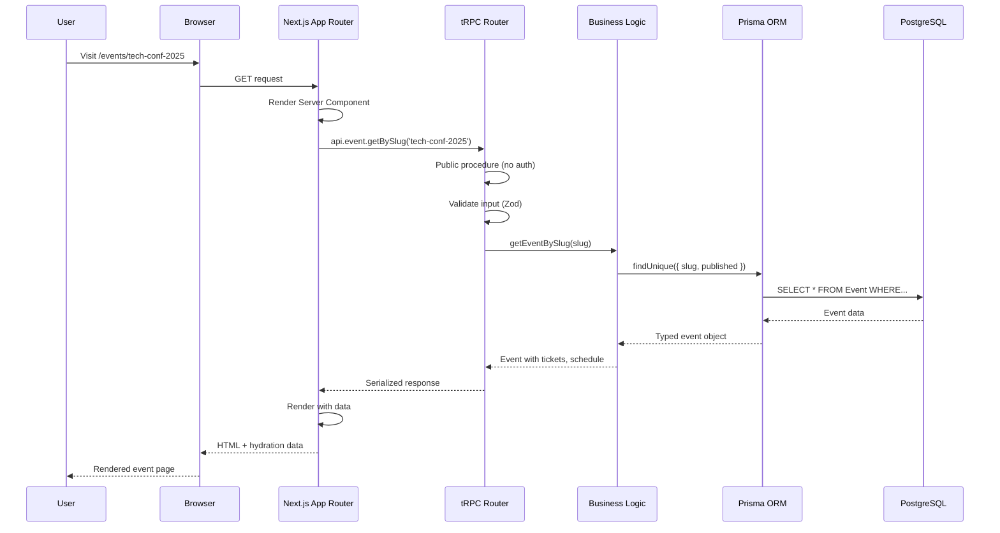
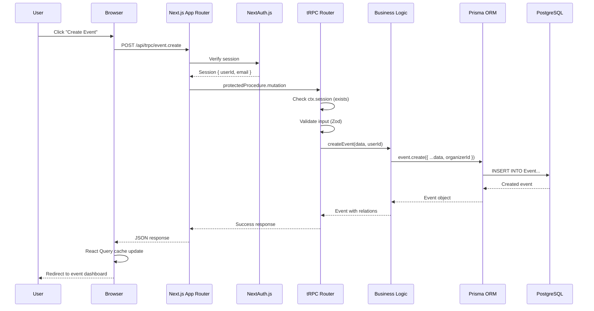
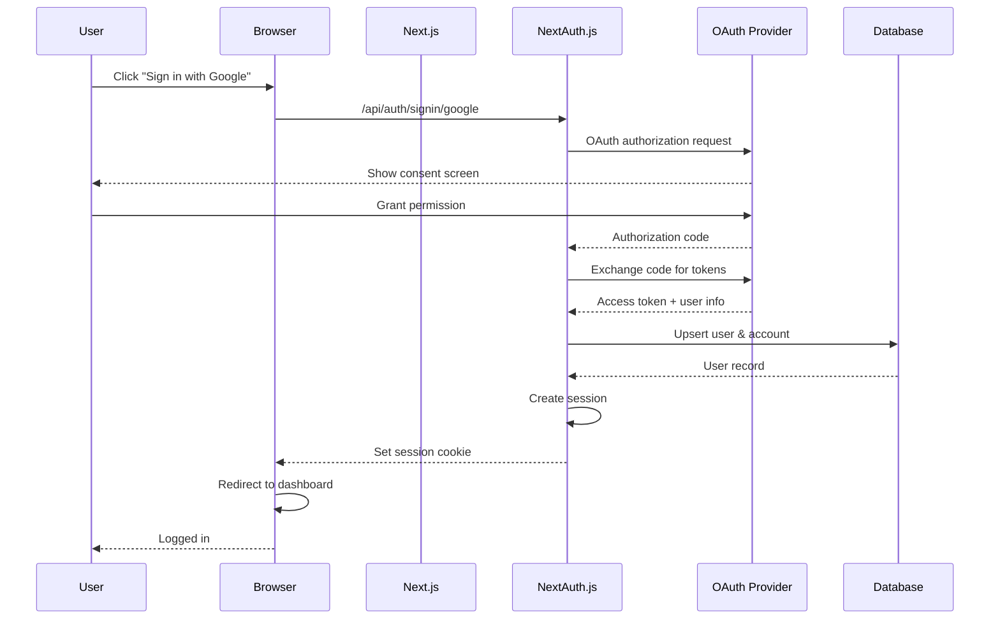
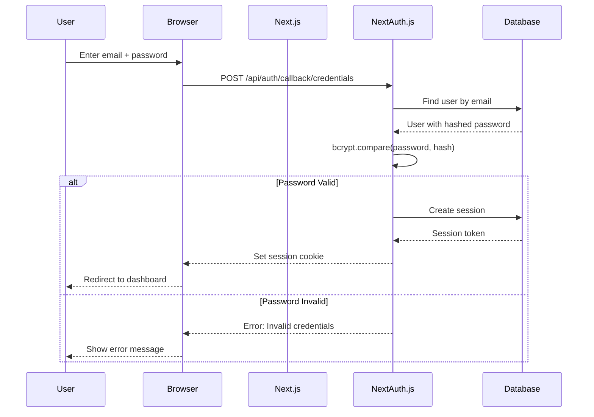
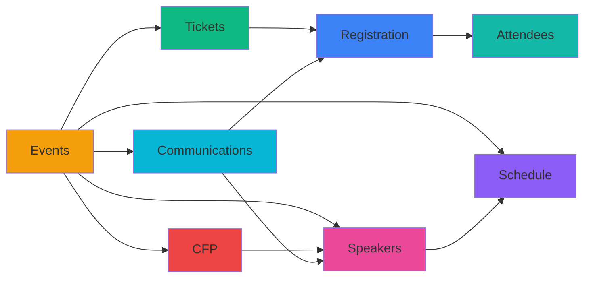
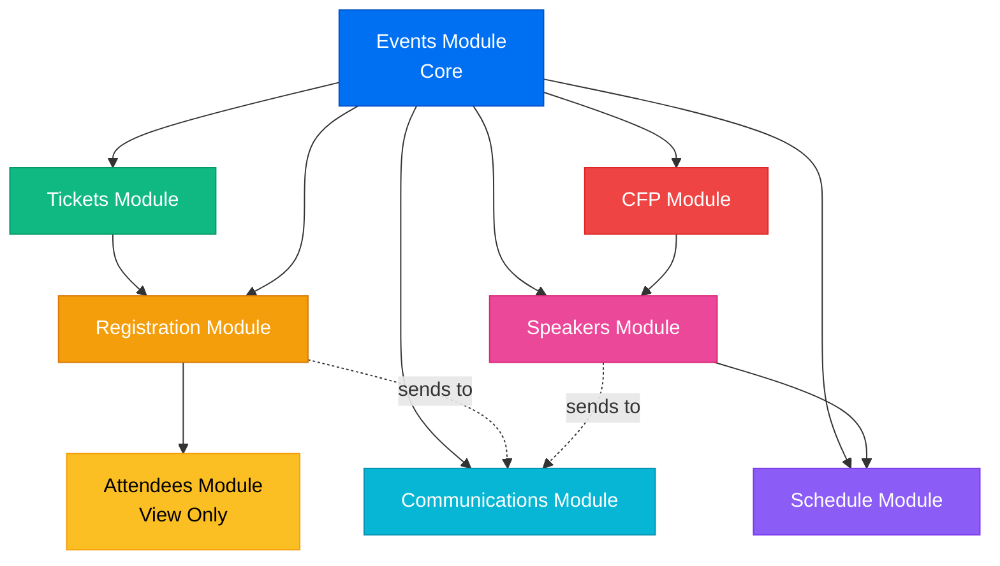

# System Overview

This document provides a high-level overview of the Events-Ting architecture, including system design, data flow patterns, and key architectural decisions.

## 🎯 System Purpose

Events-Ting is a full-stack event management platform that enables organizers to:
- Create and manage events
- Sell tickets and handle registrations
- Build event schedules with speaker assignments
- Accept and review session proposals (CFP)
- Communicate with attendees and speakers

## 🏗️ High-Level Architecture

### Architecture Diagram

```mermaid
graph TB
    subgraph "Client Layer"
        Browser[Web Browser]
        Mobile[Mobile Browser]
    end
    
    subgraph "Next.js Application Server"
        AppRouter[App Router]
        ServerComponents[Server Components]
        ClientComponents[Client Components]
        
        AppRouter --> ServerComponents
        AppRouter --> ClientComponents
    end
    
    subgraph "API Layer"
        tRPC[tRPC Procedures]
        Auth[NextAuth.js Middleware]
        Validation[Zod Validators]
        
        Auth --> tRPC
        tRPC --> Validation
    end
    
    subgraph "Business Logic Layer"
        EventService[Event Service]
        TicketService[Ticket Service]
        RegService[Registration Service]
        EmailService[Email Service]
        ScheduleService[Schedule Service]
        SpeakerService[Speaker Service]
        CFPService[CFP Service]
    end
    
    subgraph "Data Layer"
        Prisma[Prisma ORM]
        DB[(PostgreSQL)]
        
        Prisma --> DB
    end
    
    subgraph "External Services"
        Resend[Resend Email API]
        OAuth[OAuth Providers]
    end
    
    Browser --> AppRouter
    Mobile --> AppRouter
    ServerComponents --> tRPC
    ClientComponents --> tRPC
    
    tRPC --> EventService
    tRPC --> TicketService
    tRPC --> RegService
    tRPC --> EmailService
    tRPC --> ScheduleService
    tRPC --> SpeakerService
    tRPC --> CFPService
    
    EventService --> Prisma
    TicketService --> Prisma
    RegService --> Prisma
    ScheduleService --> Prisma
    SpeakerService --> Prisma
    CFPService --> Prisma
    
    EmailService --> Resend
    Auth --> OAuth
    
    style Browser fill:#e0e7ff
    style Mobile fill:#e0e7ff
    style AppRouter fill:#0070f3
    style tRPC fill:#398ccb
    style Prisma fill:#2d3748
    style DB fill:#336791
```



## 🔄 Request/Response Flow

### Public Request Flow (Unauthenticated)



### Authenticated Request Flow (Organizer Dashboard)



## 🔐 Authentication Flow

### OAuth Sign-In Flow



### Credentials Sign-In Flow



## 📊 Data Flow Patterns

### Pattern 1: Simple CRUD (Event Management)

```
User Action (Create Event)
    ↓
Client Component (EventForm)
    ↓
tRPC Mutation (event.create)
    ↓
Protected Procedure (requires auth)
    ↓
Input Validation (Zod schema)
    ↓
Authorization Check (is organizer)
    ↓
Service Layer (createEvent)
    ↓
Prisma Query (db.event.create)
    ↓
Database (INSERT)
    ↓
Response (created event)
    ↓
React Query Cache Update
    ↓
UI Update (redirect to dashboard)
```

### Pattern 2: Complex Transaction (Registration)

```
User Action (Register for Event)
    ↓
Client Component (RegistrationForm)
    ↓
tRPC Mutation (registration.create)
    ↓
Public Procedure (no auth required)
    ↓
Input Validation (email, name, ticketTypeId)
    ↓
Service Layer (createRegistration)
    ↓
Prisma Transaction Start
    ├─ Check ticket availability
    ├─ Create registration
    ├─ Decrement ticket quantity
    └─ Trigger email send
Prisma Transaction Commit
    ↓
Email Service (sendRegistrationConfirmation)
    ↓
Resend API (send transactional email)
    ↓
Response (registration + emailSent status)
    ↓
UI Update (show success + check email)
```

### Pattern 3: Cascading Updates (CFP Acceptance)

```
Organizer Action (Accept CFP Submission)
    ↓
Client Component (CFPReviewModal)
    ↓
tRPC Mutation (cfp.acceptProposal)
    ↓
Protected Procedure + Authorization
    ↓
Service Layer (acceptCfpSubmission)
    ↓
Prisma Transaction Start
    ├─ Update submission status = 'accepted'
    ├─ Create Speaker record
    ├─ Link submission to speaker
    ├─ (Optional) Create ScheduleEntry
    └─ Trigger acceptance email
Prisma Transaction Commit
    ↓
Email Service (sendCfpAcceptance)
    ↓
Response (speaker created + email sent)
    ↓
UI Update (submission marked accepted)
```

## 🧩 Architectural Layers

### Layer 1: Presentation (Next.js App Router)

**Purpose**: Render UI and handle user interactions

**Components**:
- **Server Components** (default): Fetch data, no JavaScript to client
- **Client Components** (`"use client"`): Interactive forms, buttons, modals
- **Layouts**: Shared UI structure (header, sidebar)
- **Pages**: Route-based rendering

**Key Decisions**:
- ✅ Server Components by default (performance)
- ✅ Client Components only for interactivity
- ✅ Server-side data fetching (reduce waterfall requests)
- ✅ Streaming with Suspense (progressive rendering)

### Layer 2: API (tRPC)

**Purpose**: Type-safe client-server communication

**Components**:
- **Routers**: Domain-organized API endpoints (event, ticket, etc.)
- **Procedures**: Individual API operations (create, update, list)
- **Middleware**: Auth, logging, error handling
- **Context**: Shared data (session, database client)

**Key Decisions**:
- ✅ tRPC over REST (type safety, no codegen)
- ✅ Zod validation for all inputs
- ✅ Separate public/protected procedures
- ✅ Automatic TypeScript inference

### Layer 3: Business Logic (Services)

**Purpose**: Encapsulate domain logic separate from API layer

**Components**:
- **Event Service**: Event CRUD, publishing, archiving
- **Ticket Service**: Ticket management, availability checks
- **Registration Service**: Registration flow, ticket allocation
- **Email Service**: Email composition and delivery
- **Schedule Service**: Schedule management, conflict detection
- **Speaker Service**: Speaker profiles, session assignments
- **CFP Service**: Submission flow, review, acceptance

**Key Decisions**:
- ✅ Service layer for reusability (shared logic)
- ✅ Services are testable (mock database)
- ✅ Complex transactions handled in services
- ✅ Services don't know about HTTP/tRPC

### Layer 4: Data Access (Prisma ORM)

**Purpose**: Type-safe database queries

**Components**:
- **Schema**: Database model definitions
- **Client**: Generated query builder
- **Migrations**: Version-controlled schema changes

**Key Decisions**:
- ✅ Prisma for type safety and developer experience
- ✅ PostgreSQL for relational integrity
- ✅ Migrations in version control
- ✅ Indexed columns for performance

### Layer 5: External Services

**Purpose**: Integrate third-party services

**Components**:
- **Resend**: Email delivery
- **NextAuth.js**: OAuth providers (Google, GitHub, Discord)
- **Future**: Payment processors (Stripe, Paystack)

**Key Decisions**:
- ✅ Resend for reliability and DX
- ✅ NextAuth.js for OAuth simplicity
- ✅ Abstract external services (easy to swap)

## 🔒 Security Architecture

### Authentication Layers

1. **Session-based Auth** (NextAuth.js)
   - Secure session cookies (httpOnly, secure, sameSite)
   - Session stored in database
   - Automatic session refresh

2. **Authorization Checks**
   - **protectedProcedure**: Requires authenticated user
   - **Organizer checks**: Verify event ownership
   - **Resource-level permissions**: Check user can access resource

3. **Input Validation**
   - Zod schemas for all inputs
   - Type coercion and sanitization
   - Custom validation rules

### Data Security

- **SQL Injection**: Prevented by Prisma (parameterized queries)
- **XSS**: React auto-escapes output
- **CSRF**: NextAuth.js CSRF tokens
- **Secrets**: Environment variables, never in code
- **Password Hashing**: bcrypt with salt rounds

## 🚀 Performance Considerations

### Database Optimization

- **Indexes**: Strategic indexes on frequently queried columns
  - `Event`: organizerId, slug, status, startDate
  - `Registration`: eventId, ticketTypeId, email
  - `ScheduleEntry`: eventId, startTime
  - `Speaker`: eventId, email

- **Eager Loading**: Include related data to avoid N+1 queries
  ```typescript
  // Good: Single query
  db.event.findMany({
    include: { ticketTypes: true, organizer: true }
  })
  
  // Bad: N+1 queries
  const events = await db.event.findMany()
  for (const event of events) {
    event.ticketTypes = await db.ticketType.findMany(...)
  }
  ```

- **Pagination**: Always paginate large lists
  ```typescript
  db.registration.findMany({
    take: 50,
    skip: page * 50,
    orderBy: { registeredAt: 'desc' }
  })
  ```

### Caching Strategy

- **React Query**: Client-side cache (5 min stale time)
- **Server Components**: Built-in request deduplication
- **Database**: Connection pooling (Prisma)
- **Static Pages**: Public event pages (ISR future)

### Code Splitting

- **Dynamic Imports**: Load heavy components on demand
- **Route-based Splitting**: Automatic by Next.js
- **Lazy Loading**: Images, charts, modals

## 📈 Scalability Considerations

### Current Architecture (MVP)

- **Single Region**: One database, one app server
- **Vertical Scaling**: Increase server resources
- **Connection Pooling**: Prisma handles connection reuse

### Future Scalability (Beyond MVP)

- **Horizontal Scaling**: Multiple app server instances (Vercel auto-scales)
- **Database Replication**: Read replicas for heavy read workloads
- **CDN**: Static assets and images
- **Queue System**: Background jobs (email sending, exports)
- **Caching Layer**: Redis for session storage and hot data

## 🧪 Testing Strategy (Future)

### Unit Tests
- Service layer functions
- Validation schemas
- Utility functions

### Integration Tests
- tRPC procedures
- Database transactions
- Email sending

### E2E Tests
- Critical user flows (registration, event creation)
- Payment flows (when implemented)
- CFP submission and review

## 📊 Monitoring & Observability (Future)

- **Error Tracking**: Sentry for production errors
- **Performance**: Next.js Analytics
- **Logs**: Structured logging with Winston
- **Metrics**: Database query performance
- **Alerts**: Email delivery failures, database connection issues

## 🔄 Deployment Architecture

### Development
```
Developer Machine
    ↓
Local PostgreSQL
    ↓
pnpm run dev (localhost:3000)
```

### Production (Vercel)
```
GitHub (main branch)
    ↓
Vercel Deploy
    ↓
Edge Network (Vercel)
    ↓
App Server (Node.js)
    ↓
PostgreSQL (Managed Service)
    ↓
Resend API
```

## 🗂️ Module Relationships



**Module Dependencies**:
- **Events**: Core module, no dependencies
- **Tickets**: Depends on Events
- **Registration**: Depends on Events, Tickets
- **Attendees**: View layer over Registration
- **Schedule**: Depends on Events, Speakers
- **Speakers**: Depends on Events (can be created via CFP)
- **CFP**: Depends on Events (creates Speakers on acceptance)
- **Communications**: Depends on Events (sends to Registrations, Speakers)

### Module Dependency Graph



**Legend**:
- Solid arrows: Direct dependencies
- Dashed arrows: Communication/integration points

## 📚 Related Documentation

- **[Tech Stack](./tech-stack.md)** - Detailed technology choices
- **[Data Model](./data-model.md)** - Database schema and relationships
- **[Authentication](./authentication.md)** - Auth implementation details
- **[File Structure](./file-structure.md)** - Project organization

---

[← Back to Documentation Index](../index.md) | [Tech Stack →](./tech-stack.md)

**Last Updated**: November 10, 2025  
**Next Review**: December 10, 2025
