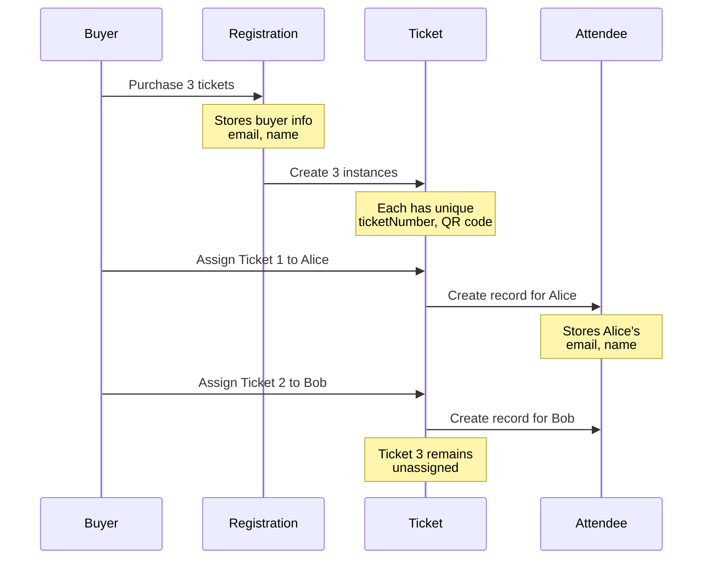

# Attendees Data Model

## Primary Model: Attendee

```prisma
model Attendee {
  id String @id @default(cuid())

  // Attendee Personal Information
  name  String  // Person attending event
  email String  // Their email address
  
  // Custom registration form responses
  customData Json? // Answers to event-specific questions
  
  // Email delivery status
  emailStatus String @default("active") // 'active' | 'bounced' | 'unsubscribed'
  
  // Relations
  ticket Ticket? // One-to-one with ticket
  
  // Optional user account link
  userId String?
  user   User?   @relation(...)
  
  createdAt DateTime @default(now())
  updatedAt DateTime @updatedAt
}
```

## Field Descriptions

### Personal Information

| Field | Type | Description |
|-------|------|-------------|
| `name` | String | Attendee's full name (person using the ticket) |
| `email` | String | Attendee's email (where ticket is sent) |

**Important**:
- These are **attendee details**, not buyer details
- Buyer information is in Registration model
- One buyer can create multiple attendees

### Custom Data (JSON)

Stores attendee responses to event-specific custom fields:

```typescript
// Example customData structure
{
  "dietary_restrictions": "vegetarian",
  "t_shirt_size": "M",
  "arrival_time": "morning",
  "special_needs": "wheelchair access"
}
```

**Use Cases**:
- Dietary preferences for catering
- T-shirt sizes for swag
- Workshop preferences
- Accessibility needs
- Any event-specific questions

### Email Status

| Value | Meaning | Impact |
|-------|---------|--------|
| `active` | Can receive emails | ✅ Sent all communications |
| `bounced` | Email delivery failed | ❌ Excluded from email sends |
| `unsubscribed` | Opted out | ❌ Excluded from email sends |

**Updated via**: Email service webhooks (Resend, SendGrid, etc.)

## Relationships

### Belongs To: Ticket (One-to-One)

```prisma
ticket Ticket? @relation(...)
```

- Each attendee linked to exactly one ticket
- Ticket can exist without attendee (unassigned)
- When ticket assigned → Attendee record created
- When ticket unassigned → Attendee record deleted (GDPR)

### Optional: User Account

```prisma
userId String?
user   User?   @relation(...)
```

- Attendee can be linked to registered user
- Allows users to view their upcoming events
- Not required - supports guest attendees

## Lifecycle

### Creation
```typescript
// Created during ticket assignment
const attendee = await db.attendee.create({
  data: {
    name: "Bob Smith",
    email: "bob@example.com",
    customData: {
      dietary_restrictions: "vegan",
      t_shirt_size: "L"
    }
  }
});

await db.ticket.update({
  where: { id: ticketId },
  data: { 
    attendeeId: attendee.id,
    isAssigned: true
  }
});
```

### Reassignment (GDPR Compliant)
```typescript
// Old attendee deleted, new one created
await db.attendee.delete({
  where: { id: oldAttendeeId }  // Removes personal data
});

const newAttendee = await db.attendee.create({
  data: {...}
});

await db.ticket.update({
  where: { id: ticketId },
  data: { attendeeId: newAttendee.id }
});
```

### Deletion
- Deleted when ticket unassigned
- Deleted when ticket deleted (cascade)
- Deleted when event deleted (cascade via ticket)

## Common Queries

### List All Attendees for Event
```typescript
const attendees = await db.attendee.findMany({
  where: {
    ticket: {
      eventId: eventId
    }
  },
  include: {
    ticket: {
      include: {
        ticketType: true,
        registration: true  // Can see buyer info
      }
    }
  }
});
```

### Export Attendee Data
```typescript
const attendees = await db.attendee.findMany({
  where: {
    ticket: { eventId },
    emailStatus: "active"  // Only active emails
  },
  select: {
    name: true,
    email: true,
    customData: true,
    ticket: {
      select: {
        ticketNumber: true,
        ticketType: { select: { name: true } },
        isCheckedIn: true
      }
    }
  }
});
```

### Search Attendees
```typescript
const results = await db.attendee.findMany({
  where: {
    ticket: { eventId },
    OR: [
      { name: { contains: search, mode: 'insensitive' } },
      { email: { contains: search, mode: 'insensitive' } }
    ]
  }
});
```

### Get Attendee with Purchase Info
```typescript
const attendee = await db.attendee.findUnique({
  where: { id: attendeeId },
  include: {
    ticket: {
      include: {
        registration: {
          select: {
            name: true,     // Buyer name
            email: true,    // Buyer email
            registeredAt: true
          }
        },
        ticketType: {
          select: { name: true }
        }
      }
    }
  }
});

// attendee.email = attendee email
// attendee.ticket.registration.email = buyer email (who purchased)
// These can be different people!
```

## Data Privacy (GDPR)

### Personal Data Stored
- ✅ Name (PII)
- ✅ Email (PII)
- ✅ Custom field answers (potentially sensitive)

### Privacy Safeguards

**Deletion on Reassignment**:
- Old attendee data immediately deleted
- No historical record of previous assignments
- Complies with "right to be forgotten"

**Access Control**:
- Only event organizers can view attendee list
- Buyers cannot see other attendees (only their own tickets)
- Attendees cannot see other attendees

**Email Preferences**:
- Unsubscribe respected (emailStatus tracking)
- Bounced emails not sent (waste prevention)

### Export Considerations
- Organizers responsible for secure storage
- Delete exports after event if not needed
- Comply with local data protection laws
- Provide opt-out mechanisms

## Indexes

```prisma
@@index([email])         // Search by email
@@index([emailStatus])   // Filter active recipients
@@index([userId])        // User's attended events
```

## Validation

**Application-Level Rules**:
- Name: 2-100 characters
- Email: Valid email format
- Custom data: Matches event's custom field schema
- Email status: Must be 'active' | 'bounced' | 'unsubscribed'

## Data Flow Diagram



## Comparison: Registration vs Attendee

| Aspect | Registration | Attendee |
|--------|-------------|----------|
| **Represents** | Purchase transaction | Event participant |
| **Who** | Buyer (who paid) | Person attending |
| **Created when** | Ticket purchased | Ticket assigned |
| **Email field** | Buyer's email | Attendee's email |
| **Name field** | Buyer's name | Attendee's name |
| **Quantity** | Can purchase multiple | Always 1 person |
| **Custom data** | Purchase metadata | Form responses |
| **Relationship** | Has many tickets | Belongs to one ticket |
| **Export use** | Financial records | Event operations |

## Common Mistakes

### Mistake 1: Expecting Buyer Data in Attendee
```typescript
// ❌ WRONG: Attendee doesn't have purchase info directly
const attendee = await db.attendee.findUnique({
  where: { email: "buyer@example.com" }  // This is attendee email!
});

// ✅ RIGHT: Access buyer via ticket → registration
const attendee = await db.attendee.findUnique({
  where: { id: attendeeId },
  include: {
    ticket: {
      include: {
        registration: true  // Buyer information here
      }
    }
  }
});
```

### Mistake 2: Counting Attendees as Registrations
```typescript
// ❌ WRONG: Counts purchases, not attendees
const count = await db.registration.count({
  where: { eventId }
});

// ✅ RIGHT: Count attendees
const count = await db.attendee.count({
  where: {
    ticket: { eventId }
  }
});
```

### Mistake 3: Updating Attendee Instead of Deleting on Reassignment
```typescript
// ❌ WRONG: Violates GDPR (keeps old data)
await db.attendee.update({
  where: { id: oldAttendeeId },
  data: { name: "New Person", email: "new@example.com" }
});

// ✅ RIGHT: Delete old, create new
await db.attendee.delete({ where: { id: oldAttendeeId } });
const newAttendee = await db.attendee.create({ data: {...} });
```

## Related Models

### Ticket
**Module**: [Tickets Module](../tickets/)  
**Relationship**: Parent (one-to-one)  
**Usage**: Every attendee belongs to exactly one ticket

### Registration
**Module**: [Registration Module](../registration/)  
**Relationship**: Indirect (via Ticket)  
**Usage**: Attendee can trace back to buyer via ticket.registration

### Event
**Module**: [Events Module](../events/)  
**Relationship**: Indirect (via Ticket)  
**Usage**: Attendee belongs to event via ticket.event

## Future Enhancements

### Model Extensions

**Additional Fields**:
```prisma
// Future additions
checkedIn       Boolean?  // Check-in status
checkedInAt     DateTime? // Check-in timestamp
checkInLocation String?   // Where they checked in
badges          Badge[]   // Printed badges
```

### Relationships
- Check-in logs (new model)
- Session attendance (new model)
- Networking connections (new model)

### Audit Trail
Consider adding audit log for:
- Attendee creation
- Email status changes
- Ticket reassignments
- Check-in events

## Performance Considerations

### Index Strategy
All indexes support common query patterns:
- Event attendee listings: Composite index on ticket.eventId
- Search: `[email]`, `[name]`
- Email filtering: `[emailStatus]`
- User events: `[userId]`

### Query Optimization
- Use `include` for related data (single query)
- Filter at database level when possible
- Aggregate functions for counts

### Scaling Considerations
- Partition by event year for large events
- Archive old attendees after event
- Consider read replicas for exports

## Security Considerations

### Data Access
- ✅ Only event organizers can view attendees
- ✅ Attendees can view their own ticket
- ❌ No public access to attendee list
- ❌ Buyers cannot see other attendees

### PII Protection
- Email and name are sensitive data
- Custom data may contain dietary/medical info
- Exports should be encrypted
- Delete exports securely after use

### GDPR Compliance
- Right to access: Attendees can request their data
- Right to erasure: Ticket unassignment deletes attendee
- Right to rectification: Support ticket reassignment
- Data minimization: Only collect necessary fields
