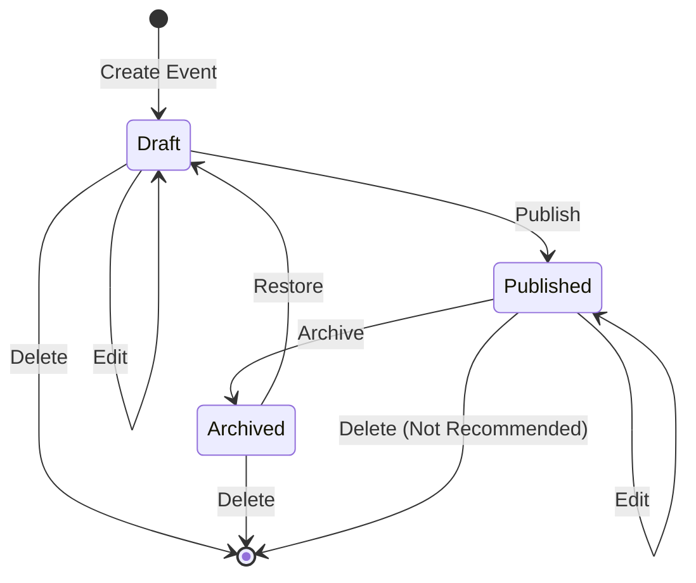

# Events Workflows

## Workflow 1: Create and Publish Event

**Actors**: Event Organizer  
**Trigger**: Organizer wants to create a new event

### Steps

**1. Navigate to Event Creation**
- **Action**: Click "Create Event" button on dashboard
- **UI**: `/(dashboard)/page.tsx`
- **Route**: Navigate to `/dashboard/new`

**2. Fill Out Event Form**
- **Action**: Enter event details in EventForm component
- **UI**: `EventForm` component
- **Fields**:
  - Event name (auto-generates slug)
  - Description
  - Location type (in-person/virtual/hybrid)
  - Address (if applicable)
  - URL (if applicable)
  - Timezone selection
  - Start and end dates
  - Status (default: draft)

**3. Submit Event Creation**
- **API**: `event.create` mutation
- **Validation**: Zod schema validates:
  - Slug uniqueness
  - Date logic (endDate > startDate)
  - Location requirements based on type
- **Database**: Insert new Event record with `organizerId` from session

**4. Success Redirect**
- **Action**: Redirect to new event dashboard
- **Route**: `/dashboard/{eventId}`
- **UI**: Show success toast message

**5. Add Ticket Types (Optional)**
- **Action**: Navigate to Tickets tab
- **Module**: Tickets Module
- **See**: [Tickets Module Workflows](../tickets/workflows.md)

**6. Publish Event**
- **Action**: Edit event, change status to "published"
- **API**: `event.update` mutation
- **Effect**: Event becomes visible on public listings

### Success Criteria
- ✅ Event created in database
- ✅ Organizer redirected to event dashboard
- ✅ Event appears in organizer's event list
- ✅ Event becomes visible on public pages when published

### Error Handling
- **Slug conflict**: Show error, suggest alternative slug
- **Validation errors**: Highlight invalid fields with error messages
- **Network errors**: Show retry option

---

## Workflow 2: Edit Event Details

**Actors**: Event Organizer  
**Trigger**: Organizer needs to update event information

### Steps

**1. Navigate to Event**
- **Action**: Click event from dashboard
- **API**: `event.getById` query
- **UI**: `/(dashboard)/[id]/page.tsx`

**2. Click Edit Button**
- **Action**: Navigate to edit page
- **Route**: `/dashboard/{eventId}/edit`
- **UI**: EventForm with `initialData` prop

**3. Modify Fields**
- **Action**: Update any event fields
- **Validation**: Real-time validation as user types

**4. Save Changes**
- **API**: `event.update` mutation
- **Validation**:
  - If slug changed, check uniqueness
  - Validate date logic
  - Validate location requirements

**5. Success Feedback**
- **Action**: Show success message
- **Route**: Return to event dashboard

### Success Criteria
- ✅ Event updated in database
- ✅ Changes visible immediately on dashboard
- ✅ `updatedAt` timestamp updated

### Error Handling
- **Slug taken**: Show error, revert to original slug
- **Concurrent edit**: Show error if `updatedAt` doesn't match (optimistic concurrency)

---

## Workflow 3: Archive Event

**Actors**: Event Organizer  
**Trigger**: Event is completed or cancelled

### Steps

**1. Open Archive Modal**
- **Action**: Click "Archive Event" button
- **UI**: ArchiveModal component
- **Warning**: Shows explanation that data is preserved

**2. Confirm Archival**
- **Action**: Click "Confirm" button
- **API**: `event.archive` mutation
- **Database Changes**:
  - `isArchived` = `true`
  - `status` = `'archived'`

**3. Update UI**
- **Action**: Event removed from active listings
- **Route**: Redirect to dashboard
- **Toast**: "Event archived successfully"

**4. View Archived Events**
- **Action**: Filter dashboard by archived status
- **API**: `event.list` with `status: 'archived'`

### Success Criteria
- ✅ Event soft-deleted (not hard-deleted)
- ✅ Event hidden from public pages
- ✅ Event still accessible to organizer
- ✅ All related data preserved (registrations, tickets, etc.)

### Error Handling
- **Already archived**: Show error message
- **Network error**: Keep modal open, show retry option

---

## Workflow 4: Restore Archived Event

**Actors**: Event Organizer  
**Trigger**: Organizer wants to bring back an archived event

### Steps

**1. View Archived Events**
- **Action**: Filter dashboard by "Archived" status
- **API**: `event.list` with `status: 'archived'`

**2. Click Restore**
- **Action**: Click "Restore" button on event card
- **API**: `event.restore` mutation
- **Database Changes**:
  - `isArchived` = `false`
  - `status` = `'draft'` (requires review before republishing)

**3. Review and Republish**
- **Action**: Edit event if needed
- **Action**: Change status to "published"
- **API**: `event.update` mutation

### Success Criteria
- ✅ Event returned to active state
- ✅ Event visible to organizer (draft mode)
- ✅ Can be published again after review

---

## Workflow 5: Public Event Discovery

**Actors**: Public User (not authenticated)  
**Trigger**: User wants to find events to attend

### Steps

**1. Browse Event Listings**
- **Route**: `/events` (public listing page)
- **API**: `event.list` query (no auth required)
- **Filters Applied**: Only `status: 'published'` and `isArchived: false`

**2. View Event Details**
- **Action**: Click event card
- **Route**: `/events/{slug}`
- **API**: `event.getBySlug` query
- **UI**: Full event page with:
  - Event details
  - Available tickets
  - Registration button
  - Schedule (if published)
  - Speakers (if any)

**3. Register for Event**
- **Action**: Click "Register" button
- **Module**: Registration Module
- **See**: [Registration Module Workflows](../registration/workflows.md)

### Success Criteria
- ✅ User can discover published events
- ✅ User can view event details without authentication
- ✅ User can proceed to registration

### Access Control
- ❌ Cannot see draft events
- ❌ Cannot see archived events
- ❌ Cannot access organizer dashboard

---

## Workflow 6: View Event Metrics

**Actors**: Event Organizer  
**Trigger**: Organizer wants to check event performance

### Steps

**1. Navigate to Event Dashboard**
- **Route**: `/dashboard/{eventId}`
- **API**: `event.getById` query
- **API**: `event.getMetrics` query

**2. View Metrics Widget**
- **UI**: EventMetrics component
- **Displays**:
  - Total registrations
  - Total ticket types
  - Total schedule entries
  - Total speakers
  - Total email campaigns
  - Recent registrations (last 5)

**3. Drill Down**
- **Action**: Click on metric to see details
- **Navigation**:
  - Registrations → `/dashboard/{eventId}/registrations`
  - Tickets → `/dashboard/{eventId}/tickets`
  - Schedule → `/dashboard/{eventId}/schedule`
  - Speakers → `/dashboard/{eventId}/speakers`
  - Communications → `/dashboard/{eventId}/communications`

### Success Criteria
- ✅ Real-time metrics displayed
- ✅ Quick overview of event status
- ✅ Easy navigation to detailed views

---

## Workflow 7: Delete Event (Permanent)

**Actors**: Event Organizer  
**Trigger**: Organizer wants to permanently remove event

**⚠️ WARNING**: This is destructive and cascades to all related data

### Steps

**1. Archive Event First**
- **Recommended**: Archive instead of delete
- **Reason**: Preserves all data

**2. If Delete Is Necessary**
- **Action**: Click "Delete Permanently" button
- **UI**: Confirmation modal with strong warning
- **Warning Text**: "This will permanently delete the event and ALL related data including registrations, tickets, speakers, and email campaigns. This action CANNOT be undone."

**3. Type Event Name to Confirm**
- **Security**: Require typing event name exactly
- **Prevents**: Accidental deletions

**4. Execute Deletion**
- **API**: `event.delete` mutation
- **Database**: Cascading delete removes:
  - Event record
  - All ticket types
  - All registrations
  - All schedule entries
  - All speakers
  - Call for papers
  - All email campaigns

**5. Redirect**
- **Route**: Back to dashboard
- **Toast**: "Event permanently deleted"

### Success Criteria
- ✅ Event and all related data removed
- ✅ Freed up event slug for reuse
- ⚠️ Data cannot be recovered

### Best Practice
**Use archival instead of deletion** to preserve historical data and analytics.

---

## State Transition Diagram

---

## Common Pitfalls

### Slug Conflicts
**Problem**: User tries to use a slug that's already taken  
**Solution**: Check slug availability in real-time, suggest alternatives

### Date Logic Errors
**Problem**: End date before start date  
**Solution**: Validate dates on frontend and backend

### Location Type Mismatch
**Problem**: Virtual event without URL, or in-person event without address  
**Solution**: Conditional form validation based on location type

### Timezone Confusion
**Problem**: Dates displayed in wrong timezone  
**Solution**: Always use event's timezone for display, store in UTC

### Premature Deletion
**Problem**: Organizer deletes event with registrations  
**Solution**: Archive instead, warn about data loss if deleting

---

## Integration Points

This workflow integrates with:
- **Tickets Module**: After creating event, add ticket types
- **Registration Module**: Public users register for published events
- **Schedule Module**: Add schedule entries to published events
- **Communications Module**: Send emails to event registrants
