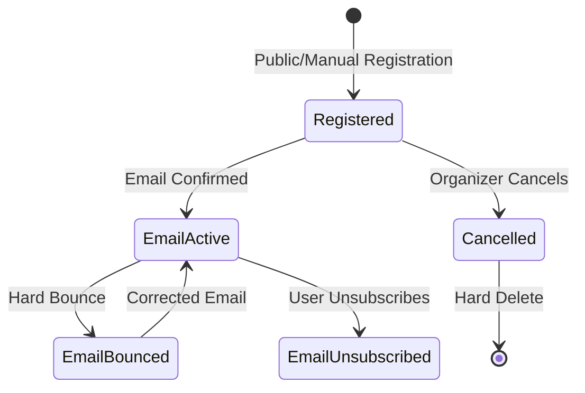

# Registration Workflows

## Workflow 1: Buyer Purchases Tickets

**Actors**: Public User (Buyer)  
**Trigger**: User wants to purchase tickets for an event

### Steps

**1. Browse Events**
- **Action**: Navigate to `/events` or discover event via link
- **UI**: Public event listing page
- **Available**: No authentication required

**2. View Event Details**
- **Action**: Click on event card or visit `/events/{slug}`
- **API**: `event.getBySlug` query
- **UI**: Full event page with:
  - Event description
  - Date, time, location
  - Available ticket types (filtered by sale period)
  - Registration count

**3. Select Ticket Type and Quantity**
- **Action**: Review available ticket types
- **Display**: Shows only tickets where:
  - Current date is within sale period (or no restrictions)
  - Quantity > sold count (availability > 0)
- **UI**: Ticket cards with:
  - Name and description
  - Price (MVP: all free)
  - Availability (X of Y remaining)
  - Quantity selector (1-10 tickets, configurable per event)
  - "Purchase" button

**4. Open Purchase Form**
- **Action**: Click "Purchase" button for desired ticket
- **Route**: Opens modal or navigates to purchase form
- **Component**: `PurchaseForm` (renamed from `RegistrationForm`)
- **Props Passed**:
  - `ticketTypeId`
  - `ticketTypeName`
  - `eventName`
  - `maxQuantity`

**5. Fill Purchase Form**
- **Required Fields**:
  - Buyer Full Name (who is making the purchase)
  - Buyer Email Address (for purchase confirmation)
  - Number of Tickets (quantity selector)
- **Note**: This is BUYER information, not attendee information
- **Help Text**: "After purchase, you'll assign each ticket to attendees"
- **Validation**: Client-side validation on blur/submit

**6. Submit Purchase**
- **Action**: Click "Complete Purchase" button
- **API**: `registration.create` mutation
- **Backend Process**:
  1. Database transaction begins
  2. `SELECT FOR UPDATE` locks TicketType row
  3. Checks availability (quantity × purchase count)
  4. Validates sale period
  5. Creates Registration record (purchase transaction)
  6. **Creates X Ticket instances** (where X = quantity)
  7. Each ticket gets unique ticketNumber and QR code
  8. Transaction commits
  9. Sends purchase confirmation email (async)

**7. See Purchase Confirmation**
- **Success UI**: 
  - "Purchase Confirmed! 🎉" heading
  - Event name
  - Number of tickets purchased
  - First ticket number as reference code
  - Link to ticket management dashboard
  - Email confirmation notice

**8. Receive Purchase Confirmation Email**
- **Timing**: Within seconds (async)
- **Template**: `RegistrationConfirmation`
- **Contents**:
  - Purchase summary
  - Number of tickets purchased
  - Link to manage tickets (assign to attendees)
  - Event details
  - Instructions for ticket assignment
- **Subject**: "Purchase Confirmed: {Event Name}"

**9. Assign Tickets to Attendees** (See Tickets Module)
- Buyer accesses ticket management dashboard
- Assigns each ticket to an attendee (can be themselves or others)
- Each assignment creates Attendee record
- Attendee receives separate ticket email with QR code

### Success Criteria
- ✅ Registration (purchase) created in database
- ✅ X Ticket instances created with unique QR codes
- ✅ Ticket sold count incremented atomically
- ✅ Purchase confirmation email sent to buyer
- ✅ Buyer receives link to ticket management dashboard

### Key Differences from Old Flow
- ❌ OLD: "Attendee registers and receives ticket"
- ✅ NEW: "Buyer purchases tickets, then assigns to attendees"
- Registration ≠ Attendee record
- One purchase can create multiple tickets
- Attendee information collected during assignment (Tickets module)

### Error Handling

**Ticket Sold Out**:
```
Error: "This ticket type is sold out. Please try another ticket type."
Code: BAD_REQUEST
UI: Show error banner, list other available tickets
```

**Sale Period Invalid**:
```
Error: "Ticket sales have not started yet" or "Ticket sales have ended"
Code: BAD_REQUEST
UI: Show error banner with sale dates
```

**Validation Errors**:
```
Error: Field-specific messages
UI: Highlight invalid fields, show error text below
```

**Network/Server Errors**:
```
Error: Generic error message
UI: "Registration failed. Please try again."
Action: Retry button available
```

**Email Failure** (Non-blocking):
```
Status: Registration still successful
Logging: Error logged server-side
UI: Success message still shown
Note: Organizer can resend via dashboard
```

---

## Workflow 2: Organizer Views Purchases

**Actors**: Event Organizer  
**Trigger**: Organizer wants to view purchase transactions (who bought tickets)

### Steps

**1. Navigate to Dashboard**
- **Route**: Sign in → `/dashboard`
- **API**: `event.list` query (user's events)
- **UI**: Event cards with metrics

**2. Select Event**
- **Action**: Click "Manage" on event card
- **Route**: `/dashboard/{eventId}`
- **UI**: Event-specific dashboard

**3. Navigate to Attendees**
- **Action**: Click "Attendees" tab in navigation
- **Route**: `/dashboard/{eventId}/attendees`
- **API**: `event.getById` (authorization check)

**4. View Purchase Table**
- **Component**: `AttendeeTable` (displays buyer data)
- **API**: `registration.list` infinite query
- **Initial Load**: First 50 purchases
- **Display**:
  - Buyer Name, Buyer Email
  - Ticket Type (badge)
  - Quantity Purchased
  - Payment Status (badge)
  - Purchase Date
  - Action buttons

**Note**: To see attendee information, use:
- Tickets module (individual assignments)
- Attendees module (all attendees, export features)

**5. Search/Filter (Optional)**
- **Search**: Type name or email
  - Debounced by 500ms
  - Searches both fields
  - Case-insensitive
- **Filter**: Select ticket type from dropdown
  - Updates query immediately
- **API**: Re-fetches with new parameters

**6. Load More Results**
- **Action**: Click "Load More" button
- **API**: `fetchNextPage()` from infinite query
- **Display**: Appends next 50 results

### Success Criteria
- ✅ Only organizer can access
- ✅ Real-time data displayed
- ✅ Search and filter work correctly
- ✅ Pagination loads smoothly

### Error Handling

**Not Authorized**:
```
Error: "You do not have permission..."
Code: FORBIDDEN
UI: Redirect to dashboard or show 403 page
```

**Event Not Found**:
```
Error: "Event not found"
Code: NOT_FOUND
UI: Redirect to dashboard
```

---

## Workflow 3: Export Purchase Data

**Actors**: Event Organizer  
**Trigger**: Organizer needs buyer information for financial reconciliation or contact purposes

### Steps

**1. Access Attendee Table**
- **Route**: `/dashboard/{eventId}/attendees`
- **Prerequisite**: Must be event organizer

**2. Click Export Button**
- **Action**: Click "Export CSV" button
- **UI**: Button shows "Exporting..." state
- **Disabled**: Button disabled during export

**3. Server Generates CSV**
- **API**: `registration.export` mutation
- **Backend Process**:
  1. Fetches ALL registrations for event
  2. Includes ticket type names
  3. Generates CSV format with proper escaping
  4. Creates data URI
  5. Returns download info

**4. Download Triggers**
- **Client-side**:
  ```typescript
  const link = document.createElement("a");
  link.href = data.url;
  link.download = data.filename;
  link.click();
  ```
- **Filename**: `{event-slug}-attendees-{date}.csv`
- **Example**: `tech-conf-2025-attendees-2025-11-18.csv`

**5. File Downloaded**
- **Location**: User's default download folder
- **Format**: CSV with UTF-8 encoding
- **Columns**:
  - Buyer Name
  - Buyer Email
  - Ticket Type
  - Quantity Purchased
  - Purchase Date (ISO format)
  - Payment Status

**What Does NOT Get Exported**:
- ❌ Attendee names/emails (use Attendees module export)
- ❌ Ticket assignment status
- ❌ Custom registration field answers

**Use Case**: Financial reconciliation, buyer contact lists, not attendee data

### Success Criteria
- ✅ CSV file downloads automatically
- ✅ All registrations included
- ✅ Special characters properly escaped
- ✅ Opens in Excel/Google Sheets correctly

### Error Handling

**Not Authorized**:
```
Error: "You do not have permission to export this data"
Code: FORBIDDEN
UI: Toast error message
```

**Export Failure**:
```
Error: "Failed to generate export"
UI: Toast error, retry button
```

### CSV Format Example
```csv
Buyer Name,Buyer Email,Ticket Type,Quantity,Purchase Date,Payment Status
"Doe, John",john@example.com,General Admission,3,2025-01-15T10:30:00Z,free
Jane Smith,jane@example.com,VIP Pass,1,2025-01-16T14:20:00Z,free
"O'Brien, Mike",mike@example.com,Early Bird,5,2025-01-17T09:15:00Z,free
```

**Note**: One row per purchase. If John bought 3 tickets, shows 1 row with quantity=3. For attendee list (3 rows), use Attendees module export.

**See Also**: [Exports Documentation](./exports.md)

---

## Workflow 4: Resend Purchase Confirmation Email

**Actors**: Event Organizer  
**Trigger**: Buyer didn't receive confirmation or lost email

### Steps

**1. Locate Purchase**
- **Route**: `/dashboard/{eventId}/attendees`
- **Action**: Search for buyer by name or email
- **UI**: `AttendeeTable` component (displays purchases)

**2. Click Resend Button**
- **Action**: Click mail icon (📧) in Actions column
- **UI**: Button for specific registration row
- **Confirmation**: Optional - immediate action or confirm dialog

**3. Server Resends Email**
- **API**: `registration.resendConfirmation` mutation
- **Input**: `{ id: registrationId }`
- **Backend Process**:
  1. Verifies organizer authorization
  2. Fetches purchase details
  3. Extracts first ticket number as reference
  4. Sends email with purchase confirmation template
  5. Includes link to ticket management dashboard
  6. Returns success message

**4. Confirmation Shown**
- **Success**: Toast notification
- **Message**: "Purchase confirmation resent to {email}"
- **UI**: Brief success indicator

**5. Buyer Receives Email**
- **Timing**: Within seconds
- **Template**: Same as original purchase confirmation
- **Contents**: Purchase details + ticket management link

### Success Criteria
- ✅ Email sent successfully
- ✅ Contains correct registration code
- ✅ Attendee receives within seconds
- ✅ Organizer sees success confirmation

### Error Handling

**Email Service Failure**:
```
Error: Email service error message
UI: Toast error, try again button
Logging: Error logged for debugging
```

**Registration Not Found**:
```
Error: "Registration not found"
Code: NOT_FOUND
UI: Toast error message
```

### Use Cases
- Buyer's email went to spam
- Buyer deleted email accidentally
- Email address had typo (update first, then resend)
- Buyer needs ticket management link again

---

## Workflow 5: Manually Add Purchase

**Actors**: Event Organizer  
**Trigger**: Organizer needs to create purchase manually (VIP, comp tickets, etc.)

### Steps

**1. Access Add Form**
- **Route**: `/dashboard/{eventId}/attendees`
- **Action**: Click "Add Attendee" button
- **UI**: Modal or dedicated page opens

**2. Fill Purchase Form**
- **Required Fields**:
  - Buyer Full Name
  - Buyer Email Address
  - Ticket Type (dropdown)
  - Quantity (number of tickets)
- **Optional**:
  - Send Confirmation Email (checkbox, default: true)

**3. Submit Form**
- **Action**: Click "Add Purchase" button
- **API**: `registration.addManually` mutation
- **Backend Process**:
  1. Verifies organizer authorization
  2. **Bypasses availability check** (organizer privilege)
  3. **Bypasses sale period validation**
  4. Generates first ticket number as reference
  5. Creates registration with `addedManually: true` flag
  6. Creates X ticket instances (where X = quantity)
  7. Sends confirmation email (if selected)

**4. Success Confirmation**
- **UI**: Success toast or banner
- **Message**: "Purchase added successfully - {quantity} ticket(s) created"
- **Table Update**: New purchase appears in list
- **Email**: Confirmation sent if checkbox selected

### Success Criteria
- ✅ Registration created even if tickets "sold out"
- ✅ Bypasses sale period restrictions
- ✅ Marked as manually added in customData
- ✅ Optional email sent

### Use Cases

**VIP Registration**:
- Add VIP who doesn't go through public form
- Special handling, no availability limit

**Complimentary Tickets**:
- Give free tickets to sponsors, speakers
- Bypass normal registration flow

**Staff/Volunteers**:
- Register team members quickly
- Bulk add functionality (future)

**Manual Corrections**:
- Re-add cancelled registrations
- Fix registration errors

### Error Handling

**Validation Errors**:
```
Error: Field-specific validation messages
UI: Highlight invalid fields
```

**Ticket Type Invalid**:
```
Error: "Ticket type not found"
Code: NOT_FOUND
UI: Toast error message
```

---

## Workflow 6: Cancel Purchase

**Actors**: Event Organizer  
**Trigger**: Need to remove purchase (duplicate, refund, etc.)

### Steps

**1. Locate Purchase**
- **Route**: `/dashboard/{eventId}/attendees`
- **Action**: Search for purchase
- **UI**: Find row in purchase table

**2. Click Cancel Button**
- **Action**: Click trash icon (🗑️) in Actions column
- **UI**: Confirmation dialog appears

**3. Confirm Cancellation**
- **Dialog Contents**:
  - Warning: "This will permanently delete the purchase and all associated tickets"
  - Note: "Tickets will become available again"
  - Optional: Reason field
  - Checkbox: Send notification email (default: true)
- **Actions**: "Cancel" or "Confirm Deletion"

**4. Server Deletes Purchase**
- **API**: `registration.cancel` mutation
- **Input**:
  ```typescript
  {
    id: registrationId,
    reason: "Optional cancellation reason",
    sendNotification: true
  }
  ```
- **Backend Process**:
  1. Verifies organizer authorization
  2. **Hard deletes** registration from database
  3. **Deletes all associated tickets** (cascade)
  4. **Frees up tickets** (decrements sold count by quantity)
  5. Sends cancellation email to buyer (if selected)

**5. UI Updates**
- **Table**: Purchase row removed immediately
- **Toast**: "Purchase cancelled successfully"
- **Available Tickets**: Count increases by quantity purchased

**6. Buyer Notified (Optional)**
- **Email**: Cancellation notice sent to buyer
- **Contents**:
  - Event name
  - Number of tickets cancelled
  - Cancellation confirmation
  - Reason (if provided)
  - Contact info for questions
- **Template**: Basic HTML (TODO: Create dedicated template)

### Success Criteria
- ✅ Purchase permanently deleted
- ✅ All associated tickets deleted
- ✅ Tickets become available again (by quantity purchased)
- ✅ UI updates immediately
- ✅ Email sent to buyer if requested

### Important Notes
⚠️ **This is a HARD DELETE**:
- Purchase and all ticket data cannot be recovered
- All ticket assignments are lost
- No undo functionality
- Use cautiously

**Impact on Attendees**:
- If tickets were assigned, attendee data is deleted (GDPR compliant)
- Attendees will no longer have access to their tickets
- Consider notifying attendees before cancelling

**Recommendation**: Future soft delete implementation:
- Keep data but mark as cancelled
- Preserve history for analytics
- Allow restoration if needed

### Error Handling

**Not Authorized**:
```
Error: "You do not have permission..."
Code: FORBIDDEN
UI: Toast error message
```

**Purchase Not Found**:
```
Error: "Purchase not found"
Code: NOT_FOUND
UI: Toast error, refresh table
```

**Use Cases**:
- Duplicate purchase (buyer error)
- Buyer requested refund
- Chargeback processed
- Fraudulent purchase
- Event capacity reduction

---

## Workflow 7: Buyer Accesses Ticket Management Dashboard

**Actors**: Buyer  
**Trigger**: Buyer wants to assign purchased tickets to attendees

### Steps

**1. Receive Purchase Confirmation Email**
- Email contains link to ticket management
- Link format: `/events/{slug}/registrations/{registrationId}`

**2. Access Dashboard (No Auth Required)**
- Click link in email
- Public page (no login needed)
- Security: URL contains registration ID (acts as token)

**3. View Purchase Summary**
- See all tickets from this purchase
- Purchase information:
  - Event name and date
  - Ticket type
  - Number of tickets purchased
  - Buyer name and email
- Each ticket shows:
  - Ticket number
  - Assignment status (assigned/unassigned)
  - Attendee name/email (if assigned)
  - Assignment actions

**4. Assign Tickets**
- Click "Assign Ticket" on unassigned ticket
- Redirected to ticket assignment form
- Fill attendee details (name, email, custom fields)
- Submit → Creates Attendee record, links to Ticket
- Attendee receives ticket email
- **See Tickets Module for full assignment workflow**

**5. Manage Assignments**
- Reassign tickets (before cutoff)
- View all assigned tickets
- Track which tickets still need assignment
- See assignment cutoff deadline

### Success Criteria
- ✅ Buyer can access dashboard via email link
- ✅ All purchased tickets displayed
- ✅ Assignment status clearly shown
- ✅ Easy navigation to assignment flow
- ✅ No authentication required (link acts as token)

### Security Considerations
- **URL as Token**: Registration ID in URL provides access
- **No Password Required**: Reduces friction for buyers
- **Limited Scope**: Only shows this specific purchase
- **Time-Limited**: Assignment cutoff prevents late changes

**Note**: This workflow bridges to the Tickets Module, which handles the actual ticket assignment process.

---

## Workflow 8: Email Status Update (Webhook)

**Actors**: Email Service Provider (Resend, SendGrid, etc.)  
**Trigger**: Email bounce or unsubscribe event

### Steps

**1. Email Event Occurs**
- **Scenarios**:
  - Hard bounce (invalid email)
  - Soft bounce (mailbox full)
  - Unsubscribe click
  - Spam report

**2. Webhook Triggered**
- **Source**: Email service provider
- **Endpoint**: `/api/trpc/registration.updateEmailStatus` (public)
- **Method**: POST (via tRPC mutation)

**3. Payload Processed**
- **Input**:
  ```typescript
  {
    email: "bounced@example.com",
    status: "bounced" // or "unsubscribed"
  }
  ```

**4. Database Updated**
- **API**: `registration.updateEmailStatus` mutation
- **Backend Process**:
  1. Finds ALL purchases with matching buyer email
  2. Updates emailStatus for all matches
  3. **Also updates Attendee emailStatus** for consistency
  4. Returns count of updated records
- **Query**:
  ```sql
  UPDATE "Registration"
  SET "emailStatus" = $status
  WHERE "email" = $email
  ```

**5. Future Emails Filtered**
- **Effect**: 
  - Bounced emails: Not sent (prevent deliverability issues)
  - Unsubscribed: Not sent (respect preference)
- **Badge**: Status shown in organizer dashboard

**Note**: Email status tracked separately for buyers (Registration) and attendees (Attendee model)

### Success Criteria
- ✅ Email status updated for all purchases with this email
- ✅ Prevents future emails to invalid addresses
- ✅ Respects unsubscribe preferences
- ✅ Updates both buyer and attendee email status

### Status Values

**active** (default):
- Can receive emails
- No delivery issues
- Normal state

**bounced**:
- Email delivery failed
- Hard bounce (invalid address)
- Won't receive emails

**unsubscribed**:
- User opted out
- Legal requirement to respect
- Won't receive emails

### Security Considerations

⚠️ **Current Implementation**: Public endpoint (no verification)

**Future Improvements**:
- Add webhook signature verification (HMAC)
- Validate request origin
- Rate limiting
- Audit logging

### Integration Example

**Resend Webhook**:
```typescript
// Resend webhook payload
{
  "type": "email.bounced",
  "data": {
    "email": "user@example.com",
    "bounceType": "hard"
  }
}

// Transform and call
api.registration.updateEmailStatus.mutate({
  email: data.email,
  status: "bounced"
});
```

---

## State Transition Diagram



---

## Common Pitfalls

### Overselling Tickets
**Problem**: Multiple users purchase for last tickets simultaneously  
**Solution**: Row-level locking (`SELECT FOR UPDATE`) prevents race conditions

### Email Delivery Failures
**Problem**: Purchase succeeds but email fails  
**Solution**: Async email sending (doesn't block), organizer can resend

### Lost Purchase Confirmation
**Problem**: Buyer loses confirmation email with ticket management link  
**Solution**: Organizer can resend from dashboard

### Duplicate Purchases
**Problem**: User purchases multiple times  
**Solution**: No prevention (by design) - organizer cancels duplicates

### Cancelled Purchase Data Loss
**Problem**: Hard delete loses purchase and ticket data  
**Solution**: Future - implement soft delete with restoration

### Confusion: Buyers vs Attendees
**Problem**: Expecting attendee data in purchase export  
**Solution**: Use Attendees module for attendee data; Registration shows buyers

---

## Integration Points

### Events Module
- Purchase requires published event
- Event organizer has access to purchases
- Event details included in emails
- Event deletion cascades to purchases and tickets

### Tickets Module
- Registration creates ticket instances (one per quantity)
- Ticket availability checked atomically
- Sale period validated
- Manual purchase bypasses restrictions
- Tickets can be assigned via Tickets module

### Communications Module
- Purchase confirmation emails sent via email service
- Email status tracked from webhooks
- Resend functionality available
- Future: Purchase reminders, follow-ups

### Attendees Module
- Attendee records created when tickets are assigned
- Different data model (attendees vs buyers)
- Export attendee data separately from purchase data
- Email status tracked for both buyers and attendees

---

## Performance Considerations

### Database Optimization
- Indexes on `eventId`, `ticketTypeId`, `email`
- Cursor-based pagination (50 per page)
- Aggregate counts instead of fetching all records

### API Optimization
- Debounced search (500ms delay)
- Infinite scroll (load on demand)
- Async email sending (non-blocking)

### Client Optimization
- Form validation before API call
- Optimistic UI updates (future)
- Client-side filtering (future)

---

## Future Enhancements

### Purchase Features
- [ ] Multi-step purchase wizard
- [ ] Waitlist management
- [ ] Discount codes/coupons
- [ ] Group purchase coordinator designation
- [ ] Purchase history for authenticated users

### Organizer Features
- [ ] Bulk actions (select multiple)
- [ ] Export to Excel format
- [ ] Email blast to buyers
- [ ] Purchase analytics and metrics
- [ ] Refund processing interface

### Email Features
- [ ] Dedicated cancellation template
- [ ] Purchase reminder emails (for unassigned tickets)
- [ ] Assignment deadline reminders
- [ ] Custom email templates

### Security
- [ ] CAPTCHA on purchase form
- [ ] Webhook signature verification
- [ ] Rate limiting on public endpoints
- [ ] Fraud detection

---

## Related Documentation

- [Backend Documentation](./backend.md) - API procedures and business logic
- [Frontend Documentation](./frontend.md) - Components and pages
- [Data Model](./data-model.md) - Database schema
- [Email Templates](./email-templates.md) - Email content and structure
- [Exports](./exports.md) - CSV export details
