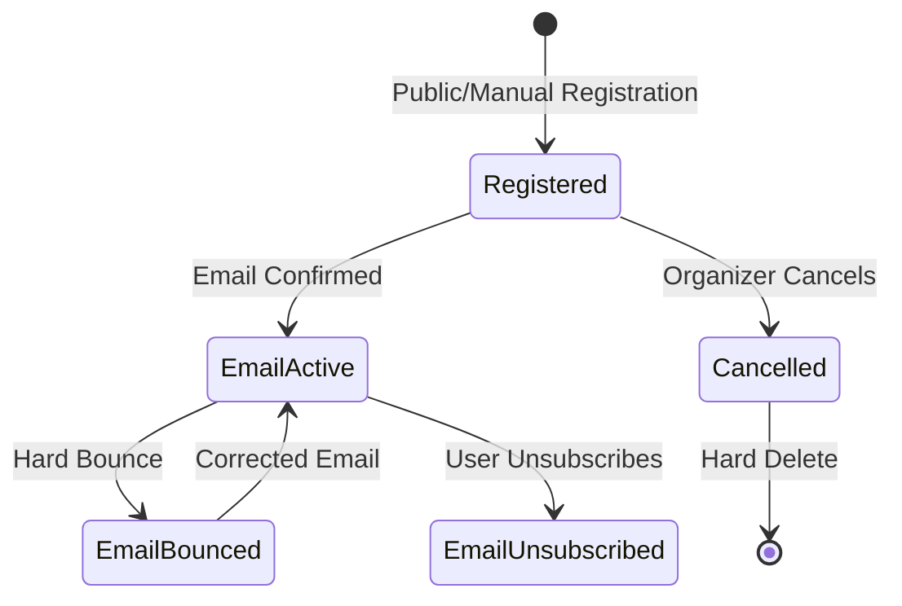

# Registration Workflows

## Workflow 1: Public Attendee Registration

**Actors**: Public User (Attendee)  
**Trigger**: User wants to register for an event

### Steps

**1. Browse Events**
- **Action**: Navigate to `/events` or discover event via link
- **UI**: Public event listing page
- **Available**: No authentication required

**2. View Event Details**
- **Action**: Click on event card or visit `/events/{slug}`
- **API**: `event.getBySlug` query
- **UI**: Full event page with:
  - Event description
  - Date, time, location
  - Available ticket types (filtered by sale period)
  - Registration count

**3. Select Ticket Type**
- **Action**: Review available ticket types
- **Display**: Shows only tickets where:
  - Current date is within sale period (or no restrictions)
  - Quantity > sold count (availability > 0)
- **UI**: Ticket cards with:
  - Name and description
  - Price (MVP: all free)
  - Availability (X of Y remaining)
  - "Register" button

**4. Open Registration Form**
- **Action**: Click "Register" button for desired ticket
- **Route**: Opens modal or navigates to registration form
- **Component**: `RegistrationForm`
- **Props Passed**:
  - `ticketTypeId`
  - `ticketTypeName`
  - `eventName`

**5. Fill Registration Form**
- **Required Fields**:
  - Full Name (2-100 characters)
  - Email Address (valid format)
- **Optional**: Custom fields (future feature)
- **Validation**: Client-side validation on blur/submit

**6. Submit Registration**
- **Action**: Click "Complete Registration" button
- **API**: `registration.create` mutation
- **Backend Process**:
  1. Database transaction begins
  2. `SELECT FOR UPDATE` locks TicketType row
  3. Checks availability (quantity - soldCount)
  4. Validates sale period
  5. Creates registration with generated code
  6. Transaction commits
  7. Sends confirmation email (async, non-blocking)

**7. See Confirmation**
- **Success UI**: 
  - Green success banner with checkmark icon
  - "Registration Confirmed! 🎉" heading
  - Event name display
  - **Registration Code** (16-char hex, uppercase)
  - Email confirmation message
  - "Check your inbox" reminder

**8. Receive Confirmation Email**
- **Timing**: Within seconds (async)
- **Template**: `RegistrationConfirmation`
- **Contents**:
  - Event details
  - Registration code
  - Event date/time
  - Ticket type
  - Link to event page
- **Subject**: "Registration Confirmed: {Event Name}"

### Success Criteria
- ✅ Registration created in database
- ✅ Ticket count decremented atomically
- ✅ Unique registration code generated
- ✅ Confirmation email sent
- ✅ Success screen displayed with code

### Error Handling

**Ticket Sold Out**:
```
Error: "This ticket type is sold out. Please try another ticket type."
Code: BAD_REQUEST
UI: Show error banner, list other available tickets
```

**Sale Period Invalid**:
```
Error: "Ticket sales have not started yet" or "Ticket sales have ended"
Code: BAD_REQUEST
UI: Show error banner with sale dates
```

**Validation Errors**:
```
Error: Field-specific messages
UI: Highlight invalid fields, show error text below
```

**Network/Server Errors**:
```
Error: Generic error message
UI: "Registration failed. Please try again."
Action: Retry button available
```

**Email Failure** (Non-blocking):
```
Status: Registration still successful
Logging: Error logged server-side
UI: Success message still shown
Note: Organizer can resend via dashboard
```

---

## Workflow 2: Organizer Views Registrations

**Actors**: Event Organizer  
**Trigger**: Organizer wants to view attendee list

### Steps

**1. Navigate to Dashboard**
- **Route**: Sign in → `/dashboard`
- **API**: `event.list` query (user's events)
- **UI**: Event cards with metrics

**2. Select Event**
- **Action**: Click "Manage" on event card
- **Route**: `/dashboard/{eventId}`
- **UI**: Event-specific dashboard

**3. Navigate to Attendees**
- **Action**: Click "Attendees" tab in navigation
- **Route**: `/dashboard/{eventId}/attendees`
- **API**: `event.getById` (authorization check)

**4. View Attendee Table**
- **Component**: `AttendeeTable`
- **API**: `registration.list` infinite query
- **Initial Load**: First 50 registrations
- **Display**:
  - Name, Email
  - Ticket Type (badge)
  - Payment Status (badge)
  - Email Status (badge)
  - Registration Date
  - Action buttons

**5. Search/Filter (Optional)**
- **Search**: Type name or email
  - Debounced by 500ms
  - Searches both fields
  - Case-insensitive
- **Filter**: Select ticket type from dropdown
  - Updates query immediately
- **API**: Re-fetches with new parameters

**6. Load More Results**
- **Action**: Click "Load More" button
- **API**: `fetchNextPage()` from infinite query
- **Display**: Appends next 50 results

### Success Criteria
- ✅ Only organizer can access
- ✅ Real-time data displayed
- ✅ Search and filter work correctly
- ✅ Pagination loads smoothly

### Error Handling

**Not Authorized**:
```
Error: "You do not have permission..."
Code: FORBIDDEN
UI: Redirect to dashboard or show 403 page
```

**Event Not Found**:
```
Error: "Event not found"
Code: NOT_FOUND
UI: Redirect to dashboard
```

---

## Workflow 3: Export Attendee List

**Actors**: Event Organizer  
**Trigger**: Organizer needs offline data or external processing

### Steps

**1. Access Attendee Table**
- **Route**: `/dashboard/{eventId}/attendees`
- **Prerequisite**: Must be event organizer

**2. Click Export Button**
- **Action**: Click "Export CSV" button
- **UI**: Button shows "Exporting..." state
- **Disabled**: Button disabled during export

**3. Server Generates CSV**
- **API**: `registration.export` mutation
- **Backend Process**:
  1. Fetches ALL registrations for event
  2. Includes ticket type names
  3. Generates CSV format with proper escaping
  4. Creates data URI
  5. Returns download info

**4. Download Triggers**
- **Client-side**:
  ```typescript
  const link = document.createElement("a");
  link.href = data.url;
  link.download = data.filename;
  link.click();
  ```
- **Filename**: `{event-slug}-attendees-{date}.csv`
- **Example**: `tech-conf-2025-attendees-2025-11-18.csv`

**5. File Downloaded**
- **Location**: User's default download folder
- **Format**: CSV with UTF-8 encoding
- **Columns**:
  - Name
  - Email
  - Ticket Type
  - Registration Date (ISO format)
  - Payment Status

### Success Criteria
- ✅ CSV file downloads automatically
- ✅ All registrations included
- ✅ Special characters properly escaped
- ✅ Opens in Excel/Google Sheets correctly

### Error Handling

**Not Authorized**:
```
Error: "You do not have permission to export this data"
Code: FORBIDDEN
UI: Toast error message
```

**Export Failure**:
```
Error: "Failed to generate export"
UI: Toast error, retry button
```

### CSV Format Example
```csv
Name,Email,Ticket Type,Registration Date,Payment Status
"Doe, John",john@example.com,General Admission,2025-01-15T10:30:00Z,free
Jane Smith,jane@example.com,VIP Pass,2025-01-16T14:20:00Z,free
"O'Brien, Mike",mike@example.com,Early Bird,2025-01-17T09:15:00Z,free
```

**See Also**: [Exports Documentation](./exports.md)

---

## Workflow 4: Resend Confirmation Email

**Actors**: Event Organizer  
**Trigger**: Attendee didn't receive confirmation or lost email

### Steps

**1. Locate Registration**
- **Route**: `/dashboard/{eventId}/attendees`
- **Action**: Search for attendee by name or email
- **UI**: `AttendeeTable` component

**2. Click Resend Button**
- **Action**: Click mail icon (📧) in Actions column
- **UI**: Button for specific registration row
- **Confirmation**: Optional - immediate action or confirm dialog

**3. Server Resends Email**
- **API**: `registration.resendConfirmation` mutation
- **Input**: `{ id: registrationId }`
- **Backend Process**:
  1. Verifies organizer authorization
  2. Fetches registration details
  3. Extracts registration code from customData
  4. Sends email with same template as original
  5. Returns success message

**4. Confirmation Shown**
- **Success**: Toast notification
- **Message**: "Confirmation email resent to {email}"
- **UI**: Brief success indicator

**5. Attendee Receives Email**
- **Timing**: Within seconds
- **Template**: Same as original confirmation
- **Contents**: Full event details + registration code

### Success Criteria
- ✅ Email sent successfully
- ✅ Contains correct registration code
- ✅ Attendee receives within seconds
- ✅ Organizer sees success confirmation

### Error Handling

**Email Service Failure**:
```
Error: Email service error message
UI: Toast error, try again button
Logging: Error logged for debugging
```

**Registration Not Found**:
```
Error: "Registration not found"
Code: NOT_FOUND
UI: Toast error message
```

**Use Cases**:
- Attendee's email went to spam
- Attendee deleted email accidentally
- Email address had typo (update first, then resend)
- Attendee needs code reminder before event

---

## Workflow 5: Manually Add Attendee

**Actors**: Event Organizer  
**Trigger**: Organizer needs to register someone manually (VIP, comp ticket, etc.)

### Steps

**1. Access Add Form**
- **Route**: `/dashboard/{eventId}/attendees`
- **Action**: Click "Add Attendee" button
- **UI**: Modal or dedicated page opens

**2. Fill Attendee Form**
- **Required Fields**:
  - Full Name
  - Email Address
  - Ticket Type (dropdown)
- **Optional**:
  - Send Confirmation Email (checkbox, default: true)

**3. Submit Form**
- **Action**: Click "Add Attendee" button
- **API**: `registration.addManually` mutation
- **Backend Process**:
  1. Verifies organizer authorization
  2. **Bypasses availability check** (organizer privilege)
  3. **Bypasses sale period validation**
  4. Generates registration code
  5. Creates registration with `addedManually: true` flag
  6. Sends confirmation email (if selected)

**4. Success Confirmation**
- **UI**: Success toast or banner
- **Message**: "Attendee added successfully"
- **Table Update**: New registration appears in list
- **Email**: Confirmation sent if checkbox selected

### Success Criteria
- ✅ Registration created even if tickets "sold out"
- ✅ Bypasses sale period restrictions
- ✅ Marked as manually added in customData
- ✅ Optional email sent

### Use Cases

**VIP Registration**:
- Add VIP who doesn't go through public form
- Special handling, no availability limit

**Complimentary Tickets**:
- Give free tickets to sponsors, speakers
- Bypass normal registration flow

**Staff/Volunteers**:
- Register team members quickly
- Bulk add functionality (future)

**Manual Corrections**:
- Re-add cancelled registrations
- Fix registration errors

### Error Handling

**Validation Errors**:
```
Error: Field-specific validation messages
UI: Highlight invalid fields
```

**Ticket Type Invalid**:
```
Error: "Ticket type not found"
Code: NOT_FOUND
UI: Toast error message
```

---

## Workflow 6: Cancel Registration

**Actors**: Event Organizer  
**Trigger**: Need to remove attendee (duplicate, refund, etc.)

### Steps

**1. Locate Registration**
- **Route**: `/dashboard/{eventId}/attendees`
- **Action**: Search for registration
- **UI**: Find row in `AttendeeTable`

**2. Click Cancel Button**
- **Action**: Click trash icon (🗑️) in Actions column
- **UI**: Confirmation dialog appears

**3. Confirm Cancellation**
- **Dialog Contents**:
  - Warning: "This will permanently delete the registration"
  - Note: "Ticket will become available again"
  - Optional: Reason field
  - Checkbox: Send notification email (default: true)
- **Actions**: "Cancel" or "Confirm Deletion"

**4. Server Deletes Registration**
- **API**: `registration.cancel` mutation
- **Input**:
  ```typescript
  {
    id: registrationId,
    reason: "Optional cancellation reason",
    sendNotification: true
  }
  ```
- **Backend Process**:
  1. Verifies organizer authorization
  2. **Hard deletes** registration from database
  3. **Frees up ticket** (decrements sold count)
  4. Sends cancellation email (if selected)

**5. UI Updates**
- **Table**: Registration row removed immediately
- **Toast**: "Registration cancelled successfully"
- **Available Tickets**: Count increases by 1

**6. Attendee Notified (Optional)**
- **Email**: Cancellation notice sent
- **Contents**:
  - Event name
  - Cancellation confirmation
  - Reason (if provided)
  - Contact info for questions
- **Template**: Basic HTML (TODO: Create dedicated template)

### Success Criteria
- ✅ Registration permanently deleted
- ✅ Ticket becomes available again
- ✅ UI updates immediately
- ✅ Email sent if requested

### Important Notes
⚠️ **This is a HARD DELETE**:
- Data cannot be recovered
- No undo functionality
- Use cautiously

**Recommendation**: Future soft delete implementation:
- Keep data but mark as cancelled
- Preserve history for analytics
- Allow restoration if needed

### Error Handling

**Not Authorized**:
```
Error: "You do not have permission..."
Code: FORBIDDEN
UI: Toast error message
```

**Registration Not Found**:
```
Error: "Registration not found"
Code: NOT_FOUND
UI: Toast error, refresh table
```

**Use Cases**:
- Duplicate registration (user error)
- Attendee requested cancellation
- Chargeback/refund processed
- Fraudulent registration
- Event capacity reduction

---

## Workflow 7: Email Status Update (Webhook)

**Actors**: Email Service Provider (Resend, SendGrid, etc.)  
**Trigger**: Email bounce or unsubscribe event

### Steps

**1. Email Event Occurs**
- **Scenarios**:
  - Hard bounce (invalid email)
  - Soft bounce (mailbox full)
  - Unsubscribe click
  - Spam report

**2. Webhook Triggered**
- **Source**: Email service provider
- **Endpoint**: `/api/trpc/registration.updateEmailStatus` (public)
- **Method**: POST (via tRPC mutation)

**3. Payload Processed**
- **Input**:
  ```typescript
  {
    email: "bounced@example.com",
    status: "bounced" // or "unsubscribed"
  }
  ```

**4. Database Updated**
- **API**: `registration.updateEmailStatus` mutation
- **Backend Process**:
  1. Finds ALL registrations with matching email
  2. Updates emailStatus for all matches
  3. Returns count of updated records
- **Query**:
  ```sql
  UPDATE "Registration"
  SET "emailStatus" = $status
  WHERE "email" = $email
  ```

**5. Future Emails Filtered**
- **Effect**: 
  - Bounced emails: Not sent (prevent deliverability issues)
  - Unsubscribed: Not sent (respect preference)
- **Badge**: Status shown in organizer dashboard

### Success Criteria
- ✅ Email status updated for all registrations
- ✅ Prevents future emails to invalid addresses
- ✅ Respects unsubscribe preferences

### Status Values

**active** (default):
- Can receive emails
- No delivery issues
- Normal state

**bounced**:
- Email delivery failed
- Hard bounce (invalid address)
- Won't receive emails

**unsubscribed**:
- User opted out
- Legal requirement to respect
- Won't receive emails

### Security Considerations

⚠️ **Current Implementation**: Public endpoint (no verification)

**Future Improvements**:
- Add webhook signature verification (HMAC)
- Validate request origin
- Rate limiting
- Audit logging

### Integration Example

**Resend Webhook**:
```typescript
// Resend webhook payload
{
  "type": "email.bounced",
  "data": {
    "email": "user@example.com",
    "bounceType": "hard"
  }
}

// Transform and call
api.registration.updateEmailStatus.mutate({
  email: data.email,
  status: "bounced"
});
```

---

## State Transition Diagram



---

## Common Pitfalls

### Overselling Tickets
**Problem**: Multiple users register for last ticket simultaneously  
**Solution**: Row-level locking (`SELECT FOR UPDATE`) prevents race conditions

### Email Delivery Failures
**Problem**: Registration succeeds but email fails  
**Solution**: Async email sending (doesn't block), organizer can resend

### Lost Registration Codes
**Problem**: Attendee loses confirmation email  
**Solution**: Organizer can resend from dashboard

### Duplicate Registrations
**Problem**: User registers multiple times  
**Solution**: No prevention (by design) - organizer cancels duplicates

### Cancelled Registrations Data Loss
**Problem**: Hard delete loses data  
**Solution**: Future - implement soft delete with restoration

---

## Integration Points

### Events Module
- Registration requires published event
- Event organizer has access to registrations
- Event details included in emails
- Event deletion cascades to registrations

### Tickets Module
- Registration selects ticket type
- Ticket availability checked atomically
- Sale period validated
- Manual registration bypasses restrictions

### Communications Module
- Confirmation emails sent via email service
- Email status tracked from webhooks
- Resend functionality available
- Future: Event reminders, follow-ups

### Attendees Module
- Same backend router shared
- Alternative frontend view
- Different use cases (import, check-in)
- Shared data model

---

## Performance Considerations

### Database Optimization
- Indexes on `eventId`, `ticketTypeId`, `email`
- Cursor-based pagination (50 per page)
- Aggregate counts instead of fetching all records

### API Optimization
- Debounced search (500ms delay)
- Infinite scroll (load on demand)
- Async email sending (non-blocking)

### Client Optimization
- Form validation before API call
- Optimistic UI updates (future)
- Client-side filtering (future)

---

## Future Enhancements

### Registration Features
- [ ] QR code generation for check-in
- [ ] Ticket transfer between attendees
- [ ] Waitlist management
- [ ] Discount codes/coupons
- [ ] Group registrations

### Organizer Features
- [ ] Bulk actions (select multiple)
- [ ] Export to Excel format
- [ ] Email blast to attendees
- [ ] Print badges
- [ ] Check-in app integration

### Email Features
- [ ] Dedicated cancellation template
- [ ] Event reminder emails (24h before)
- [ ] Post-event thank you
- [ ] Custom email templates

### Security
- [ ] CAPTCHA on registration form
- [ ] Webhook signature verification
- [ ] Rate limiting on public endpoints
- [ ] Spam detection

---

## Related Documentation

- [Backend Documentation](./backend.md) - API procedures and business logic
- [Frontend Documentation](./frontend.md) - Components and pages
- [Data Model](./data-model.md) - Database schema
- [Email Templates](./email-templates.md) - Email content and structure
- [Exports](./exports.md) - CSV export details
