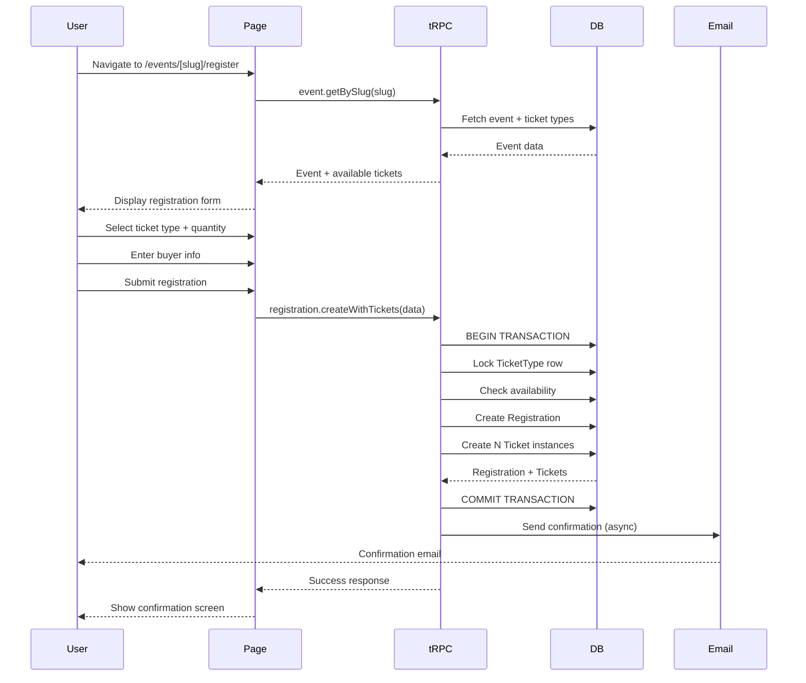

# PRD: Event Registration Flow Page

## Problem Statement

Task T029 in the ticket-attendee-separation feature references a registration page at `src/app/events/[slug]/register/page.tsx` that **does not exist**. Currently, the system has:

1. **Registration Module** - Backend procedures for creating registrations
2. **RegistrationForm Component** - UI component for collecting buyer information
3. **No dedicated registration flow page** - Missing the full user journey from ticket selection to purchase completion

The existing documentation and architecture assume buyers complete registration through the event detail page, but there's no dedicated, optimized registration flow that:

- Displays event context throughout the process
- Allows ticket quantity selection
- Collects buyer information
- Creates both Registration AND individual Ticket instances
- Provides clear confirmation with ticket management instructions
- Explains the multi-ticket assignment workflow

**Impact**: Without this page, the ticket-attendee separation feature cannot function as designed, since buyers have no interface to purchase multiple tickets that they'll later assign to individual attendees.

---

## Goals & Success Metrics

### Primary Goals

1. **Enable Multi-Ticket Purchases**: Allow buyers to select quantity and purchase 1-N tickets in a single transaction
2. **Create Ticket Instances**: Automatically generate N individual Ticket records when a Registration is created
3. **Clear Next Steps**: Guide buyers on how to assign their purchased tickets to attendees
4. **Seamless Experience**: Provide a focused, distraction-free registration flow with clear progress indication

### Success Metrics

- **Registration Completion Rate**: >80% of users who start registration complete it
- **Time to Complete**: Average registration time <2 minutes for standard tickets
- **Error Rate**: <5% of registration attempts fail due to validation or system errors
- **Ticket Creation Success**: 100% of registrations create the correct number of ticket instances
- **Mobile Completion**: >70% completion rate on mobile devices

---

## User Personas & Scenarios

### Persona 1: Individual Attendee (Aanuoluwa)

**Profile**: 
- First-time event attendee
- Purchasing 1 ticket for herself
- Mobile user

**Scenario**:
1. Browses event page on phone
2. Clicks "Register" button
3. Selects "General Admission" ticket
4. Enters her name and email
5. Completes registration
6. Receives confirmation with instructions to assign ticket to herself

**Expected Experience**:
- Clear, mobile-optimized form
- Minimal fields to fill
- Immediate confirmation
- Simple path to assign ticket to herself

---

### Persona 2: Group Buyer (Moyin)

**Profile**:
- Company admin purchasing for team
- Buying 8 tickets at once
- Desktop user, needs to manage assignments later

**Scenario**:
1. Opens event page from email invite
2. Clicks "Register" and selects quantity: 8
3. Reviews total and ticket type
4. Enters his contact information as buyer
5. Completes purchase
6. Receives confirmation email with link to ticket management dashboard
7. Plans to assign tickets to team members before event

**Expected Experience**:
- Easy quantity selection (dropdown or input)
- Clear pricing breakdown (even if free)
- Confirmation that he'll assign tickets later
- Prominent link to ticket management dashboard
- Email includes team assignment instructions

---

### Persona 3: Conference Organizer (Tobi)

**Profile**:
- Tech conference organizer
- Monitoring registration flow for her event
- Needs analytics on ticket purchases

**Scenario**:
1. Event goes live
2. Monitors registration dashboard
3. Sees buyers purchasing multiple tickets
4. Tracks total tickets sold vs individual attendees assigned
5. Sends reminder emails to buyers with unassigned tickets

**Expected Experience**:
- Real-time visibility into registrations
- Distinction between tickets sold (registrations) vs tickets assigned (attendees)
- Ability to identify buyers with unassigned tickets

---

## User Stories & Acceptance Criteria

### Epic: Multi-Ticket Purchase Flow

#### US-REG-001: View Event Registration Page

**As a** potential attendee  
**I want to** access a dedicated registration page for an event  
**So that** I can focus on completing my registration without distractions

**Acceptance Criteria**:
- [ ] Page accessible at `/events/[slug]/register`
- [ ] Server-side rendering for performance and SEO
- [ ] Displays event details: name, date, location, description summary
- [ ] Shows event banner image if available
- [ ] Includes back link to full event details page
- [ ] Mobile-responsive layout (mobile-first design)
- [ ] WCAG AA accessible (keyboard navigation, screen reader support)

---

#### US-REG-002: Select Ticket Type and Quantity

**As a** buyer  
**I want to** select which ticket type and how many tickets I need  
**So that** I can purchase the right tickets for my needs

**Acceptance Criteria**:
- [ ] Displays all available ticket types (filtered by sale period and availability)
- [ ] Each ticket type shows: name, description, price, availability
- [ ] Ticket types marked "Sold Out" are disabled but visible
- [ ] Quantity selector for chosen ticket type (default: 1)
- [ ] Quantity limited by:
  - Remaining ticket availability
  - Event's `maxTicketsPerPurchase` setting (default: 10)
- [ ] Real-time validation as quantity changes
- [ ] Clear error message if requested quantity exceeds limits
- [ ] Visual indication of total tickets being purchased

**Business Rules**:
```typescript
maxQuantity = Math.min(
  ticketType.quantity - ticketType.soldCount,
  event.maxTicketsPerPurchase ?? 10
)
```

---

#### US-REG-003: Enter Buyer Information

**As a** buyer  
**I want to** provide my contact information  
**So that** I receive confirmation and can manage my tickets

**Acceptance Criteria**:
- [ ] Form includes required fields:
  - Full Name (2-100 characters)
  - Email Address (valid email format)
- [ ] Client-side validation before submission
- [ ] Clear error messages for invalid inputs
- [ ] Email format validation (RFC 5322 compliant)
- [ ] Autofocus on first field for accessibility
- [ ] Auto-complete attributes for browser autofill
- [ ] If user is authenticated, pre-fill from user profile
- [ ] Privacy notice about data usage
- [ ] Consent checkbox for event communications (required)

**Validation Rules**:
```typescript
name: z.string().min(2).max(100),
email: z.string().email(),
acceptTerms: z.boolean().refine(val => val === true)
```

---

#### US-REG-004: Create Registration with Ticket Instances

**As a** system  
**I must** create both a Registration record and N Ticket records atomically  
**So that** the buyer's purchase is accurately represented

**Acceptance Criteria**:
- [ ] Single tRPC mutation creates Registration + Tickets in database transaction
- [ ] Registration record stores:
  - Buyer contact info (name, email)
  - TicketType reference
  - Quantity purchased
  - Payment status (default: "free")
  - Timestamp
- [ ] N Ticket records created where N = quantity selected
- [ ] Each Ticket record includes:
  - Unique ticket number (format: `TKT-{EVENT_ID}-{NANOID}`)
  - Reference to Registration (buyer)
  - Reference to TicketType
  - QR code data (JSON: `{ticketId, eventId, ticketNumber}`)
  - Initial state: `isAssigned: false`, `isCheckedIn: false`
- [ ] Transaction rollback if any step fails
- [ ] Optimistic locking on TicketType to prevent overselling

**Database Transaction**:
```typescript
await db.$transaction(async (tx) => {
  // 1. Lock ticket type row
  const ticketType = await tx.ticketType.findUnique({
    where: { id: input.ticketTypeId },
  });
  
  // 2. Check availability
  const soldCount = await tx.ticket.count({
    where: { ticketTypeId: input.ticketTypeId },
  });
  
  if (soldCount + input.quantity > ticketType.quantity) {
    throw new Error("Not enough tickets available");
  }
  
  // 3. Create registration
  const registration = await tx.registration.create({
    data: {
      eventId: ticketType.eventId,
      ticketTypeId: input.ticketTypeId,
      name: input.name,
      email: input.email,
      quantity: input.quantity,
      paymentStatus: "free",
    },
  });
  
  // 4. Create ticket instances
  const tickets = await Promise.all(
    Array.from({ length: input.quantity }).map(async () => {
      const ticketNumber = generateTicketNumber(eventId);
      return tx.ticket.create({
        data: {
          registrationId: registration.id,
          ticketTypeId: input.ticketTypeId,
          ticketNumber,
          qrCodeData: JSON.stringify({
            ticketId: "PENDING", // Will update after create
            eventId,
            ticketNumber,
          }),
        },
      });
    })
  );
  
  return { registration, tickets };
});
```

---

#### US-REG-005: Display Registration Confirmation

**As a** buyer  
**I want to** see immediate confirmation that my registration succeeded  
**So that** I know my tickets are secured and what to do next

**Acceptance Criteria**:
- [ ] Success screen displays immediately after registration
- [ ] Shows confirmation details:
  - Event name and date
  - Ticket type purchased
  - Quantity of tickets
  - Buyer name and email
  - Registration timestamp
- [ ] Clear "Next Steps" section explaining:
  - Confirmation email sent to buyer's email
  - How to access ticket management dashboard
  - Need to assign tickets to attendees
  - Assignment deadline (event's cutoff time)
- [ ] Prominent "Manage Tickets" button linking to:
  - `/events/[slug]/registrations/[registrationId]`
- [ ] Secondary "Back to Event" link
- [ ] Visual success indicator (checkmark icon, green accent)
- [ ] Mobile-optimized layout

**Example Confirmation Message**:
```
🎉 Registration Confirmed!

You've successfully registered for [Event Name]

Tickets Purchased: 3x General Admission
Buyer: Marcus Johnson (marcus@company.com)
Confirmation sent to your email

NEXT STEPS:
1. Check your email for confirmation details
2. Click "Manage Tickets" below to assign your 3 tickets
3. Each ticket can be assigned to a different person
4. Assignments must be completed by [Cutoff Time]

[Manage Tickets Button] [Back to Event]
```

---

#### US-REG-006: Send Confirmation Email

**As a** buyer  
**I want to** receive a confirmation email  
**So that** I have a record of my purchase and can access my tickets later

**Acceptance Criteria**:
- [ ] Email sent asynchronously (doesn't block registration response)
- [ ] Email template includes:
  - Event details (name, date, location)
  - Ticket type and quantity
  - Buyer information
  - Unique registration ID
  - Link to ticket management dashboard
  - Instructions for assigning tickets
  - Assignment deadline
  - Organizer contact information
- [ ] Email sends within 30 seconds of registration
- [ ] Failure to send email does NOT fail registration
- [ ] Email status tracked in Registration.emailStatus
- [ ] Resend capability available from organizer dashboard

**Email Template Structure**:
```
Subject: Registration Confirmed - [Event Name]

Hi [Buyer Name],

You're registered for [Event Name]!

Event Details:
- Date: [Event Date]
- Location: [Event Location]
- Tickets: [Quantity]x [Ticket Type]

What's Next:
You've purchased [N] tickets. Each ticket needs to be assigned to 
an attendee (could be yourself or others).

[Manage Your Tickets]

Assignment deadline: [Cutoff Time]

Questions? Contact [Organizer Email]
```

---

#### US-REG-007: Handle Registration Errors

**As a** buyer  
**I want to** see clear, actionable error messages if registration fails  
**So that** I can correct the issue and complete my registration

**Acceptance Criteria**:
- [ ] Ticket sold out error:
  - Message: "These tickets are sold out. Try another ticket type."
  - Show alternative available ticket types
  - Highlight next closest ticket type
- [ ] Sale period error:
  - Message: "Ticket sales [haven't started/have ended]"
  - Display sale start/end dates
  - Suggest notification signup (if before sale start)
- [ ] Quantity exceeds availability:
  - Message: "Only [X] tickets remaining for this type"
  - Adjust quantity selector maximum
  - Suggest splitting across ticket types if possible
- [ ] Validation errors:
  - Inline field-level errors
  - Clear instructions on how to fix
  - Highlight invalid fields with red border
- [ ] Network/server errors:
  - Message: "Registration failed. Please try again."
  - Retry button without losing form data
  - Persist form state in case of failure
- [ ] Form preserved on error (don't clear inputs)
- [ ] Focus returns to first error field

---

### Supporting User Stories

#### US-REG-008: Progress Indication

**As a** buyer  
**I want to** see my progress through the registration flow  
**So that** I know what steps remain

**Acceptance Criteria**:
- [ ] Progress indicator shows steps:
  1. Select Tickets
  2. Your Information
  3. Confirmation
- [ ] Current step highlighted
- [ ] Completed steps marked with checkmark
- [ ] Cannot skip forward, can go back
- [ ] Mobile: Compact progress bar
- [ ] Desktop: Step labels with icons

---

#### US-REG-009: Event Context Persistence

**As a** buyer  
**I want to** see event information throughout registration  
**So that** I'm confident I'm registering for the right event

**Acceptance Criteria**:
- [ ] Sticky header with event name
- [ ] Event date visible on all steps
- [ ] Event banner image as background (subtle)
- [ ] "Back to Event Details" link always accessible
- [ ] Mobile: Compact header with essentials only

---

#### US-REG-010: Authenticated User Experience

**As a** logged-in user  
**I want to** have my information pre-filled  
**So that** registration is faster

**Acceptance Criteria**:
- [ ] If user is authenticated, pre-fill:
  - Name from user profile
  - Email from user account
- [ ] User can edit pre-filled values
- [ ] Link registration to userId in database
- [ ] User's registration history accessible from profile
- [ ] After registration, redirect option to user dashboard

---

## Technical Specifications

### Page Architecture

**File**: `src/app/(public)/events/[slug]/register/page.tsx`  
**Route**: `/events/[slug]/register`  
**Type**: Next.js Server Component (initial render) + Client Components (forms)  
**Authentication**: Not required (public), but enhanced if authenticated

#### Component Hierarchy

```
EventRegistrationPage (Server Component)
├── EventRegistrationHeader (Client)
│   ├── EventBanner
│   ├── EventName
│   └── BackToEventLink
│
├── RegistrationProgress (Client)
│   └── ProgressSteps
│
└── RegistrationFlow (Client - Multi-step)
    ├── Step 1: TicketSelection (Client)
    │   ├── TicketTypeCard (multiple)
    │   └── QuantitySelector
    │
    ├── Step 2: BuyerInformation (Client)
    │   ├── RegistrationForm (reuse existing)
    │   └── ConsentCheckbox
    │
    └── Step 3: ConfirmationScreen (Client)
        ├── ConfirmationDetails
        ├── NextStepsGuide
        └── ManageTicketsButton
```

---

### Data Flow



---

### tRPC Procedures

#### New Procedure: `registration.createWithTickets`

**Location**: `src/server/api/routers/registration.ts`

**Purpose**: Atomic creation of Registration + Ticket instances

**Input Schema**:
```typescript
const createWithTicketsSchema = z.object({
  ticketTypeId: z.string().cuid(),
  quantity: z.number().int().min(1).max(100),
  name: z.string().min(2).max(100),
  email: z.string().email(),
  acceptTerms: z.boolean().refine(val => val === true, {
    message: "You must accept the terms to register"
  }),
});
```

**Output Schema**:
```typescript
type CreateWithTicketsOutput = {
  registration: {
    id: string;
    email: string;
    name: string;
    quantity: number;
    registeredAt: Date;
  };
  tickets: Array<{
    id: string;
    ticketNumber: string;
    isAssigned: boolean;
  }>;
  event: {
    id: string;
    name: string;
    slug: string;
    startDate: Date;
  };
  ticketType: {
    name: string;
    price: Decimal;
  };
  message: string;
};
```

**Implementation**:
```typescript
createWithTickets: publicProcedure
  .input(createWithTicketsSchema)
  .mutation(async ({ input, ctx }) => {
    // 1. Validate ticket type exists and get event
    const ticketType = await ctx.db.ticketType.findUnique({
      where: { id: input.ticketTypeId },
      include: { 
        event: {
          select: {
            id: true,
            name: true,
            slug: true,
            startDate: true,
            maxTicketsPerPurchase: true,
          }
        }
      },
    });
    
    if (!ticketType) {
      throw new TRPCError({
        code: "NOT_FOUND",
        message: "Ticket type not found",
      });
    }
    
    const event = ticketType.event;
    
    // 2. Validate quantity against event limit
    const maxAllowed = event.maxTicketsPerPurchase ?? 10;
    if (input.quantity > maxAllowed) {
      throw new TRPCError({
        code: "BAD_REQUEST",
        message: `Maximum ${maxAllowed} tickets per purchase`,
      });
    }
    
    // 3. Atomic transaction: Create registration + tickets
    const result = await ctx.db.$transaction(async (tx) => {
      // Lock ticket type row
      await tx.$executeRaw`
        SELECT * FROM "TicketType" 
        WHERE id = ${input.ticketTypeId}
        FOR UPDATE
      `;
      
      // Check availability
      const soldCount = await tx.ticket.count({
        where: { ticketTypeId: input.ticketTypeId },
      });
      
      const available = ticketType.quantity - soldCount;
      
      if (available < input.quantity) {
        throw new TRPCError({
          code: "BAD_REQUEST",
          message: `Only ${available} tickets available`,
        });
      }
      
      // Create registration
      const registration = await tx.registration.create({
        data: {
          eventId: event.id,
          ticketTypeId: input.ticketTypeId,
          name: input.name,
          email: input.email,
          quantity: input.quantity,
          userId: ctx.session?.user?.id,
          paymentStatus: "free",
        },
      });
      
      // Generate ticket instances
      const tickets = await Promise.all(
        Array.from({ length: input.quantity }).map(async (_, index) => {
          const ticketNumber = generateTicketNumber(event.id);
          
          const ticket = await tx.ticket.create({
            data: {
              registrationId: registration.id,
              ticketTypeId: input.ticketTypeId,
              ticketNumber,
              isAssigned: false,
              isCheckedIn: false,
            },
          });
          
          // Update with QR code data (includes ticket ID)
          return tx.ticket.update({
            where: { id: ticket.id },
            data: {
              qrCodeData: JSON.stringify({
                ticketId: ticket.id,
                eventId: event.id,
                ticketNumber: ticket.ticketNumber,
              }),
            },
          });
        })
      );
      
      return { registration, tickets };
    });
    
    // 4. Send confirmation email (async, non-blocking)
    sendRegistrationConfirmationEmail({
      registration: result.registration,
      event,
      ticketType,
      ticketCount: result.tickets.length,
    }).catch(error => {
      console.error("[Registration] Email failed:", error);
      // Don't throw - registration already successful
    });
    
    // 5. Return success response
    return {
      registration: {
        id: result.registration.id,
        email: result.registration.email,
        name: result.registration.name,
        quantity: result.registration.quantity,
        registeredAt: result.registration.registeredAt,
      },
      tickets: result.tickets.map(t => ({
        id: t.id,
        ticketNumber: t.ticketNumber,
        isAssigned: t.isAssigned,
      })),
      event: {
        id: event.id,
        name: event.name,
        slug: event.slug,
        startDate: event.startDate,
      },
      ticketType: {
        name: ticketType.name,
        price: ticketType.price,
      },
      message: "Registration successful! Check your email for details.",
    };
  }),
```

---

### Database Schema Updates

**No changes required** - Uses existing models:
- `Registration` (add `quantity` field if missing)
- `Ticket` (from 003-ticket-attendee-separation)
- `TicketType`
- `Event`

**Migration** (if `quantity` field missing):
```prisma
// prisma/schema.prisma
model Registration {
  // ... existing fields
  quantity Int @default(1) // Add if missing
}
```

```bash
pnpm prisma migrate dev --name add-registration-quantity
```

---

### UI Components

#### TicketTypeCard Component

**Purpose**: Display available ticket type with selection

**Location**: `src/components/registration/ticket-type-card.tsx`

```typescript
interface TicketTypeCardProps {
  ticketType: {
    id: string;
    name: string;
    description: string | null;
    price: Decimal;
    quantity: number;
    soldCount: number;
    saleStart: Date | null;
    saleEnd: Date | null;
  };
  maxQuantityAllowed: number;
  selected: boolean;
  onSelect: (ticketTypeId: string, quantity: number) => void;
}

export function TicketTypeCard({ 
  ticketType, 
  maxQuantityAllowed,
  selected,
  onSelect 
}: TicketTypeCardProps) {
  const available = ticketType.quantity - ticketType.soldCount;
  const isSoldOut = available <= 0;
  const maxQuantity = Math.min(available, maxQuantityAllowed);
  
  const [quantity, setQuantity] = useState(1);
  
  return (
    <Card className={cn(
      "cursor-pointer transition-all",
      selected && "ring-2 ring-blue-500",
      isSoldOut && "opacity-50 cursor-not-allowed"
    )}>
      <div className="flex justify-between items-start">
        <div>
          <h3 className="text-lg font-semibold">{ticketType.name}</h3>
          {ticketType.description && (
            <p className="text-sm text-gray-600">{ticketType.description}</p>
          )}
        </div>
        <div className="text-right">
          <p className="text-xl font-bold">
            {ticketType.price.toNumber() === 0 ? "Free" : `$${ticketType.price}`}
          </p>
          <p className="text-xs text-gray-500">
            {available} / {ticketType.quantity} available
          </p>
        </div>
      </div>
      
      {!isSoldOut && (
        <div className="mt-4 flex items-center gap-4">
          <Label htmlFor={`quantity-${ticketType.id}`}>Quantity:</Label>
          <Select
            id={`quantity-${ticketType.id}`}
            value={quantity.toString()}
            onValueChange={(val) => setQuantity(parseInt(val))}
            disabled={!selected}
          >
            {Array.from({ length: maxQuantity }, (_, i) => i + 1).map(n => (
              <option key={n} value={n}>{n}</option>
            ))}
          </Select>
          
          <Button
            onClick={() => onSelect(ticketType.id, quantity)}
            variant={selected ? "default" : "outline"}
          >
            {selected ? "Selected" : "Select"}
          </Button>
        </div>
      )}
      
      {isSoldOut && (
        <Badge color="failure">Sold Out</Badge>
      )}
    </Card>
  );
}
```

---

#### RegistrationProgress Component

**Purpose**: Show multi-step progress

**Location**: `src/components/registration/registration-progress.tsx`

```typescript
interface Step {
  label: string;
  icon: React.ComponentType<{ className?: string }>;
}

interface RegistrationProgressProps {
  currentStep: number; // 0-indexed
  steps: Step[];
}

export function RegistrationProgress({ currentStep, steps }: RegistrationProgressProps) {
  return (
    <nav aria-label="Progress">
      <ol className="flex items-center justify-center space-x-4">
        {steps.map((step, index) => {
          const isComplete = index < currentStep;
          const isCurrent = index === currentStep;
          
          return (
            <li key={step.label} className="flex items-center">
              <div className={cn(
                "flex items-center justify-center w-10 h-10 rounded-full border-2",
                isComplete && "bg-green-500 border-green-500 text-white",
                isCurrent && "border-blue-500 text-blue-500",
                !isComplete && !isCurrent && "border-gray-300 text-gray-400"
              )}>
                {isComplete ? (
                  <HiCheck className="w-6 h-6" />
                ) : (
                  <step.icon className="w-6 h-6" />
                )}
              </div>
              
              <span className={cn(
                "ml-2 text-sm font-medium hidden sm:inline",
                isCurrent && "text-blue-600",
                !isCurrent && "text-gray-500"
              )}>
                {step.label}
              </span>
              
              {index < steps.length - 1 && (
                <div className={cn(
                  "w-12 h-0.5 mx-4",
                  isComplete ? "bg-green-500" : "bg-gray-300"
                )} />
              )}
            </li>
          );
        })}
      </ol>
    </nav>
  );
}
```

---

### Email Template Update

**File**: `emails/registration-confirmation.tsx`

**Updates**:
- Add ticket count to subject and body
- Include link to ticket management dashboard
- Explain assignment process
- Show assignment deadline

```tsx
interface RegistrationConfirmationEmailProps {
  buyerName: string;
  buyerEmail: string;
  eventName: string;
  eventDate: Date;
  eventLocation: string;
  ticketTypeName: string;
  ticketCount: number;
  registrationId: string;
  eventSlug: string;
  assignmentCutoff: Date;
}

export default function RegistrationConfirmationEmail({
  buyerName,
  eventName,
  ticketCount,
  eventDate,
  ticketTypeName,
  registrationId,
  eventSlug,
  assignmentCutoff,
}: RegistrationConfirmationEmailProps) {
  const manageUrl = `${env.NEXT_PUBLIC_APP_URL}/events/${eventSlug}/registrations/${registrationId}`;
  
  return (
    <Html>
      <Head />
      <Preview>
        You're registered for {eventName}! {ticketCount} {ticketCount === 1 ? 'ticket' : 'tickets'} to assign.
      </Preview>
      <Body>
        <Container>
          <Heading>Registration Confirmed! 🎉</Heading>
          
          <Text>Hi {buyerName},</Text>
          
          <Text>
            You've successfully registered for <strong>{eventName}</strong>
          </Text>
          
          <Section>
            <Heading as="h2">Purchase Details</Heading>
            <ul>
              <li>Tickets: {ticketCount}x {ticketTypeName}</li>
              <li>Event Date: {formatDate(eventDate)}</li>
              <li>Buyer: {buyerName}</li>
            </ul>
          </Section>
          
          {ticketCount > 1 ? (
            <>
              <Heading as="h2">Next Steps: Assign Your Tickets</Heading>
              <Text>
                You've purchased {ticketCount} tickets. Each ticket needs to be assigned 
                to an attendee—this could be yourself or others in your group.
              </Text>
              <Text>
                <strong>Assignment Deadline:</strong> {formatDate(assignmentCutoff)}
              </Text>
              <Button href={manageUrl}>
                Manage Your Tickets
              </Button>
            </>
          ) : (
            <>
              <Heading as="h2">Next Step: Assign Your Ticket</Heading>
              <Text>
                Click below to assign your ticket (enter your details or someone else's).
              </Text>
              <Button href={manageUrl}>
                Assign Ticket
              </Button>
            </>
          )}
          
          <Hr />
          
          <Text className="text-sm text-gray-600">
            Questions? Reply to this email or contact the event organizer.
          </Text>
        </Container>
      </Body>
    </Html>
  );
}
```

---

## Edge Cases & Error Handling

### Edge Case Matrix

| Scenario | Handling | User Experience |
|----------|----------|-----------------|
| Last ticket purchased simultaneously | Row-level locking | First request succeeds, second sees "Sold Out" |
| User refreshes during registration | Form state preserved | Pre-filled data retained, can retry |
| Email service down | Async email, don't block | Registration succeeds, email queued for retry |
| User selects quantity > available | Client + server validation | Max quantity auto-adjusted, error message shown |
| Event deleted during registration | Foreign key constraint | Clear error: "Event no longer available" |
| User has no JavaScript | Server-side form handling | Full functionality with progressive enhancement |
| Quantity = 0 selected | Client validation | Quantity selector minimum value = 1 |
| Sale period ends during registration | Transaction validation | Error: "Ticket sales have ended" |
| Authenticated user with missing profile data | Pre-fill what's available | Allow user to complete missing fields |
| Network timeout during submission | Loading state + retry | "Registration taking longer than expected. Retry?" |

---

### Error Messages Reference

```typescript
const ERROR_MESSAGES = {
  TICKET_NOT_FOUND: "Ticket type not found. Please refresh and try again.",
  SOLD_OUT: "These tickets are sold out. Please select a different ticket type.",
  QUANTITY_EXCEEDS_AVAILABLE: (available: number) => 
    `Only ${available} tickets remaining. Please reduce quantity.`,
  QUANTITY_EXCEEDS_LIMIT: (limit: number) => 
    `Maximum ${limit} tickets per purchase.`,
  SALE_NOT_STARTED: (startDate: Date) => 
    `Ticket sales start on ${formatDate(startDate)}`,
  SALE_ENDED: (endDate: Date) => 
    `Ticket sales ended on ${formatDate(endDate)}`,
  INVALID_EMAIL: "Please enter a valid email address.",
  NAME_TOO_SHORT: "Name must be at least 2 characters.",
  TERMS_NOT_ACCEPTED: "You must accept the terms to continue.",
  NETWORK_ERROR: "Registration failed. Please check your connection and try again.",
  SERVER_ERROR: "Something went wrong. Please try again or contact support.",
} as const;
```

---

## Performance Requirements

### Page Load Performance

- **Initial Load**: <2.5s (LCP target)
- **Server-Side Rendering**: Event data fetched on server
- **Hydration**: Minimal client-side JavaScript
- **Images**: Optimized with Next.js Image component
- **Fonts**: Preloaded, subset for used characters

### Form Interaction

- **Input Response**: <100ms (FID target)
- **Validation Feedback**: Immediate (on blur)
- **Submit Processing**: Loading indicator within 200ms
- **Confirmation Display**: <1s after successful submission

### Database Operations

- **Transaction Timeout**: 5s maximum
- **Connection Pooling**: Prisma connection pool
- **Query Optimization**: Indexed lookups on ticketTypeId, eventId
- **Rollback**: Automatic on any transaction failure

---

## Accessibility Requirements (WCAG AA)

### Keyboard Navigation

- [ ] All interactive elements keyboard-accessible
- [ ] Logical tab order through form fields
- [ ] Skip to content link
- [ ] Focus indicators visible (3:1 contrast ratio)
- [ ] No keyboard traps

### Screen Reader Support

- [ ] Semantic HTML structure
- [ ] Form labels properly associated
- [ ] Error messages announced
- [ ] Progress indicator accessible
- [ ] Dynamic content changes announced (aria-live)

### Visual Design

- [ ] Color contrast ratio ≥4.5:1 (normal text)
- [ ] Color contrast ratio ≥3:1 (large text, UI elements)
- [ ] Information not conveyed by color alone
- [ ] Text resizable to 200% without loss of functionality
- [ ] Touch targets ≥44x44 pixels (mobile)

### Form Accessibility

```tsx
<label htmlFor="buyer-name" className="required">
  Full Name
</label>
<input
  id="buyer-name"
  name="name"
  type="text"
  required
  aria-required="true"
  aria-invalid={!!errors.name}
  aria-describedby={errors.name ? "name-error" : undefined}
  autoComplete="name"
/>
{errors.name && (
  <p id="name-error" role="alert" className="error-message">
    {errors.name}
  </p>
)}
```

---

## Testing Strategy

### Unit Tests

```typescript
// src/server/api/routers/registration.test.ts

describe("registration.createWithTickets", () => {
  it("creates registration with correct number of tickets", async () => {
    const result = await caller.registration.createWithTickets({
      ticketTypeId: "ticket-123",
      quantity: 3,
      name: "John Doe",
      email: "john@example.com",
      acceptTerms: true,
    });
    
    expect(result.tickets).toHaveLength(3);
    expect(result.registration.quantity).toBe(3);
  });
  
  it("prevents overselling with concurrent requests", async () => {
    // Create ticket type with 1 remaining
    const ticketType = await db.ticketType.create({
      data: { quantity: 1, /* ... */ },
    });
    
    // Attempt 2 simultaneous purchases
    const [result1, result2] = await Promise.allSettled([
      caller.registration.createWithTickets({ quantity: 1, /* ... */ }),
      caller.registration.createWithTickets({ quantity: 1, /* ... */ }),
    ]);
    
    expect(result1.status).toBe("fulfilled");
    expect(result2.status).toBe("rejected");
    expect(result2.reason.code).toBe("BAD_REQUEST");
  });
  
  it("enforces event maxTicketsPerPurchase limit", async () => {
    const event = await db.event.create({
      data: { maxTicketsPerPurchase: 5, /* ... */ },
    });
    
    await expect(
      caller.registration.createWithTickets({ quantity: 10, /* ... */ })
    ).rejects.toThrow("Maximum 5 tickets per purchase");
  });
  
  it("generates unique ticket numbers for all tickets", async () => {
    const result = await caller.registration.createWithTickets({
      quantity: 5,
      /* ... */
    });
    
    const ticketNumbers = result.tickets.map(t => t.ticketNumber);
    const uniqueNumbers = new Set(ticketNumbers);
    
    expect(uniqueNumbers.size).toBe(5);
  });
});
```

### Integration Tests

```typescript
// src/app/(public)/events/[slug]/register/page.test.tsx

describe("Event Registration Page", () => {
  it("displays available ticket types", async () => {
    render(<EventRegistrationPage params={{ slug: "test-event" }} />);
    
    await waitFor(() => {
      expect(screen.getByText("General Admission")).toBeInTheDocument();
      expect(screen.getByText("VIP Pass")).toBeInTheDocument();
    });
  });
  
  it("allows quantity selection up to availability", async () => {
    render(<EventRegistrationPage params={{ slug: "test-event" }} />);
    
    const quantitySelect = await screen.findByLabelText("Quantity:");
    const options = within(quantitySelect).getAllByRole("option");
    
    expect(options).toHaveLength(10); // max 10 or availability
  });
  
  it("submits registration and shows confirmation", async () => {
    const user = userEvent.setup();
    render(<EventRegistrationPage params={{ slug: "test-event" }} />);
    
    // Select ticket
    await user.click(screen.getByText("Select", { selector: "button" }));
    
    // Fill form
    await user.type(screen.getByLabelText("Full Name"), "John Doe");
    await user.type(screen.getByLabelText("Email"), "john@example.com");
    await user.click(screen.getByLabelText(/accept terms/i));
    
    // Submit
    await user.click(screen.getByText("Complete Registration"));
    
    // Check confirmation
    await waitFor(() => {
      expect(screen.getByText(/Registration Confirmed/i)).toBeInTheDocument();
      expect(screen.getByText(/Manage Tickets/i)).toBeInTheDocument();
    });
  });
  
  it("shows error when tickets sold out", async () => {
    // Mock sold-out response
    server.use(
      http.post("/api/trpc/registration.createWithTickets", () => {
        return HttpResponse.json({
          error: { code: "BAD_REQUEST", message: "Tickets sold out" }
        }, { status: 400 });
      })
    );
    
    const user = userEvent.setup();
    render(<EventRegistrationPage params={{ slug: "test-event" }} />);
    
    // ... fill and submit form
    
    await waitFor(() => {
      expect(screen.getByText(/sold out/i)).toBeInTheDocument();
    });
  });
});
```

### E2E Tests (Playwright)

```typescript
// tests/e2e/registration-flow.spec.ts

test("complete registration flow - single ticket", async ({ page }) => {
  await page.goto("/events/tech-conf-2025");
  
  // Navigate to registration
  await page.click("text=Register");
  await expect(page).toHaveURL(/\/register$/);
  
  // Select ticket
  await page.click("text=General Admission >> .. >> button:has-text('Select')");
  
  // Fill information
  await page.fill("input[name='name']", "Test User");
  await page.fill("input[name='email']", "test@example.com");
  await page.check("input[name='acceptTerms']");
  
  // Submit
  await page.click("button:has-text('Complete Registration')");
  
  // Verify confirmation
  await expect(page.locator("h1")).toContainText("Registration Confirmed");
  await expect(page.locator("text=1x General Admission")).toBeVisible();
  
  // Verify manage tickets button
  const manageButton = page.locator("a:has-text('Manage Tickets')");
  await expect(manageButton).toBeVisible();
  await expect(manageButton).toHaveAttribute("href", /\/registrations\//);
});

test("complete registration flow - multiple tickets", async ({ page }) => {
  await page.goto("/events/tech-conf-2025/register");
  
  // Select ticket with quantity
  await page.selectOption("select[id*='quantity']", "5");
  await page.click("button:has-text('Select')");
  
  // Fill form
  await page.fill("input[name='name']", "Marcus Johnson");
  await page.fill("input[name='email']", "marcus@company.com");
  await page.check("input[name='acceptTerms']");
  
  // Submit
  await page.click("button:has-text('Complete Registration')");
  
  // Verify multiple tickets in confirmation
  await expect(page.locator("text=5x")).toBeVisible();
  await expect(page.locator("text=/assign.*5 tickets/i")).toBeVisible();
});

test("handles sold out tickets", async ({ page }) => {
  // ... setup sold out scenario
  
  await page.goto("/events/sold-out-event/register");
  
  // Attempt to select sold-out ticket
  const soldOutBadge = page.locator("text=Sold Out");
  await expect(soldOutBadge).toBeVisible();
  
  // Verify select button is disabled
  const selectButton = page.locator("button:has-text('Select')").first();
  await expect(selectButton).toBeDisabled();
});
```

---

## Analytics & Monitoring

### Key Metrics to Track

```typescript
// Analytics events to implement

type RegistrationAnalyticsEvent = 
  | { event: "registration_started", eventId: string, ticketTypeId: string }
  | { event: "ticket_selected", ticketTypeId: string, quantity: number }
  | { event: "registration_step_completed", step: 1 | 2 | 3 }
  | { event: "registration_completed", registrationId: string, ticketCount: number, duration: number }
  | { event: "registration_failed", error: string, step: number }
  | { event: "confirmation_email_sent", registrationId: string }
  | { event: "confirmation_email_failed", registrationId: string, error: string };

// Example implementation
export function trackRegistrationEvent(event: RegistrationAnalyticsEvent) {
  if (typeof window !== "undefined" && window.gtag) {
    window.gtag("event", event.event, {
      ...event,
      timestamp: new Date().toISOString(),
    });
  }
}
```

### Dashboard Metrics

**For Organizers**:
- Total registrations vs total tickets sold
- Tickets assigned vs unassigned
- Average tickets per purchase
- Registration completion rate
- Dropout step analysis

**For Platform**:
- Overall registration volume
- Peak traffic times
- Error rates by type
- Average registration time
- Email delivery success rate

---

## Security Considerations

### Input Validation

- [ ] Server-side validation of all inputs (never trust client)
- [ ] SQL injection prevention (Prisma parameterized queries)
- [ ] XSS prevention (React auto-escapes, sanitize user content)
- [ ] Email format validation (RFC 5322)
- [ ] Quantity validation (positive integer, within limits)

### Rate Limiting

```typescript
// Implement rate limiting on registration endpoint
const rateLimiter = new RateLimiter({
  windowMs: 15 * 60 * 1000, // 15 minutes
  max: 5, // 5 registrations per IP per window
  message: "Too many registration attempts. Please try again later.",
});

export default async function registerPage() {
  await rateLimiter.check(req);
  // ... rest of page logic
}
```

### CSRF Protection

- [ ] Use Next.js CSRF tokens for form submissions
- [ ] Verify referer header
- [ ] SameSite cookie attributes

### Data Privacy

- [ ] Don't expose sensitive data in URLs
- [ ] Hash/encrypt registration IDs in public links (optional)
- [ ] Comply with GDPR (consent for marketing emails)
- [ ] Log data access for audit trails

---

## Internationalization (Future)

### Preparation for i18n

```typescript
// Use react-intl or next-intl for future localization

const translations = {
  en: {
    "registration.title": "Register for {eventName}",
    "registration.quantity": "Quantity",
    "registration.submit": "Complete Registration",
    "registration.success": "Registration Confirmed!",
  },
  es: {
    "registration.title": "Registrarse para {eventName}",
    "registration.quantity": "Cantidad",
    "registration.submit": "Completar Registro",
    "registration.success": "¡Registro Confirmado!",
  },
};

// Component usage
import { useTranslations } from "next-intl";

export function RegistrationPage() {
  const t = useTranslations("registration");
  
  return <h1>{t("title", { eventName: event.name })}</h1>;
}
```

---

## Migration & Rollout Plan

### Phase 1: Backend (Week 1)

- [ ] Implement `registration.createWithTickets` procedure
- [ ] Add `quantity` field to Registration model (if missing)
- [ ] Write unit tests for ticket creation logic
- [ ] Test concurrent registration scenarios
- [ ] Deploy backend changes to staging

### Phase 2: Frontend (Week 2)

- [ ] Create registration page at `/events/[slug]/register`
- [ ] Build TicketTypeCard component
- [ ] Build RegistrationProgress component
- [ ] Integrate with new tRPC procedure
- [ ] Test responsive design on mobile/tablet/desktop
- [ ] Deploy to staging

### Phase 3: Email & Integration (Week 3)

- [ ] Update registration confirmation email template
- [ ] Test email delivery in staging
- [ ] Implement analytics tracking
- [ ] Add monitoring/alerting
- [ ] Full E2E testing

### Phase 4: Production Rollout (Week 4)

- [ ] Deploy to production (off-peak hours)
- [ ] Monitor error rates and performance
- [ ] Verify email delivery
- [ ] Collect user feedback
- [ ] Iterate on UX improvements

---

## Success Criteria

### MVP Launch Criteria

- [ ] Page loads successfully at `/events/[slug]/register`
- [ ] Users can select ticket type and quantity
- [ ] Registration creates Registration + N Tickets atomically
- [ ] Confirmation screen displays with correct information
- [ ] Email sent to buyer within 30 seconds
- [ ] Link to ticket management dashboard works
- [ ] Mobile experience is fully functional
- [ ] Accessibility audit passes (WCAG AA)
- [ ] Page load time <2.5s on 3G connection
- [ ] Zero critical bugs in production

### Post-Launch Metrics (Month 1)

- [ ] 80%+ registration completion rate
- [ ] <5% error rate
- [ ] Average registration time <2 minutes
- [ ] 70%+ mobile completion rate
- [ ] Positive user feedback (survey/support tickets)

---

## Open Questions & Future Enhancements

### Open Questions

1. **Payment Integration**: How does this page adapt when paid tickets are introduced?
   - *Answer*: Add payment step between buyer info and confirmation, integrate Stripe/Paystack
   
2. **Multi-Event Registration**: Should buyers be able to register for multiple events at once?
   - *Defer to future enhancement*
   
3. **Guest Checkout vs Required Auth**: Should we require authentication for purchases?
   - *Current decision*: Guest checkout allowed, optional auth for enhanced experience

### Future Enhancements

- [ ] Save registration draft (browser localStorage)
- [ ] Social login for faster checkout
- [ ] Promo code / discount code support
- [ ] Gift ticket purchases
- [ ] Bulk upload attendees (CSV import during registration)
- [ ] Multi-event cart/checkout
- [ ] Waitlist registration when sold out
- [ ] Group registration discounts
- [ ] Payment plan options (installments)

---

## Appendix

### Related Documentation

- [Registration Module Docs](../../docs/modules/registration/)
- [Tickets Module Docs](../../docs/modules/tickets/)
- [Attendees Module Docs](../../docs/modules/attendees/)
- [Feature Spec: 003-ticket-attendee-separation](../../specs/003-ticket-attendee-separation/spec.md)
- [Task T029](../../specs/003-ticket-attendee-separation/tasks.md#T029)

### Design Mockups

*(To be added)*

### API Contract

See full API contract in:
`specs/003-ticket-attendee-separation/contracts/registration.createWithTickets.md`

---

## Approval & Sign-off

**Product Owner**: _________________  
**Engineering Lead**: _________________  
**Design Lead**: _________________  
**Date**: _________________

---

**Document Version**: 1.0  
**Last Updated**: 2025-11-21  
**Status**: Ready for Review
