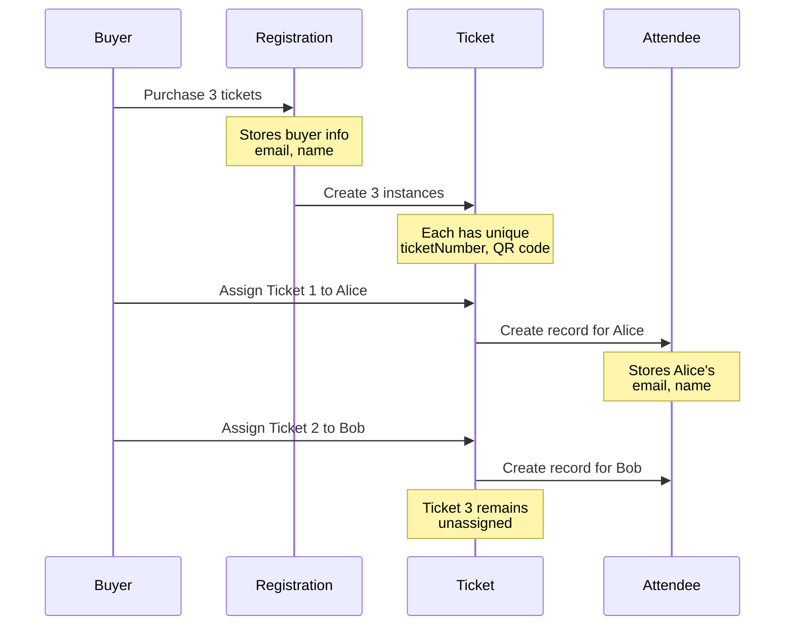
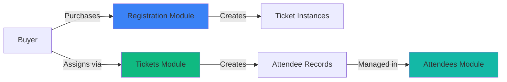

# PRD: Registration Module Documentation Update

**Status**: IMPLEMENTED ✅ - See [71774f86370aa03032487fe3d1d04dfc9040ef56](https://github.com/babblebey/events-ting/commit/71774f86370aa03032487fe3d1d04dfc9040ef56) 
**Created**: November 22, 2025  
**Owner**: Documentation Team  
**Priority**: High  

---

## Executive Summary

The Registration Module documentation currently misrepresents the actual system architecture by conflating the **ticket purchasing process** with **attendee management**. Based on the current database schema and implementation, the system follows a three-tier model:

1. **Registration** = Ticket purchase transaction (buyer information)
2. **Ticket** = Individual ticket instances created from purchase
3. **Attendee** = Person who receives/uses a ticket (actual event participant)

This PRD outlines the comprehensive documentation changes needed to accurately reflect this architecture across all module documentation.

---

## Problem Statement

### Current Issues

**1. Conceptual Confusion**
- Registration docs describe it as "attendee sign-ups" when it's actually a **purchase transaction**
- Buyer and attendee are treated as the same person in documentation
- Multi-ticket purchases are not clearly explained
- The relationship between Registration → Ticket → Attendee is unclear

**2. Data Model Misrepresentation**
```prisma
// ACTUAL SCHEMA (docs don't reflect this)
model Registration {
  email   String  // BUYER email (not attendee)
  name    String  // BUYER name (not attendee)
  quantity Int    // Number of tickets purchased
  tickets Ticket[] // Individual ticket instances
}

model Ticket {
  registrationId String    // Links to purchase
  attendeeId     String?   // Links to actual attendee
  isAssigned     Boolean   // Whether ticket has been assigned
}

model Attendee {
  name  String  // ATTENDEE name (person using ticket)
  email String  // ATTENDEE email
  ticket Ticket? // One-to-one with ticket
}
```

**3. Workflow Inaccuracies**
- Documentation shows attendees registering themselves
- Doesn't explain buyer assigns tickets to different people
- Missing the ticket assignment workflow
- Assignment cutoff logic not documented in registration context

**4. Module Boundary Confusion**
- Registration module docs include attendee management features
- Attendees module understates its importance (called "specialized view")
- Tickets module correctly documents the flow but lacks context

---

## Current System Architecture (From Code Analysis)

### Database Schema

```
┌─────────────────┐
│  Registration   │ (Buyer's Purchase)
├─────────────────┤
│ id              │
│ eventId         │
│ ticketTypeId    │
│ email           │◄── BUYER email
│ name            │◄── BUYER name  
│ userId?         │◄── BUYER account (optional)
│ quantity        │◄── Number of tickets purchased
│ paymentStatus   │
│ registeredAt    │
└────────┬────────┘
         │ 1:N
         ▼
┌─────────────────┐
│     Ticket      │ (Individual Ticket Instance)
├─────────────────┤
│ id              │
│ registrationId  │◄── Links to purchase
│ eventId         │
│ ticketTypeId    │
│ ticketNumber    │◄── Unique identifier
│ qrCodeData      │◄── Pre-generated QR code
│ isAssigned      │◄── Assignment status
│ assignedAt      │
│ attendeeId?     │◄── Links to attendee (nullable)
│ isCheckedIn     │
│ checkedInAt     │
└────────┬────────┘
         │ 1:1 (optional)
         ▼
┌─────────────────┐
│    Attendee     │ (Actual Event Participant)
├─────────────────┤
│ id              │
│ name            │◄── ATTENDEE name
│ email           │◄── ATTENDEE email
│ customData      │◄── Registration form answers
│ emailStatus     │◄── Bounce/unsubscribe tracking
│ userId?         │◄── Optional account link
└─────────────────┘
```

### Key Relationships

1. **One Registration → Many Tickets**
   - When buyer purchases 5 tickets, creates 1 Registration + 5 Ticket instances
   
2. **One Ticket → One Attendee (optional)**
   - Ticket can be unassigned (attendeeId = null)
   - Once assigned, creates/links to Attendee record
   
3. **Buyer ≠ Attendee**
   - Registration stores buyer info (who paid)
   - Attendee stores participant info (who attends)
   - They can be the same person or different people

### API Router Analysis

**`registrationRouter`** handles:
- ✅ Creating purchase transactions (`create`)
- ✅ Listing purchases for organizers (`list`)
- ✅ Manual registration by organizers (`addManually`)
- ✅ Canceling purchases (`cancel`)
- ✅ Exporting buyer lists (`export`)
- ✅ Buyer accessing their purchases (`lookupByEmail`, `getByIdPublic`)
- ⚠️ Email status updates (should be on Attendee, not Registration)

**`ticketsRouter`** handles:
- ✅ Assigning tickets to attendees (`assign`)
- ✅ Unassigning tickets (`unassign`)
- ✅ Listing tickets for a registration (`list`)
- ✅ Viewing individual tickets (`getById`, `getByNumber`)
- ✅ QR code generation (deprecated - now pre-generated)

**Key Finding**: Email status is being updated on Attendee model (correct), but old code references suggest Registration used to have emailStatus field (legacy).

---

## Proposed Documentation Changes

### 1. Registration Module Documentation

#### 1.1 `docs/modules/registration/README.md`

**Changes Needed:**

**BEFORE (Current)**:
> "The Registration module handles attendee sign-ups for events..."

**AFTER (Corrected)**:
> "The Registration module handles ticket purchase transactions for events. It manages the checkout process where buyers purchase one or multiple tickets, which can then be assigned to different attendees."

**Section Restructuring:**

```markdown
## Overview

The Registration module manages the **ticket purchase workflow** for events. When someone buys tickets, the system creates a Registration record (purchase transaction) and generates individual Ticket instances that can be assigned to different attendees.

### Key Concepts

- **Registration** = Purchase transaction (buyer information, payment details)
- **Buyer** = Person who purchases tickets (stored in Registration)
- **Ticket** = Individual ticket instance created from purchase
- **Attendee** = Person who receives/uses a ticket (separate entity)

### Typical Flow

1. Buyer visits event page and selects ticket type + quantity
2. Buyer completes purchase → Creates Registration record
3. System creates X Ticket instances (where X = quantity purchased)
4. Buyer assigns each ticket to an attendee (can be themselves or others)
5. Each assigned ticket creates/links to an Attendee record
6. Attendee receives ticket email with QR code for check-in

## Features

- **Public Purchase Flow**: Self-service ticket purchase for buyers
- **Multi-Ticket Support**: Buy multiple tickets in single transaction
- **Quantity Selection**: Choose number of tickets to purchase
- **Email Confirmation**: Buyer receives confirmation with ticket management link
- **Manual Purchase**: Organizers can create purchases on behalf of buyers
- **Purchase Management**: View, search, and filter purchase transactions
- **CSV Export**: Download buyer data (not attendee data - see Attendees module)
- **Purchase Cancellation**: Cancel entire purchase (frees all associated tickets)
```

**User Roles Section:**

```markdown
## User Roles

### Buyers (Ticket Purchasers)
- Purchase one or multiple tickets via public form
- Select ticket type and quantity
- Receive confirmation email with purchase details
- Access ticket management dashboard to assign tickets
- Can assign tickets to themselves or others
- No authentication required for purchase

### Organizers
- View all purchases for their events
- Search and filter buyer list
- Manually create purchases (bypass availability checks)
- Export purchase data to CSV
- Cancel purchases
- Resend purchase confirmation emails
- Monitor payment status

### Important Distinction
⚠️ **Buyers are NOT the same as Attendees**
- Registration stores buyer information (who paid)
- Attendees are managed in Tickets module (who attends)
- One buyer can purchase tickets for multiple attendees
```

**Module Dependencies:**

```markdown
## Module Dependencies

**This module depends on:**
- **Events Module**: Purchases belong to events
- **Tickets Module**: Defines ticket types available for purchase
- **Communications Module**: Sends purchase confirmation emails

**This module is required by:**
- **Tickets Module**: Creates ticket instances from purchases
- **Attendees Module**: Buyer data used for assignment notifications
- **Dashboard Module**: Purchase metrics and statistics

**Important**: This module handles the PURCHASE transaction. For:
- Ticket assignment → See [Tickets Module](../tickets/)
- Attendee management → See [Attendees Module](../attendees/)
- Attendee data export → See [Attendees Module](../attendees/)
```

#### 1.2 `docs/modules/registration/workflows.md`

**Major Restructuring Needed:**

**Workflow 1: Buyer Purchases Tickets** (renamed from "Public Attendee Registration")

```markdown
## Workflow 1: Buyer Purchases Tickets

**Actors**: Public User (Buyer)  
**Trigger**: User wants to purchase tickets for an event

### Steps

**1. Browse Events**
- Navigate to `/events` or discover event via link
- Public event listing page
- No authentication required

**2. View Event Details**
- Visit `/events/{slug}`
- View event description, date, location
- See available ticket types with pricing

**3. Select Ticket Type and Quantity**
- Choose desired ticket type
- **Select quantity** (1-10 tickets, configurable per event)
- See total price (MVP: all tickets are free)
- Shows only tickets where:
  - Current date is within sale period
  - Quantity > sold count (availability check)

**4. Complete Purchase Form**
- **Required Fields**:
  - Buyer Full Name (who is making the purchase)
  - Buyer Email Address (for purchase confirmation)
- **Note**: This is BUYER information, not attendee information
- Attendee details collected later during ticket assignment

**5. Submit Purchase**
- API: `registration.create` mutation
- **Backend Process**:
  1. Database transaction begins
  2. `SELECT FOR UPDATE` locks TicketType row
  3. Checks availability (quantity × purchase count)
  4. Validates sale period
  5. Creates Registration record (purchase transaction)
  6. **Creates X Ticket instances** (where X = quantity)
  7. Each ticket gets unique ticketNumber and QR code
  8. Transaction commits
  9. Sends purchase confirmation email (async)

**6. See Purchase Confirmation**
- Success screen displays:
  - "Purchase Confirmed! 🎉"
  - Event name
  - Number of tickets purchased
  - First ticket number as reference code
  - Link to ticket management dashboard
  - Email confirmation notice

**7. Receive Purchase Confirmation Email**
- Email sent to buyer address
- Contains:
  - Purchase summary
  - Number of tickets purchased
  - Link to manage tickets (assign to attendees)
  - Event details
  - Instructions for ticket assignment

**8. Assign Tickets to Attendees** (See Tickets Module)
- Buyer accesses ticket management dashboard
- Assigns each ticket to an attendee (can be themselves or others)
- Each assignment creates Attendee record
- Attendee receives separate ticket email with QR code

### Success Criteria
- ✅ Registration (purchase) created in database
- ✅ X Ticket instances created with unique QR codes
- ✅ Ticket sold count incremented atomically
- ✅ Purchase confirmation email sent to buyer
- ✅ Buyer receives link to ticket management dashboard

### Key Differences from Old Flow
- ❌ OLD: "Attendee registers and receives ticket"
- ✅ NEW: "Buyer purchases tickets, then assigns to attendees"
- Registration ≠ Attendee record
- One purchase can create multiple tickets
- Attendee information collected during assignment (Tickets module)
```

**Workflow 2: Organizer Views Purchases** (renamed from "Organizer Views Registrations")

```markdown
## Workflow 2: Organizer Views Purchases

**Purpose**: View who purchased tickets (not who is attending)

**Data Shown**:
- Buyer name and email
- Ticket type purchased
- Quantity purchased
- Payment status
- Purchase date

**Note**: To see attendee information, use:
- Tickets module (individual assignments)
- Attendees module (all attendees, export features)
```

**Workflow 3: Export Purchase Data** (clarified scope)

```markdown
## Workflow 3: Export Purchase Data

**What Gets Exported**:
- Buyer information (name, email)
- Ticket type purchased
- Quantity purchased
- Purchase date
- Payment status

**What Does NOT Get Exported**:
- ❌ Attendee names/emails (use Attendees module export)
- ❌ Ticket assignment status
- ❌ Custom registration field answers

**Use Case**: Financial reconciliation, buyer contact lists
```

**NEW Workflow: Buyer Accesses Ticket Management**

```markdown
## Workflow 7: Buyer Accesses Ticket Management Dashboard

**Actors**: Buyer  
**Trigger**: Buyer wants to assign purchased tickets to attendees

### Steps

**1. Receive Purchase Confirmation Email**
- Email contains link to ticket management
- Link format: `/events/{slug}/registrations/{registrationId}`

**2. Access Dashboard (No Auth Required)**
- Click link in email
- Public page (no login needed)
- Security: URL contains registration ID (acts as token)

**3. View Purchase Summary**
- See all tickets from this purchase
- Each ticket shows:
  - Ticket number
  - Assignment status (assigned/unassigned)
  - Attendee name/email (if assigned)
  - Assignment actions

**4. Assign Tickets**
- Click "Assign Ticket" on unassigned ticket
- Fill attendee details (name, email, custom fields)
- Submit → Creates Attendee record, links to Ticket
- Attendee receives ticket email
- **See Tickets Module for full assignment workflow**

**5. Manage Assignments**
- Reassign tickets (before cutoff)
- View all assigned tickets
- Track which tickets still need assignment

### Success Criteria
- ✅ Buyer can access dashboard via email link
- ✅ All purchased tickets displayed
- ✅ Assignment status clearly shown
- ✅ Easy navigation to assignment flow
```

#### 1.3 `docs/modules/registration/data-model.md`

**Complete Rewrite of Field Descriptions:**

```markdown
# Registration Data Model

## Primary Model: Registration (Purchase Transaction)

```prisma
model Registration {
  id          String   @id @default(cuid())
  eventId     String
  event       Event    @relation(...)
  
  ticketTypeId String
  ticketType   TicketType @relation(...)
  
  // BUYER Information (person making the purchase)
  email       String  // Buyer's email
  name        String  // Buyer's name
  userId      String? // Optional: link to buyer's account
  user        User?   @relation(...)
  
  // Purchase Details
  quantity    Int @default(1)  // Number of tickets purchased
  
  // Payment
  paymentStatus     String  @default("free")
  paymentIntentId   String?
  paymentProcessor  String?
  
  // Relations
  tickets Ticket[] // Individual ticket instances created from this purchase
  
  registeredAt DateTime @default(now())
  updatedAt    DateTime @updatedAt
}
```

## Field Descriptions

### Buyer Information (NOT Attendee)

| Field | Type | Description |
|-------|------|-------------|
| `email` | String | **BUYER'S** email address (who made the purchase) |
| `name` | String | **BUYER'S** full name (who paid for tickets) |
| `userId` | String? | Optional link to buyer's User account |

**Critical Distinction**:
- These fields store **buyer information** (who purchased)
- They do NOT store attendee information (who attends)
- Attendee information is in the separate `Attendee` model
- One buyer can purchase tickets for multiple attendees

### Purchase Details

| Field | Type | Description |
|-------|------|-------------|
| `quantity` | Int | Number of tickets purchased in this transaction |

**How It Works**:
- Buyer selects quantity during purchase (e.g., 5 tickets)
- System creates 1 Registration record + 5 Ticket instances
- Each Ticket can be assigned to a different Attendee

### Relationships

#### Has Many: Tickets
- **Relation**: One registration → Many tickets
- **Cardinality**: 1:N (minimum 1, no maximum enforced by schema)
- **Purpose**: Each purchased ticket gets its own Ticket instance

**Example**:
```typescript
// Buyer purchases 3 tickets
const registration = await db.registration.create({
  data: {
    email: "buyer@example.com",  // Buyer email
    name: "John Buyer",           // Buyer name
    quantity: 3,
    tickets: {
      create: [
        { ticketNumber: "TKT-001", ... },  // Can assign to Attendee A
        { ticketNumber: "TKT-002", ... },  // Can assign to Attendee B
        { ticketNumber: "TKT-003", ... },  // Can assign to Attendee C
      ]
    }
  }
});
```

## Common Queries

### Get Purchase with All Tickets
```typescript
const purchase = await db.registration.findUnique({
  where: { id: registrationId },
  include: {
    tickets: {
      include: {
        attendee: true,  // See who each ticket is assigned to
      }
    }
  }
});

// purchase.email = buyer email
// purchase.tickets[0].attendee?.email = first attendee email
// These can be different people!
```

### Get Buyer's Purchase History
```typescript
const purchases = await db.registration.findMany({
  where: { userId: userId },  // Buyer's user ID
  include: {
    tickets: {
      where: { isAssigned: true },
      include: { attendee: true }
    }
  }
});
```

## Data Flow


```

#### 1.4 `docs/modules/registration/frontend.md`

**Update Component Descriptions:**

```markdown
## Components

### `RegistrationForm` → Rename to `PurchaseForm`

**File**: `src/components/registration/registration-form.tsx`  
**Purpose**: Public-facing ticket purchase form (BUYER information)

**Props**:
```typescript
interface PurchaseFormProps {
  ticketTypeId: string;
  ticketTypeName: string;
  eventName: string;
  maxQuantity?: number;      // NEW: maximum tickets per purchase
  onSuccess?: (registrationId: string, quantity: number) => void;
}
```

**Form Fields**:
```tsx
<FormSection title="Buyer Information">
  <FormField
    label="Your Full Name"
    helpText="As the purchaser of these tickets"
    // ...
  />
  
  <FormField
    label="Your Email Address"
    helpText="Purchase confirmation will be sent here"
    // ...
  />
  
  <FormField
    label="Number of Tickets"
    type="number"
    min={1}
    max={maxQuantity ?? 10}
    helpText="You can assign these tickets to different people"
    // ...
  />
</FormSection>

<div className="info-box">
  💡 After purchase, you'll receive a link to assign each ticket to attendees
</div>
```

**Success State**:
```tsx
<div className="success-screen">
  <h2>Purchase Confirmed! 🎉</h2>
  
  <p>You purchased {quantity} ticket(s) for {eventName}</p>
  
  <div className="next-steps">
    <h3>Next Steps:</h3>
    <ol>
      <li>Check your email for purchase confirmation</li>
      <li>Click the link to manage your tickets</li>
      <li>Assign each ticket to an attendee</li>
    </ol>
  </div>
  
  <Button onClick={() => router.push(`/registrations/${registrationId}`)}>
    Manage Your Tickets
  </Button>
</div>
```

### `AttendeeTable` → Move to Attendees Module

**Note**: This component is being documented incorrectly. It should be fully documented in:
- `docs/modules/attendees/frontend.md` (NOT in registration module)
```

#### 1.5 `docs/modules/registration/backend.md`

**Update Procedure Descriptions:**

```markdown
## Procedures

### `create` - Create Purchase Transaction

**Access**: Public  
**Purpose**: Process ticket purchase (NOT attendee registration)

**Input**:
```typescript
{
  ticketTypeId: string;
  email: string;      // BUYER email
  name: string;       // BUYER name
  quantity: number;   // NEW: how many tickets to purchase (default 1)
}
```

**Process**:
1. Validate ticket availability (quantity × count)
2. Check sale period
3. Create Registration record (buyer info)
4. **Create X Ticket instances** (where X = input.quantity)
5. Generate unique ticketNumber and QR code for each
6. Send purchase confirmation to buyer email
7. Email includes link to ticket management dashboard

**Returns**:
```typescript
{
  id: string;                    // Registration ID
  registrationCode: string;      // First ticket number
  quantity: number;              // Number of tickets purchased
  ticketManagementUrl: string;   // Link to assign tickets
}
```

**Email Sent**: Purchase confirmation (to buyer)
**Email NOT Sent**: Ticket assignment emails (sent later during assignment)

### `list` - List Purchases (Organizer)

**What It Returns**: BUYER data, not attendee data

**Output**:
```typescript
{
  items: [
    {
      id: string;
      email: string;        // Buyer email
      name: string;         // Buyer name
      quantity: number;     // Tickets purchased
      ticketType: {...};
      paymentStatus: string;
      registeredAt: Date;
    }
  ]
}
```

**Use Case**: 
- See who purchased tickets
- Financial reconciliation
- Contact buyers

**NOT for**:
- ❌ Seeing attendee list (use Attendees module)
- ❌ Checking ticket assignments (use Tickets module)
- ❌ Exporting attendee data (use Attendees module)

### `export` - Export Purchase Data

**What Gets Exported**: Buyer information only

**CSV Columns**:
- Buyer Name
- Buyer Email
- Ticket Type
- Quantity Purchased
- Purchase Date
- Payment Status

**Does NOT Include**:
- ❌ Attendee names
- ❌ Attendee emails
- ❌ Ticket numbers
- ❌ Assignment status
- ❌ Custom field answers

**For Attendee Data**: Use `attendees.export` instead

### `lookupByEmail` - Buyer Accesses Purchases (Public)

**NEW Procedure** (document this better)

**Purpose**: Allow buyers to find their purchases without login

**Input**:
```typescript
{
  eventId: string;
  email: string;  // Buyer email
}
```

**Returns**: All purchases made by this email for this event

**Use Case**: 
- "Forgot my confirmation email" flow
- Buyer self-service without creating account
```

---

### 2. Attendees Module Documentation

#### 2.1 `docs/modules/attendees/README.md`

**MAJOR REWRITE - Elevate Module Importance**

```markdown
# Attendees Module

## Overview

The Attendees module manages the **actual event participants** - the people who receive tickets and attend the event. This is distinct from the Registration module which handles ticket purchases.

### Critical Distinction

**Registration Module** = Ticket purchasing (buyer data)  
**Attendees Module** = Event participation (who actually attends)

**Example Flow**:
1. Alice (buyer) purchases 5 tickets → Creates Registration
2. System creates 5 Ticket instances
3. Alice assigns tickets to: Bob, Carol, Dave, Eve, and herself
4. 5 Attendee records created → Attendees module manages them

## Key Concepts

### Attendee vs Buyer vs Ticket

| Entity | Represents | Example |
|--------|-----------|---------|
| **Registration** | Purchase transaction | Alice buys 5 tickets |
| **Ticket** | Individual ticket instance | Ticket #001, #002, #003... |
| **Attendee** | Person using a ticket | Bob, Carol, Dave, Eve, Alice |

**One Registration** (Alice's purchase)  
→ **Five Tickets** (individual instances)  
→ **Five Attendees** (the people attending)

### Attendee Data Model

```prisma
model Attendee {
  id          String  @id
  name        String  // ATTENDEE name (not buyer)
  email       String  // ATTENDEE email (not buyer)
  customData  Json?   // Registration form answers
  emailStatus String  // Bounce/unsubscribe tracking
  ticket      Ticket? // One-to-one relationship
}
```

## Features

- **Attendee List View**: All people attending event (not who purchased)
- **Real-time Search**: Find attendees by name or email
- **Ticket Type Filtering**: Filter by ticket tier
- **Email Status Tracking**: Monitor bounces and unsubscribes
- **CSV Export**: Download attendee data (with custom field answers)
- **CSV Import**: Bulk import attendees with validation
- **Resend Tickets**: Re-send ticket emails to attendees
- **Assignment Management**: View ticket assignments
- **Custom Field Data**: View attendee responses to custom questions

## User Roles

### Organizers
- View all attendees (people attending, not buyers)
- Search and filter attendee list
- Export attendee data with custom fields
- Resend ticket emails
- Monitor email delivery status
- **Full control** over attendee management

### Attendees
- Receive ticket via email (assigned by buyer)
- View their ticket details and QR code
- No direct access to attendee list
- Privacy protected

### Buyers
- Assign tickets to create attendees (Tickets module)
- Cannot directly view attendee list (privacy)
- Can only see attendees for tickets they purchased

## Module Dependencies

**This module depends on:**
- **[Tickets Module](../tickets/)**: Attendees are created via ticket assignment
- **[Events Module](../events/)**: Attendees belong to events
- **[Communications Module](../communications/)**: Email delivery to attendees

**This module is required by:**
- **Communications Module**: Target recipients for email campaigns
- **Check-in Module** (future): Attendee check-in at event

## Module Scope

### This Module Handles:
- ✅ Viewing who is attending the event
- ✅ Exporting attendee data (names, emails, custom fields)
- ✅ Searching and filtering attendees
- ✅ Resending ticket emails
- ✅ Monitoring email delivery status
- ✅ Importing attendees in bulk

### This Module Does NOT Handle:
- ❌ Ticket purchasing (see Registration module)
- ❌ Ticket assignment (see Tickets module)
- ❌ Buyer information management (see Registration module)
- ❌ Payment processing (see Registration module)

## Relationship to Other Modules

### vs Registration Module
- **Registration**: Who **purchased** tickets (buyer data)
- **Attendees**: Who is **attending** event (participant data)
- Often different people (group purchases)

### vs Tickets Module
- **Tickets**: Individual ticket instances (QR codes, assignment status)
- **Attendees**: The people assigned to tickets
- One ticket → One attendee (after assignment)

### Backend Implementation Note

The Attendees module uses data from the `Attendee` model, which is:
- **Created during ticket assignment** (Tickets module)
- **Managed and viewed** (Attendees module)
- **Used for communications** (Communications module)

It does NOT use the Registration model directly.
```

#### 2.2 `docs/modules/attendees/data-model.md`

**NEW FILE - Fully Document Attendee Model**

```markdown
# Attendees Data Model

## Primary Model: Attendee

```prisma
model Attendee {
  id String @id @default(cuid())

  // Attendee Personal Information
  name  String  // Person attending event
  email String  // Their email address
  
  // Custom registration form responses
  customData Json? // Answers to event-specific questions
  
  // Email delivery status
  emailStatus String @default("active") // 'active' | 'bounced' | 'unsubscribed'
  
  // Relations
  ticket Ticket? // One-to-one with ticket
  
  // Optional user account link
  userId String?
  user   User?   @relation(...)
  
  createdAt DateTime @default(now())
  updatedAt DateTime @updatedAt
}
```

## Field Descriptions

### Personal Information

| Field | Type | Description |
|-------|------|-------------|
| `name` | String | Attendee's full name (person using the ticket) |
| `email` | String | Attendee's email (where ticket is sent) |

**Important**:
- These are **attendee details**, not buyer details
- Buyer information is in Registration model
- One buyer can create multiple attendees

### Custom Data (JSON)

Stores attendee responses to event-specific custom fields:

```typescript
// Example customData structure
{
  "dietary_restrictions": "vegetarian",
  "t_shirt_size": "M",
  "arrival_time": "morning",
  "special_needs": "wheelchair access"
}
```

**Use Cases**:
- Dietary preferences for catering
- T-shirt sizes for swag
- Workshop preferences
- Accessibility needs
- Any event-specific questions

### Email Status

| Value | Meaning | Impact |
|-------|---------|--------|
| `active` | Can receive emails | ✅ Sent all communications |
| `bounced` | Email delivery failed | ❌ Excluded from email sends |
| `unsubscribed` | Opted out | ❌ Excluded from email sends |

**Updated via**: Email service webhooks (Resend, SendGrid, etc.)

## Relationships

### Belongs To: Ticket (One-to-One)

```prisma
ticket Ticket? @relation(...)
```

- Each attendee linked to exactly one ticket
- Ticket can exist without attendee (unassigned)
- When ticket assigned → Attendee record created
- When ticket unassigned → Attendee record deleted (GDPR)

### Optional: User Account

```prisma
userId String?
user   User?   @relation(...)
```

- Attendee can be linked to registered user
- Allows users to view their upcoming events
- Not required - supports guest attendees

## Lifecycle

### Creation
```typescript
// Created during ticket assignment
const attendee = await db.attendee.create({
  data: {
    name: "Bob Smith",
    email: "bob@example.com",
    customData: {
      dietary_restrictions: "vegan",
      t_shirt_size: "L"
    }
  }
});

await db.ticket.update({
  where: { id: ticketId },
  data: { 
    attendeeId: attendee.id,
    isAssigned: true
  }
});
```

### Reassignment (GDPR Compliant)
```typescript
// Old attendee deleted, new one created
await db.attendee.delete({
  where: { id: oldAttendeeId }  // Removes personal data
});

const newAttendee = await db.attendee.create({
  data: {...}
});

await db.ticket.update({
  where: { id: ticketId },
  data: { attendeeId: newAttendee.id }
});
```

### Deletion
- Deleted when ticket unassigned
- Deleted when ticket deleted (cascade)
- Deleted when event deleted (cascade via ticket)

## Common Queries

### List All Attendees for Event
```typescript
const attendees = await db.attendee.findMany({
  where: {
    ticket: {
      eventId: eventId
    }
  },
  include: {
    ticket: {
      include: {
        ticketType: true,
        registration: true  // Can see buyer info
      }
    }
  }
});
```

### Export Attendee Data
```typescript
const attendees = await db.attendee.findMany({
  where: {
    ticket: { eventId },
    emailStatus: "active"  // Only active emails
  },
  select: {
    name: true,
    email: true,
    customData: true,
    ticket: {
      select: {
        ticketNumber: true,
        ticketType: { select: { name: true } },
        isCheckedIn: true
      }
    }
  }
});
```

### Search Attendees
```typescript
const results = await db.attendee.findMany({
  where: {
    ticket: { eventId },
    OR: [
      { name: { contains: search, mode: 'insensitive' } },
      { email: { contains: search, mode: 'insensitive' } }
    ]
  }
});
```

## Data Privacy (GDPR)

### Personal Data Stored
- ✅ Name (PII)
- ✅ Email (PII)
- ✅ Custom field answers (potentially sensitive)

### Privacy Safeguards

**Deletion on Reassignment**:
- Old attendee data immediately deleted
- No historical record of previous assignments
- Complies with "right to be forgotten"

**Access Control**:
- Only event organizers can view attendee list
- Buyers cannot see other attendees (only their own tickets)
- Attendees cannot see other attendees

**Email Preferences**:
- Unsubscribe respected (emailStatus tracking)
- Bounced emails not sent (waste prevention)

### Export Considerations
- Organizers responsible for secure storage
- Delete exports after event if not needed
- Comply with local data protection laws
- Provide opt-out mechanisms

## Indexes

```prisma
@@index([email])         // Search by email
@@index([emailStatus])   // Filter active recipients
@@index([userId])        // User's attended events
```

## Validation

**Application-Level Rules**:
- Name: 2-100 characters
- Email: Valid email format
- Custom data: Matches event's custom field schema
- Email status: Must be 'active' | 'bounced' | 'unsubscribed'
```

---

### 3. Tickets Module Documentation

#### 3.1 `docs/modules/tickets/README.md`

**Updates Needed:**

```markdown
## Overview

The Tickets module manages individual ticket instances and their assignment to attendees. It serves as the **bridge between purchases (Registration) and participants (Attendees)**.

### The Three-Tier Model

```
Registration (Purchase)
    ↓ creates
Ticket Instances
    ↓ assigned to
Attendees (Participants)
```

**Example**:
1. Alice (buyer) purchases 3 tickets → 1 Registration + 3 Tickets
2. Alice assigns Ticket #1 to Bob → Creates Attendee "Bob"
3. Alice assigns Ticket #2 to Carol → Creates Attendee "Carol"
4. Ticket #3 remains unassigned → No attendee yet

## Key Concepts

### Registration → Ticket → Attendee Flow

| Step | Entity | Data | Purpose |
|------|--------|------|---------|
| 1 | **Registration** | Buyer info, quantity, payment | Purchase transaction |
| 2 | **Ticket** (×N) | Ticket numbers, QR codes | Individual instances |
| 3 | **Attendee** (×N) | Attendee info, custom fields | Event participants |

### Module Scope

This module handles:
- ✅ Creating ticket instances from purchases
- ✅ Assigning tickets to attendees
- ✅ Reassigning tickets (GDPR-compliant deletion)
- ✅ Unassigning tickets
- ✅ Generating/managing QR codes
- ✅ Tracking assignment status
- ✅ Enforcing assignment cutoffs

This module does NOT handle:
- ❌ Ticket purchasing (see Registration module)
- ❌ Listing all attendees (see Attendees module)
- ❌ Exporting attendee data (see Attendees module)
- ❌ Check-in processing (future module)

## User Roles

### Buyers (Ticket Purchasers) - PRIMARY USERS
- **Purchase tickets** via Registration module
- **Access ticket management dashboard** via email link
- **Assign tickets to attendees** (name, email, custom fields)
- **Reassign tickets** before cutoff
- **View all tickets** from their purchase
- Cannot assign tickets after cutoff time

**Typical Flow**:
1. Buy 5 tickets → Receive purchase confirmation
2. Click "Manage Tickets" link in email
3. Assign each ticket to a person
4. Each assignee receives ticket email with QR code

### Attendees (Ticket Recipients)
- **Receive unique ticket** via email (assigned by buyer)
- **View individual ticket** details and QR code
- Cannot reassign tickets (only buyer can)
- Use QR code for event check-in (future)

### Organizers
- View all tickets for their events
- See assignment status and metrics
- Configure assignment cutoff time
- Set maximum tickets per purchase
- Cannot directly assign tickets (buyers do this)

## Module Dependencies

**This module depends on:**
- **[Registration Module](../registration/)**: Tickets created from purchases
- **[Events Module](../events/)**: Assignment cutoff configured at event level
- **[Communications Module](../communications/)**: Send ticket emails to attendees

**This module is required by:**
- **[Attendees Module](../attendees/)**: Each ticket creates an Attendee when assigned
- **Check-in Module** (future): QR code scanning for event entry

**Creates data for**:
- Attendee records (via assignment)
```

#### 3.2 Update Backend Documentation

```markdown
## Backend Router: `ticketsRouter`

### `assign` - Assign Ticket to Attendee

**Access**: Protected (buyer or event organizer)  
**Purpose**: Create attendee record and link to ticket

**Input**:
```typescript
{
  ticketId: string;
  attendee: {
    name: string;      // ATTENDEE name (not buyer)
    email: string;     // ATTENDEE email (not buyer)
    customData?: Record<string, unknown>;
  };
  expectedUpdatedAt: Date;  // Optimistic locking
}
```

**Process**:
1. Verify buyer owns registration OR user is organizer
2. Check assignment cutoff hasn't passed
3. Validate custom data against event schema
4. **If reassignment**: Delete old Attendee record (GDPR)
5. **Create new Attendee record**
6. Update Ticket: set attendeeId, isAssigned = true
7. Send ticket email to ATTENDEE email (not buyer)

**Creates**: Attendee record in database

**Email Sent**: Ticket assignment email (to attendee, not buyer)

**Returns**: Updated ticket with linked attendee
```

---

### 4. Index and Navigation Updates

#### 4.1 `docs/index.md`

**BEFORE**:
```markdown
- **[Registration](./modules/registration/)** - Attendee registration and check-in
```

**AFTER**:
```markdown
- **[Registration](./modules/registration/)** - Ticket purchasing and transaction management
- **[Tickets](./modules/tickets/)** - Ticket assignment and management
- **[Attendees](./modules/attendees/)** - Event participant management and tracking
```

#### 4.2 `docs/README.md`

**Update Module Interconnection Map**:

```markdown
## Module Flow Diagram



### Quick Concept Reference

| Concept | Module | Represents | Example |
|---------|--------|------------|---------|
| **Registration** | Registration | Ticket purchase transaction | Alice buys 5 tickets |
| **Ticket** | Tickets | Individual ticket instance | Ticket #TKT-001, #TKT-002... |
| **Attendee** | Attendees | Person attending event | Bob, Carol, Dave, Eve, Alice |
```

---

### 5. Troubleshooting Guide Updates

#### 5.1 `docs/troubleshooting.md`

**Add New Section**:

```markdown
## Registration vs Attendees Confusion

### Problem
"I can't find attendee information in the registration export"

### Explanation
**Registration** and **Attendees** are separate concepts:

- **Registration** = Ticket purchase (buyer data)
  - Who purchased tickets
  - How many tickets
  - Payment information
  
- **Attendees** = Event participants (attendee data)
  - Who is actually attending
  - Ticket assignments
  - Custom field answers

### Solution
For attendee data, use:
- **Attendees Module** → View attendees tab
- **Export Attendees** → Get attendee CSV (includes custom fields)

For buyer/purchase data, use:
- **Registration Module** → View purchases
- **Export Registrations** → Get buyer CSV

### Example Scenario
Alice purchases 5 tickets:
- **Registration export** shows: 1 row (Alice as buyer)
- **Attendees export** shows: 5 rows (Bob, Carol, Dave, Eve, Alice)

---

## "Where do I assign tickets to attendees?"

### Answer
Ticket assignment happens in the **Tickets Module**, not Registration.

**Flow**:
1. Buyer purchases tickets (Registration module)
2. Buyer receives confirmation email
3. Buyer clicks "Manage Tickets" link
4. Buyer assigns each ticket (Tickets module)
5. Each assignment creates Attendee record
6. Attendee receives ticket email

**Organizers**: Cannot directly assign tickets. Buyers must do this via their ticket management dashboard.
```

---

## Implementation Plan

### Phase 1: Core Module READMEs (Week 1)
- [ ] Update `docs/modules/registration/README.md`
- [ ] Rewrite `docs/modules/attendees/README.md`
- [ ] Update `docs/modules/tickets/README.md`
- [ ] Review and test all cross-references

### Phase 2: Detailed Documentation (Week 1-2)
- [ ] Rewrite `docs/modules/registration/workflows.md`
- [ ] Rewrite `docs/modules/registration/data-model.md`
- [ ] Update `docs/modules/registration/frontend.md`
- [ ] Update `docs/modules/registration/backend.md`
- [ ] Create `docs/modules/attendees/data-model.md`
- [ ] Update `docs/modules/attendees/workflows.md`
- [ ] Update `docs/modules/tickets/backend.md`

### Phase 3: Navigation and Index (Week 2)
- [ ] Update `docs/index.md`
- [ ] Update `docs/README.md` (system overview)
- [ ] Update `docs/troubleshooting.md`
- [ ] Update `docs/architecture/data-model.md`

### Phase 4: Verification (Week 2)
- [ ] Cross-reference check (all links work)
- [ ] Consistency check (terminology aligned)
- [ ] Code examples match actual implementation
- [ ] Diagrams updated and accurate

---

## Success Criteria

### Documentation Quality
- ✅ Clear distinction between Registration, Ticket, and Attendee
- ✅ Accurate representation of database schema
- ✅ Workflows match actual code implementation
- ✅ All cross-references use correct terminology
- ✅ No conflation of buyer and attendee concepts

### Developer Experience
- ✅ New developers understand the three-tier model
- ✅ Module boundaries clearly defined
- ✅ Easy to find relevant documentation
- ✅ Code examples are accurate and helpful

### User Clarity
- ✅ Organizers understand where to find attendee data
- ✅ Clear guidance on export functionality
- ✅ Troubleshooting guide addresses common confusion

---

## Terminology Standardization

### Use These Terms

| ✅ Correct | ❌ Avoid | Context |
|-----------|---------|---------|
| Buyer | Registrant | Person purchasing tickets |
| Attendee | Registrant | Person attending event |
| Purchase | Registration | The transaction |
| Ticket assignment | Registration | Linking ticket to attendee |
| Ticket management | Registration management | Buyer's dashboard |
| Purchase confirmation | Registration confirmation | Email to buyer |
| Ticket email | Attendee confirmation | Email to attendee |

### Consistent Phrasing

**When describing the flow**:
- ✅ "Buyer purchases tickets, then assigns to attendees"
- ❌ "Attendee registers for event"

**When describing data**:
- ✅ "Registration stores buyer information"
- ❌ "Registration stores attendee information"

**When describing exports**:
- ✅ "Export buyers" (Registration module)
- ✅ "Export attendees" (Attendees module)
- ❌ "Export registrations" (ambiguous)

---

## Open Questions

1. **Should we rename the Registration model to Purchase?**
   - Pros: More accurate terminology
   - Cons: Breaking change, requires migration
   - Recommendation: No - just improve documentation

2. **Should we add quantity field validation?**
   - Currently enforced at application level
   - Consider database constraint: `CHECK (quantity > 0)`
   - Recommendation: Add in future PR

3. **Should Attendees module have its own tRPC router?**
   - Currently shares registrationRouter
   - Pros of separate router: Clearer boundaries
   - Cons: Code duplication, migration effort
   - Recommendation: Keep shared router, document clearly

4. **Email status field location**
   - Currently on Attendee model (correct)
   - Old references suggest it was on Registration
   - Recommendation: Verify and remove legacy references

---

## Related PRDs

- `specs/003-ticket-attendee-separation` - Original specification for three-tier model
- `prds/modular-documentation` - Documentation structure standards

---

## Approval & Sign-off

**Technical Review**: [ ] Approved / [ ] Needs Changes  
**Documentation Lead**: [ ] Approved / [ ] Needs Changes  
**Product Owner**: [ ] Approved / [ ] Needs Changes  

---

**Document Version**: 1.0  
**Last Updated**: November 22, 2025  
**Next Review**: After Phase 1 completion
