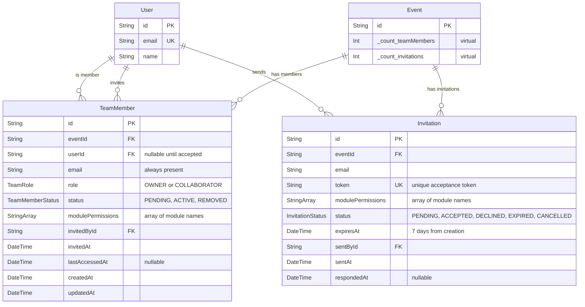
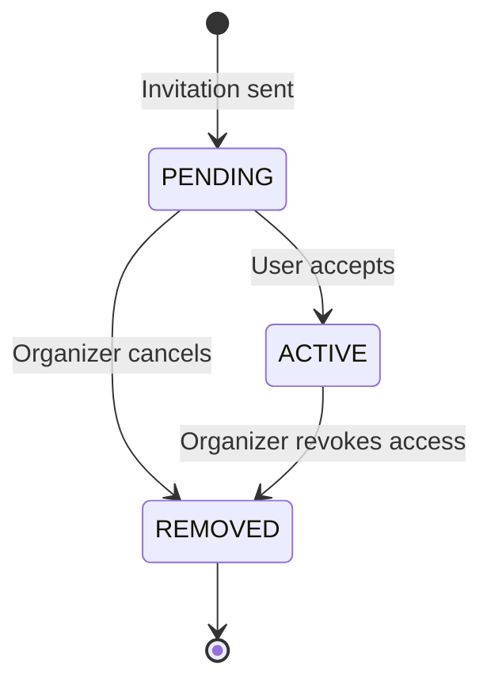
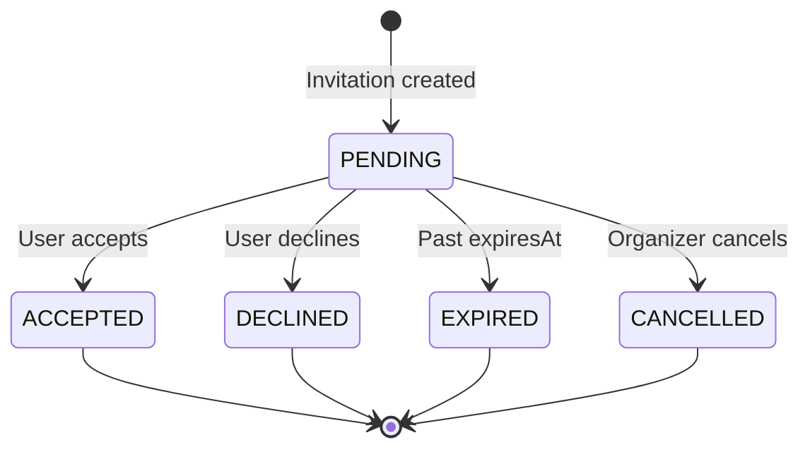

# Data Model: Event Team Collaborators & Permissions

**Feature**: Team collaboration with granular module permissions  
**Date**: November 16, 2025  
**Status**: Phase 1 - Design Complete

---

## Entity Relationship Diagram



---

## Prisma Schema Changes

### New Enums

```prisma
/// Role of team member in event
enum TeamRole {
  OWNER          /// Event creator, full access
  COLLABORATOR   /// Invited team member, configurable access
}

/// Lifecycle status of team member
enum TeamMemberStatus {
  PENDING   /// Invitation sent, awaiting acceptance
  ACTIVE    /// Invitation accepted, user has access
  REMOVED   /// Access revoked by organizer
}

/// Status of invitation
enum InvitationStatus {
  PENDING    /// Awaiting user response
  ACCEPTED   /// User accepted invitation
  DECLINED   /// User declined invitation
  EXPIRED    /// Past 7-day expiration date
  CANCELLED  /// Organizer cancelled before acceptance
}
```

### New Models

#### TeamMember

**Purpose**: Represents a user's membership in an event team with role and permissions

```prisma
model TeamMember {
  id                String            @id @default(cuid())
  
  // Relations
  eventId           String
  event             Event             @relation(fields: [eventId], references: [id], onDelete: Cascade)
  
  userId            String?           // Null until invitation accepted
  user              User?             @relation("TeamMemberUser", fields: [userId], references: [id], onDelete: SetNull)
  
  // Identity
  email             String            // Always present for invitations
  
  // Role & Status
  role              TeamRole          @default(COLLABORATOR)
  status            TeamMemberStatus  @default(PENDING)
  
  // Permissions
  modulePermissions String[]          @default([])  // ["CFP", "ATTENDEES", "SCHEDULE"]
  
  // Audit Trail
  invitedById       String
  invitedBy         User              @relation("TeamMemberInviter", fields: [invitedById], references: [id], onDelete: Restrict)
  invitedAt         DateTime          @default(now())
  lastAccessedAt    DateTime?
  
  // Timestamps
  createdAt         DateTime          @default(now())
  updatedAt         DateTime          @updatedAt
  
  // Constraints
  @@unique([eventId, email])          // One membership per email per event
  @@unique([eventId, userId])         // One membership per user per event (after accepted)
  
  // Indexes
  @@index([eventId])
  @@index([userId])
  @@index([email])
  @@index([status])
  @@index([eventId, status])          // For filtering active members
  @@index([eventId, role])            // For owner lookups
}
```

**Key Design Decisions**:
- **email always present**: Supports invitations before user account exists
- **userId nullable**: Set only after invitation acceptance
- **modulePermissions as String[]**: Efficient for binary permission checks, validated via Zod
- **Unique constraints**: Prevents duplicate memberships (by email AND by userId)
- **onDelete: Cascade for Event**: Deleting event removes all team members
- **onDelete: SetNull for User**: User deletion doesn't delete team history
- **onDelete: Restrict for invitedBy**: Prevents deleting organizers who invited people

**Status Lifecycle**:
```
PENDING → ACTIVE (invitation accepted)
PENDING → REMOVED (organizer cancels invitation)
ACTIVE → REMOVED (organizer revokes access)
```

#### Invitation

**Purpose**: Tracks pending invitations with secure tokens and expiry

```prisma
model Invitation {
  id                String            @id @default(cuid())
  
  // Relations
  eventId           String
  event             Event             @relation(fields: [eventId], references: [id], onDelete: Cascade)
  
  // Invitation Details
  email             String
  token             String            @unique  // crypto.randomBytes(32) in base64url
  modulePermissions String[]          @default([])
  
  // Status & Expiry
  status            InvitationStatus  @default(PENDING)
  expiresAt         DateTime          // Set to now() + 7 days on creation
  
  // Sender
  sentById          String
  sentBy            User              @relation(fields: [sentById], references: [id], onDelete: Restrict)
  sentAt            DateTime          @default(now())
  
  // Response Tracking
  respondedAt       DateTime?         // Set when accepted/declined
  
  // Indexes
  @@index([token])                    // For fast token lookup
  @@index([eventId])                  // For listing invitations per event
  @@index([email])                    // For duplicate detection
  @@index([status, expiresAt])        // For expiry cleanup queries
  @@index([eventId, status])          // For filtering pending invitations
}
```

**Key Design Decisions**:
- **token unique**: Prevents collision, enables fast lookup
- **expiresAt**: Database-enforced expiry (checked in queries, not via cron)
- **respondedAt nullable**: Only set when status changes to ACCEPTED/DECLINED
- **No userId relation**: Invitation is pre-acceptance, user may not exist yet
- **onDelete: Cascade for Event**: Deleting event removes invitations
- **onDelete: Restrict for sentBy**: Prevents deleting organizers who sent invitations

**Status Transitions**:
```
PENDING → ACCEPTED (user accepts)
PENDING → DECLINED (user declines)
PENDING → EXPIRED (past expiresAt, checked via query)
PENDING → CANCELLED (organizer cancels)
```

---

### Model Updates

#### Event

**Add relations to existing Event model**:

```prisma
model Event {
  // ... existing fields ...
  
  // New Relations
  teamMembers     TeamMember[]
  invitations     Invitation[]
  
  // Update _count to include new relations
  _count          EventCount?
}

// Virtual counts (auto-generated by Prisma)
// event._count.teamMembers
// event._count.invitations
```

#### User

**Add relations to existing User model**:

```prisma
model User {
  // ... existing fields ...
  
  // New Relations
  teamMemberships  TeamMember[]   @relation("TeamMemberUser")
  invitedMembers   TeamMember[]   @relation("TeamMemberInviter")
  invitationsSent  Invitation[]
}
```

---

## Field Specifications

### TeamMember Fields

| Field | Type | Nullable | Default | Description |
|-------|------|----------|---------|-------------|
| `id` | String (CUID) | No | auto | Primary key |
| `eventId` | String | No | — | Foreign key to Event |
| `userId` | String | **Yes** | null | Foreign key to User (null until accepted) |
| `email` | String | No | — | Email address for invitation |
| `role` | TeamRole | No | COLLABORATOR | OWNER or COLLABORATOR |
| `status` | TeamMemberStatus | No | PENDING | PENDING, ACTIVE, REMOVED |
| `modulePermissions` | String[] | No | [] | Array of module names |
| `invitedById` | String | No | — | User who sent invitation |
| `invitedAt` | DateTime | No | now() | When invitation was sent |
| `lastAccessedAt` | DateTime | **Yes** | null | Last time member accessed event |
| `createdAt` | DateTime | No | now() | Record creation timestamp |
| `updatedAt` | DateTime | No | now() | Record update timestamp |

### Invitation Fields

| Field | Type | Nullable | Default | Description |
|-------|------|----------|---------|-------------|
| `id` | String (CUID) | No | auto | Primary key |
| `eventId` | String | No | — | Foreign key to Event |
| `email` | String | No | — | Email address of invitee |
| `token` | String | No | — | Unique acceptance token (base64url, 43 chars) |
| `modulePermissions` | String[] | No | [] | Array of module names |
| `status` | InvitationStatus | No | PENDING | PENDING, ACCEPTED, DECLINED, EXPIRED, CANCELLED |
| `expiresAt` | DateTime | No | — | Expiration date (7 days from creation) |
| `sentById` | String | No | — | User who sent invitation |
| `sentAt` | DateTime | No | now() | When invitation was sent |
| `respondedAt` | DateTime | **Yes** | null | When user accepted/declined |

---

## Validation Rules

### Module Permissions

**Valid module names** (enforced via Zod):
```typescript
const MODULE_NAMES = [
  "OVERVIEW",
  "ATTENDEES",
  "TICKETS",
  "SCHEDULE",
  "SPEAKERS",
  "CFP",
  "COMMUNICATIONS",
] as const;

type ModuleName = typeof MODULE_NAMES[number];
```

**Validation schema**:
```typescript
const modulePermissionsSchema = z.array(
  z.enum(MODULE_NAMES)
).min(1, "Select at least one module");
```

**Notes**:
- SETTINGS module is NOT assignable (owner-only)
- OVERVIEW is optional (many organizers grant this for visibility)
- At least one module required for invitation

### Invitation Expiry

**Calculation**:
```typescript
const INVITATION_EXPIRY_DAYS = 7;

function calculateExpiryDate(): Date {
  const now = new Date();
  return new Date(now.getTime() + INVITATION_EXPIRY_DAYS * 24 * 60 * 60 * 1000);
}
```

**Query for expired invitations**:
```typescript
const expiredInvitations = await db.invitation.findMany({
  where: {
    status: "PENDING",
    expiresAt: { lt: new Date() },  // Less than now
  },
});

// Update status
await db.invitation.updateMany({
  where: { id: { in: expiredInvitations.map(i => i.id) } },
  data: { status: "EXPIRED" },
});
```

---

## State Transitions

### TeamMember Status



**Rules**:
- PENDING → ACTIVE: Only via invitation acceptance
- ACTIVE → REMOVED: Only by organizer action
- REMOVED is terminal: Cannot reactivate (must send new invitation)

### Invitation Status



**Rules**:
- PENDING → ACCEPTED: Creates TeamMember with status ACTIVE
- PENDING → DECLINED: No TeamMember created
- PENDING → EXPIRED: Automatic (checked in queries)
- PENDING → CANCELLED: Organizer action
- All non-PENDING statuses are terminal

---

## Cascade Rules

### TeamMember

| Relation | Field | onDelete | Rationale |
|----------|-------|----------|-----------|
| Event | `eventId` | Cascade | Deleting event removes all team members |
| User | `userId` | SetNull | User deletion preserves team history (audit) |
| User (inviter) | `invitedById` | Restrict | Cannot delete organizer who invited members |

### Invitation

| Relation | Field | onDelete | Rationale |
|----------|-------|----------|-----------|
| Event | `eventId` | Cascade | Deleting event removes all invitations |
| User (sender) | `sentById` | Restrict | Cannot delete organizer who sent invitations |

---

## Indexes & Performance

### Critical Queries

1. **Get active members for event**:
   ```typescript
   db.teamMember.findMany({
     where: { eventId, status: "ACTIVE" },
   });
   // Uses: [eventId, status] composite index
   ```

2. **Check user permission**:
   ```typescript
   db.teamMember.findUnique({
     where: { 
       eventId_userId: { eventId, userId } 
     },
   });
   // Uses: [eventId, userId] unique index
   ```

3. **Find invitation by token**:
   ```typescript
   db.invitation.findUnique({
     where: { token },
   });
   // Uses: [token] unique index
   ```

4. **Get pending invitations for event**:
   ```typescript
   db.invitation.findMany({
     where: { eventId, status: "PENDING" },
   });
   // Uses: [eventId, status] composite index
   ```

### Index Coverage

| Index | Purpose | Estimated Usage |
|-------|---------|-----------------|
| `[eventId]` | List all members/invitations | High |
| `[userId]` | User's team memberships | Medium |
| `[email]` | Duplicate detection | High |
| `[status]` | Filter by status | Medium |
| `[eventId, status]` | Active members per event | Very High |
| `[eventId, role]` | Find event owner | Medium |
| `[token]` | Invitation acceptance | High |
| `[status, expiresAt]` | Expiry cleanup | Low (cron) |

---

## Migration Strategy

### Step 1: Create Migration

```bash
pnpm prisma migrate dev --name add_team_collaboration
```

### Step 2: Seed Initial Owners

**Every existing event needs an owner TeamMember**:

```typescript
// prisma/migrations/[timestamp]_add_team_collaboration/seed.sql
-- Create OWNER team member for each existing event
INSERT INTO "TeamMember" (
  "id", "eventId", "userId", "email", "role", "status",
  "modulePermissions", "invitedById", "invitedAt",
  "createdAt", "updatedAt"
)
SELECT
  'tm_' || gen_random_uuid(),  -- Generate CUID
  e."id",
  e."organizerId",
  u."email",
  'OWNER',
  'ACTIVE',
  '{}',  -- Empty array (owner has full access regardless)
  e."organizerId",  -- Self-invited
  e."createdAt",
  NOW(),
  NOW()
FROM "Event" e
INNER JOIN "User" u ON e."organizerId" = u."id"
WHERE NOT EXISTS (
  SELECT 1 FROM "TeamMember" tm 
  WHERE tm."eventId" = e."id" AND tm."role" = 'OWNER'
);
```

### Step 3: Verify Migration

```typescript
// Check all events have owners
const eventsWithoutOwners = await db.event.findMany({
  where: {
    teamMembers: {
      none: { role: "OWNER", status: "ACTIVE" },
    },
  },
});

console.assert(eventsWithoutOwners.length === 0, "All events must have owners");
```

---

## Example Data

### Scenario: Tech Conference with Team

**Event**: `tech-conf-2025`

**TeamMembers**:
```typescript
[
  {
    id: "tm_abc123",
    eventId: "evt_tech2025",
    userId: "usr_alice",
    email: "alice@example.com",
    role: "OWNER",
    status: "ACTIVE",
    modulePermissions: [],  // Owner has full access
    invitedById: "usr_alice",  // Self
    invitedAt: "2025-01-01T00:00:00Z",
    lastAccessedAt: "2025-11-16T10:30:00Z",
  },
  {
    id: "tm_def456",
    eventId: "evt_tech2025",
    userId: "usr_bob",
    email: "bob@example.com",
    role: "COLLABORATOR",
    status: "ACTIVE",
    modulePermissions: ["CFP", "SPEAKERS", "SCHEDULE"],
    invitedById: "usr_alice",
    invitedAt: "2025-02-15T08:00:00Z",
    lastAccessedAt: "2025-11-15T14:20:00Z",
  },
  {
    id: "tm_ghi789",
    eventId: "evt_tech2025",
    userId: null,  // Not accepted yet
    email: "carol@example.com",
    role: "COLLABORATOR",
    status: "PENDING",
    modulePermissions: ["COMMUNICATIONS"],
    invitedById: "usr_alice",
    invitedAt: "2025-11-10T12:00:00Z",
    lastAccessedAt: null,
  },
]
```

**Invitations**:
```typescript
[
  {
    id: "inv_xyz789",
    eventId: "evt_tech2025",
    email: "carol@example.com",
    token: "a1b2c3d4e5f6g7h8i9j0k1l2m3n4o5p6q7r8s9t0u1v",
    modulePermissions: ["COMMUNICATIONS"],
    status: "PENDING",
    expiresAt: "2025-11-17T12:00:00Z",  // 7 days from sentAt
    sentById: "usr_alice",
    sentAt: "2025-11-10T12:00:00Z",
    respondedAt: null,
  },
  {
    id: "inv_old123",
    eventId: "evt_tech2025",
    email: "bob@example.com",
    token: "old_token_already_used",
    modulePermissions: ["CFP", "SPEAKERS", "SCHEDULE"],
    status: "ACCEPTED",
    expiresAt: "2025-02-22T08:00:00Z",
    sentById: "usr_alice",
    sentAt: "2025-02-15T08:00:00Z",
    respondedAt: "2025-02-15T09:30:00Z",
  },
]
```

---

## Design Decisions Summary

| Decision | Choice | Rationale |
|----------|--------|-----------|
| **TeamMember vs Permission table** | Single TeamMember with String[] | Simpler queries, binary permissions, fewer joins |
| **userId nullable** | Yes | Supports invitations before user signup |
| **Invitation separate from TeamMember** | Yes | Clear separation: invitation = intent, TeamMember = actual access |
| **Token storage** | Plain text in database | No need to hash (not a password, single-use, expires) |
| **Expiry enforcement** | Query-time check | Simpler than cron job, checked on acceptance |
| **Owner as TeamMember** | Yes | Consistent permission checking, simplifies queries |
| **modulePermissions format** | String array | Efficient for Prisma, validated via Zod, queryable |
| **Cascade on Event delete** | Yes | Event deletion should clean up team data |
| **Cascade on User delete** | SetNull | Preserve audit trail (who invited whom) |

---

## Related Documentation

- [Feature Specification](./spec.md) - Requirements and user stories
- [Research](./research.md) - Technology decisions and alternatives
- [API Contracts](./contracts/) - tRPC procedure definitions
- [Quickstart](./quickstart.md) - Implementation guide

---

**Status**: ✅ Phase 1 Complete  
**Next**: Generate API Contracts
